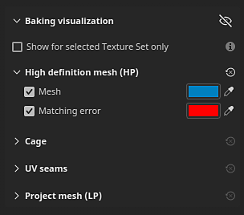
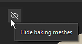

# Einstellungen für die Visualisierung von Bakings

Die Visualisierung des Bakings ist ein Bedienfeld im Viewport von Painter, während es im Baking-Modus läuft. Damit können Sie Einstellungen für die Anzeige von Meshs im Viewport anpassen.

## Allgemeine Einstellungen

| Einstellung | Beschreibung |
| --- | --- |
| **Baking führend Mesh ausblenden** | Falls aktiviert, verbirgt dieses Symbol den Mesh mit den hohen Poly- und Käfigen im Viewport. 

 |
| **Nur für ausgewählten Textursatz anzeigen** | Wenn diese Option aktiviert ist, werden nur der Käfig und die Meshs mit hohem Poly-Wert des aktuell aktiven Textursatzes im Viewport angezeigt. |

### High-Definition-Mesh (HP)

| Einstellung | Beschreibung |
| --- | --- |
| <b>Mesh</b> | Wenn diese Option aktiviert ist, zeigen Sie die Meshs mit hohem Poly in der 3D-Ansicht an. Wenn diese Option deaktiviert ist, werden auch Mesh mit hohem Poly-Anteil aus dem Speicher entladen und können die Leistung verbessern. Verwenden Sie die Farboption neben dieser Einstellung, um die Oberflächenfarbe des Meshs im Viewport zu steuern. |
| <b>Übereinstimmungsfehler</b> | Wenn diese Option aktiviert ist, werden Bereiche der Mesh mit hoher Poly-Qualität angezeigt, die sich außerhalb der Shell des Käfig-Meshs in der angegebenen Farbe befinden. Diese Einstellung hilft dabei, Bereiche zu identifizieren, die während des Bakings nicht berücksichtigt werden und zu einem Verlust von Details/Informationen führen können. Verwenden Sie die Farboption neben dieser Einstellung, um die Farbe der sich überschneidenden Bereiche im Viewport zu steuern. |

### Käfig

| Einstellung | Beschreibung |
| --- | --- |
| <b>Käfig </b> | Wenn diese Option aktiviert ist, wird die Oberfläche des Käfig-Meshs in der 3D-Ansicht angezeigt. Die Oberfläche des Käfigs wird durch die Farbschaltfläche neben der Einstellung definiert. |
| <b>Deckkraft der Käfig-Oberfläche</b> | Machen Sie den Mesh mehr oder weniger transparent, um die Sichtbarkeit von Details im zugrunde liegenden Mesh zu verwalten. |
| <b>Käfig Drahtgitter</b> | Wenn diese Option aktiviert ist, wird das Drahtgitter des Käfig-Meshs im Viewport angezeigt. Die Drahtgitter-Farbe kann mit der Farbschaltfläche neben dieser Einstellung angepasst werden. |
| <b>Käfig Drahtgitter Deckkraft</b> | Das Drahtgitter mehr oder weniger transparent machen. |

### UV-Nahtstellen

| Einstellung | Beschreibung |
| --- | --- |
| <b>Fehlende Nähte an harten Kanten</b> | Wenn diese Option aktiviert ist, werden harte Kanten auf der Oberfläche des Meshs, die keine UV-Nähte sind, mit der Farbe hervorgehoben, die durch die Schaltfläche neben der Einstellung definiert wird. Hervorgehobene Kanten sind nur auf dem Käfig und dem Mesh mit geringer Poly-Zahl sichtbar. Kanten können sowohl in der 2D- als auch in der 3D-Ansicht angezeigt werden. Diese Einstellung hilft bei der Identifizierung von Kanten, die geteilte Scheitelpunkt-Normalen haben, ohne dass eine UV-entpackend Naht vorhanden ist, was später zu Problemen beim Baking führen könnte. |

### Projekt-Mesh

<table data-preserve-html="true">
<colgroup><col/><col/><col/></colgroup><tbody><tr><th scope="col">Einstellung</th>
<th scope="col">Sekundäre Einstellung</th>
<th scope="col">Beschreibung</th>
</tr><tr><td><b>Projekt-Mesh</b></td>
<td> </td>
<td>
Wenn diese Option aktiviert ist, werden die Mesh mit niedrigem Poly, auf denen die Mesh mit hohem Poly Baking geführt sind, im Viewport angezeigt. Wenn <b>Baking führend Mesh ausblenden</b> aktiviert ist, wird diese Einstellung automatisch ebenfalls aktiviert, um einen leeren Viewport zu vermeiden.

Verwenden Sie die Farboption neben dieser Einstellung, um die Farbe des Projekt-Meshs anzupassen.

</td>
</tr><tr><td rowspan="7"><b>Neutrales Material</b></td>
<td><b>Qualität</b></td>
<td>Steuert die Specular-Reflexionsqualität auf der Oberfläche des Meshs mit niedriger Poly-Zahl. Die Verwendung eines hohen Werts führt zu einer besseren Wiedergabetreue, ein hoher Wert kann sich jedoch auf die Leistung auswirken. Ein niedriger Wert kann zu Nähte in der Schattierung mit Normalen-Map führen (Hinweis: Dies ist nur ein Anzeigeproblem).</td>
</tr><tr><td><b>Rauheit</b></td>
<td>Steuert die Rauheit des Materials mit dem niedrigen Poly-Mesh in den Viewporten.</td>
</tr><tr><td><b>Metallisch</b></td>
<td>Steuert die Metallität des Materials mit wenig Mesh in den Viewporten.</td>
</tr><tr><td><b>AO-Intensität</b></td>
<td>Steuert, wie viel der Baking geführt Ambient occlusion zur Schattierung mit wenig Poly-Meshs im Viewport beiträgt.</td>
</tr><tr><td><b>Normal gebogen</b></td>
<td>Wenn diese Option aktiviert ist, verwenden Sie Baking geführt Bent normals, um die Schattierung mit wenig Mesh im Viewport zu verbessern.</td>
</tr><tr><td><b>Normal gebogen, Diffusionsstärke</b></td>
<td>Steuert, wie stark die Bent normals die diffuse Schattierung beeinflussen.</td>
</tr><tr><td><b>Normal gebogen, Glanzlichtstärke</b></td>
<td>Steuert, wie stark die Bent normals die Specular-Schattierung beeinflussen.</td>
</tr></tbody></table>
