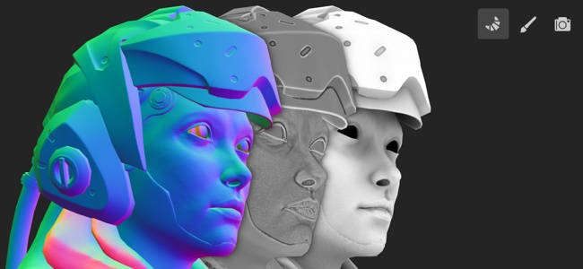

# Baking

Baking bezieht sich auf die Aktion **Übertragen von Mesh-basierten Informationen in Texturen**. Diese Informationen werden dann von Shadern und/oder Substance-Filtern gelesen, um erweiterte Effekte zu erzeugen. Intelligente Materialien und Intelligente Masken sind beispielsweise neben anderen Baking geführt Informationen auf Baking geführt Krümmungen und Normalen-Map angewiesen.

In Painter erfolgt das Baking über den dedizierten Baking-Modus. Auf diesen Modus kann über das dedizierte Symbol (kleines Croissant in der kontextabhängigen Symbolleiste), über das [Modusmenü](../interface/main-menu/mode-menu.md) oder mit dem [Tastatur-Tastaturbefehl](../interface/settings/shortcuts.md) zugegriffen werden.

Weitere Informationen zum Baking führ in Painter finden Sie auf den folgenden Seiten:

* [Benutzeroberfläche des Baking-Modus](baking-interface.md)
* [Wie man Mesh-Map Baking führe](how-to-bake-mesh-maps.md)
* [Einstellungen für die Visualisierung von Bakings](baking-visualization-settings.md)
* [Verzerrungskorrektur](skew-correction.md)

Einen kurzen Überblick über den Baking-Modus erhalten Sie in unserem Video-Tutorial:

>[!NOTE]
>
> Weitere Informationen zum Baking im Allgemeinen finden Sie in der dedizierten [Dokumentation zum Baking](https://experienceleague.adobe.com/de/docs/substance-3d/bakers/home).