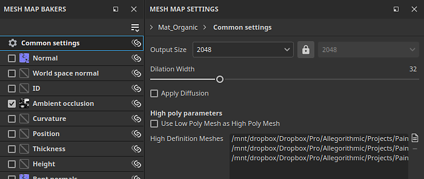
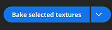

# So backen Sie Mesh-Maps

Mit dem dedizierten Backmodus von Substance 3D Painter können Sie Mesh-Maps ganz einfach backen, um großartige Smart-Materialien und andere Werkzeuge zu erstellen. Lesen Sie weiter oder sehen Sie sich das folgende Video an, um zu erfahren, wie Sie das Backen mit Substance 3D Painter beginnen.

## 1 - Wechseln in den Backmodus

Standardmäßig startet Painter beim Erstellen oder Öffnen eines Projekts im Malmodus. Um Mesh-Maps backen zu können, müssen Sie in den Backmodus wechseln. Verwenden Sie eine der folgenden Optionen, um in den Backmodus zu wechseln:

* Verwenden Sie die <b>Schaltfläche für den Backmodus</b> (<b>Croissant-Symbol</b>) in der Kontextsymbolleiste oben rechts im Viewport

  

  >[!NOTE]
  >
  > Manchmal kann die <b>Schaltfläche für den Backupmodus</b> je nach Arbeitsbereichlayout hinter anderen Bedienfeldern ausgeblendet werden.
* Verwenden Sie das Menü &quot;Modus&quot; und wählen Sie <b>Gitterzuordnungen backen.\
  </b>
* Verwenden Sie den Tastaturbefehl <b>F8</b>.

### 2 - Auswählen von Textursets und UV-Kacheln

Verwenden Sie in der <b>Textursatzliste</b> das Kontrollkästchen neben jedem Textursatz (und die Nummer der UV-Kacheln, falls vorhanden), um auszuwählen, welche Teile gebacken werden sollen:

### 3 - Bäcker auswählen

Verwenden Sie die Kontrollkästchen im Fenster &quot;Gitterzuordnungs-Bäcker&quot;, um die Karten auszuwählen, die Sie backen möchten:

### 4 - Ändern allgemeiner Einstellungen

Klicken Sie im Bedienfeld &quot;Gittermap-Bäcker&quot; auf die allgemeinen Einstellungen, um die Einstellungen wie durch Baking erzeugte Map-Auflösung, Dilationsbreite und hohe Poly-Parameter zu ändern, die auf allen Maps gemeinsam verwendet werden:

In den allgemeinen Einstellungen können Sie festlegen, welche Dateien als HD-Gitter verwendet werden sollen. Durch die Auswahl von hochauflösenden Gittern können Sie definieren, wie der Käfig für Ihre Gitter erzeugt wird:

* Entfernungsabhängig: Blasen Sie die Scheitelpunkte vom Gitter aus in einem gleichmäßigen Abstand über das Modell auf, um einen Käfig zu erstellen.
* Automatisch (experimentell): Painter analysiert dein Gitter und generiert automatisch einen Käfig. Der Käfig bleibt nahe an der Oberfläche, ohne Schnittpunkte zu erstellen.
* Benutzerdefinierte Datei: Importieren Sie eine Datei, die Sie erstellt haben, um sie als Käfig zu verwenden. Beachten Sie, dass importierte Dateien dieselbe Anzahl an Scheitelpunkten wie das Basisgitter haben müssen, damit sie ordnungsgemäß funktionieren.

Wenn Sie nicht aus einem Gitter mit hoher Poly-Polung backen, aktivieren Sie stattdessen das Kontrollkästchen <b>Gitter mit geringer Poly-Polung als Gitter mit hoher Poly-Polung verwenden</b>.

### 5 - Korb verstellen

Es stehen verschiedene Optionen zur Verfügung, um den Käfig je nach verwendeter Käfigmethode anzupassen. Mit einem abstandsbasierten Käfig können Sie die Frontal- und die Rückwärtsabstände anpassen, um den Schnittpunkt zwischen dem Käfig und Ihrem Gitter zu minimieren.

>[!NOTE]
>
> Rote Punkte erscheinen, wenn sich der Käfig mit der Geometrie des Modells schneidet. Ein sich überschneidender Käfig führt im Allgemeinen zu Artefakten und Problemen im sich überschneidenden Bereich.

### 6 - Starten des Backvorgangs

Klicken Sie unten im Viewport auf die Schaltfläche &quot;Backen&quot;, um den Backvorgang zu starten.

### 7 - Fehlerbehebung für das Inspect Backing Log

Sobald der Backvorgang abgeschlossen ist, können Sie im Fenster Backprotokoll überprüfen, ob Fehler gemeldet wurden.

Wenn welche vorhanden sind, verwenden Sie den Pfeil neben der Fehlermeldung, um die entsprechenden Bäckereinstellungen anzuzeigen:

