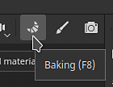
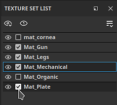
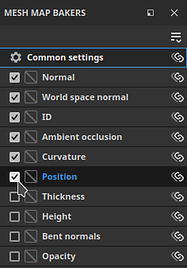
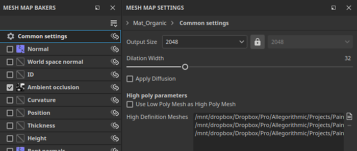
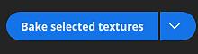
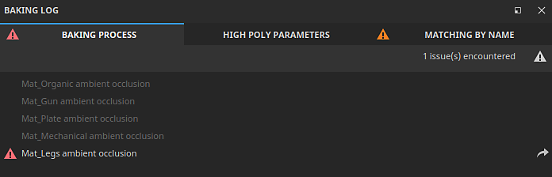

# Wie man Mesh-Map Baking führe

Mit dem dedizierten Baking-Modus von Substance 3D Painter können Sie ganz einfach Mesh-Map Baking führen, die großartige intelligenten Materials und andere Tools unterstützen. Lesen Sie weiter oder sehen Sie sich das folgende Video an, um zu erfahren, wie Sie mit dem Baking führ mit Substance 3D Painter beginnen.

## 1 - Wechseln in den Baking-Modus

Standardmäßig startet Painter beim Erstellen oder Öffnen eines Projekts im Malmodus. Um Mesh-Map Baking führen, müssen Sie in den Baking-Modus wechseln. Verwenden Sie eine der folgenden Optionen, um in den Baking-Modus zu wechseln:

* Verwenden Sie die Schaltfläche für den <b>Baking-Modus</b> (<b>Croissant-Symbol</b>) in der kontextabhängigen Symbolleiste oben rechts im Viewport.

  

  >[!NOTE]
  >
  > Manchmal kann die Schaltfläche für den <b>Baking-Modus</b> je nach Arbeitsbereichlayout hinter anderen Bedienfeldern ausgeblendet werden.
* Wählen Sie im Menü &quot;Modus&quot; die Option &quot;<b> Baking Mesh-Map&quot;.\
  </b>
* Verwenden Sie den <b>F8</b>-Tastatur-Tastaturbefehl.

### 2 - Textursatz und UV-Kacheln auswählen

Verwenden Sie in der <b>Textursatz-Liste</b> das Kontrollkästchen neben jedem Textursatz (und die UV-Kacheln-Nummer, falls vorhanden), um die zu Baking führend Teile auszuwählen:

### 3 - Baker auswählen

Verwenden Sie die Kontrollkästchen im Fenster &quot;Mesh-Map Baker&quot;, um die Maps auszuwählen, die Baking geführt werden sollen:

### 4 - Ändern allgemeiner Einstellungen

Klicken Sie im Bedienfeld &quot;Mesh-Map-Baker&quot; auf die allgemeinen Einstellungen, um die Einstellungen wie durch Baking erzeugte Map-Auflösung, Ausdehnung und hohe Poly-Parameter zu ändern, die für alle Maps gelten:

In den allgemeinen Einstellungen können Sie festlegen, welche Dateien als High-Definition-Mesh verwendet werden sollen. Wenn Sie High-Definition-Mesh auswählen, können Sie definieren, wie der Käfig für Ihre Mesh generiert wird:

* Entfernungsabhängig: Blasen Sie die Scheitelpunkt vom Mesh aus in einer gleichmäßigen Entfernung über das Model hinweg auf, um einen Käfig zu erzeugen.
* Automatisch (experimentell): Painter analysiert Ihren Mesh und generiert automatisch einen Käfig. Dabei wird versucht, den Käfig in der Nähe der Oberfläche zu halten, ohne dass Schnittpunkte erstellt werden, um optimale Ergebnisse zu erzielen.
* Benutzerdefinierte Datei: Importieren Sie eine Datei, die Sie erstellt haben, um sie als Käfig zu verwenden. Beachten Sie, dass importierte Dateien dieselbe Anzahl von Scheitelpunkten wie der Basis-Mesh aufweisen müssen, damit sie ordnungsgemäß funktionieren.

Wenn Sie nicht von einem Mesh mit hoher Poly-Qualität Baking geführt werden, aktivieren Sie stattdessen das Kontrollkästchen <b>Low-Poly-Mesh als High-Poly-Mesh</b> verwenden.

### 5 - Käfig anpassen

Es sind verschiedene Optionen verfügbar, um den Käfig je nach verwendeter Käfig-Methode anzupassen. Mit einem entfernungsbasierten Käfig können Sie die Frontal- und die Rückwärtsabstände anpassen, um den Schnittpunkt zwischen dem Käfig und Ihrem Mesh zu minimieren.

>[!NOTE]
>
> Wenn sich der Käfig mit der Geometrie des Modells schneidet, erscheinen rote Punkte. Ein sich überschneidender Käfig führt im Allgemeinen zu Artefakten und Problemen im sich überschneidenden Bereich.

### 6 - Baking starten

Klicke unten im Viewport auf den Baking-Button, um das Baking zu starten.

### 7 - Inspect das Baking-Protokoll auf Fehler überprüfen

Sobald der Baking-Vorgang abgeschlossen ist, können Sie im Fenster &quot;Fehlerprotokoll&quot; überprüfen, ob Baking gemeldet wurden.

Wenn welche vorhanden sind, verwenden Sie den Pfeil neben der Fehlermeldung, um die entsprechenden Baker-Einstellungen anzuzeigen:

