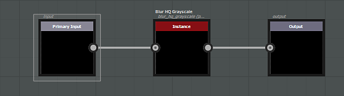
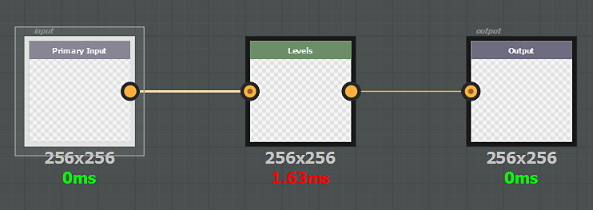

# Generischer Filter

Ein generischer Effekt wird auf alle Dokumentkanäle angewendet, einschließlich der Deckkraft. Ein generischer Filter kann sein:

* **grayscale**, wird auf jede Komponente (R, G, B und A) jedes Kanals (Grundfarbe, metallic, Rauheit usw.) angewendet
* **color**, wird auf den farbigen Kanal unverändert angewendet oder intern in Graustufen konvertiert, um Graustufen-Kanäle zu beeinflussen

Für den Eingabeknoten des Effekts muss die **Identifizierung** oder **Verwendung** definiert sein **Eingabe**, und der Ausgabeknoten muss **Ausgabe** aufweisen. Beachten Sie, dass **Farbfilter** nicht auf der Maske einer Ebene verwendet werden können, nur **Graustufen** Filter sind kompatibel.

>[!NOTE]
>
> Es ist möglich, die **Verwendung** oder die **Identifizierung** in einem Eingabeknoten zu verwenden (die Verwendung hat die Priorität).

Beispiel :

{width="575px"}
