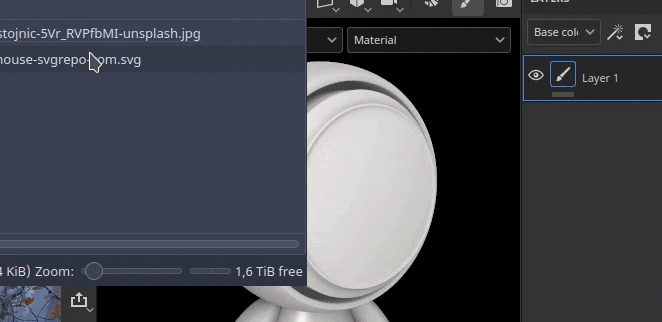

# Hinzufügen von Ressourcen per Drag &amp; Drop

Das Importieren von Ressourcen kann einfach durch Ziehen und Ablegen einer Datei von außerhalb der Anwendung in verschiedene Bereiche der Benutzeroberfläche erfolgen.

## Importieren in das Fenster &quot;Elemente&quot;

Um eine Ressource in Painter zu importieren, ziehen Sie sie einfach in das Fenster &quot;Elemente&quot;.

Dadurch wird das Fenster Ressource importieren geöffnet, in dem Sie steuern können, wo die Ressource abgelegt werden soll (innerhalb des Projekts, auf der Festplatte für die projektübergreifende Wiederverwendung oder in der Sitzung für eine temporäre Verwendung). In diesem Fenster können Sie auch die Verwendung einer Ressource richtig konfigurieren, da einige Dateiformate manchmal mehrdeutig sind.

### Importieren in den Viewport

Um ein Material direkt in Ihr Projekt zu importieren und anzuwenden, ziehen Sie es einfach in den Viewport. Beim Ziehen der Datei sollte das Gitter hervorgehoben werden, um anzugeben, auf welchen Teil des Projekts es angewendet wird.

Es ist auch möglich, eine SVG-Datei durch Ziehen und Ablegen in den Viewport zu importieren. Dadurch wird eine neue Ebene mit dem Warp-Projektionsmodus und der Ressource <b>Grafik zu Material</b> erstellt, wodurch Aufkleber leicht erstellt werden können.

### Importieren in den Ebenenstapel

Wenn du eine Ressource per Drag-and-Drop auf die Ebene ziehst, werden beim Ablegen Ebenen (oder Effekte) erstellt. Möglicherweise wird ein Menü angezeigt, in dem Sie gefragt werden, in welchen Kanal die Ressource gespeichert werden soll, wenn es sich nicht um Substance-Materialien oder -Filter handelt.

<table>
<tr style="border: 0;">
<td style="border: 0;" valign="top">

<b>Audio</b>

Passe Audio an oder füge Audio zu deinem Projekt hinzu.

* Passen Sie die Quellvideolautstärke an, wenn sie Audio enthält.
* Externe Audiodateien hinzufügen, entfernen oder ersetzen
* Passen Sie die externe Lautstärke der Audiodatei an.

</td>
<td style="border: 0;" valign="top">

</td>
</tr>
</table>

### Importieren in einen Ressourcensteckplatz

Wenn Sie eine Datei per Drag-and-drop in einen der Ressourcenschlitze auf der Benutzeroberfläche ziehen, z. B. in einen Kanal innerhalb einer Füllebene, wird die Ressource importiert und automatisch angewendet.

