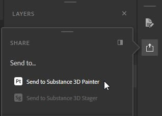

# Empfangen von Elementen aus anderen Substance 3D-Programmen

Ab Version 7.2.0 können Sie auch Elemente erhalten und aktualisieren, die von Designer und Sampler über die Funktion &quot;Senden an&quot; gesendet wurden. Da Sie hierfür Zugriff auf Sampler und Designer benötigen, ist diese Funktion nur verfügbar, wenn Sie Painter über Substance 3D Texturing oder Substance 3D Collection verwenden.

Sobald das Element gesendet wurde, wird es im Bedienfeld Elemente von Painter angezeigt und in den Standardbibliothekspfad auf der Festplatte importiert. Sie können **von update** gesendete Assets auch dann aktualisieren, wenn Sie Änderungen in Designer oder Sampler **in derselben Sitzung** vorgenommen haben (solange keine der Apps geschlossen wurde).

## Asset aus Designer an Painter senden

1. Wählen Sie im Explorer-Bedienfeld Ihr Hauptpaket aus.
1. Klicken Sie auf das Dropdown-Menü Publish (alternativ können Sie auch mit der rechten Maustaste auf das Hauptpaket klicken).
1. Wählen Sie die Option **An Substance 3D Painter senden** aus (Painter wird automatisch gestartet, wenn es noch nicht geöffnet ist).
1. Das gesendete Element wird im Fenster &quot;Elemente&quot; angezeigt.

## Asset aus Sampler an Painter senden

1. Öffnen Sie auf der rechten Symbolleiste das Bedienfeld &quot;Freigeben&quot;.
1. Klicken Sie auf **An Substance 3D Painter senden** (Painter wird automatisch gestartet, wenn es noch nicht geöffnet ist).
1. Das gesendete Asset wird im Asset-Fenster angezeigt.

