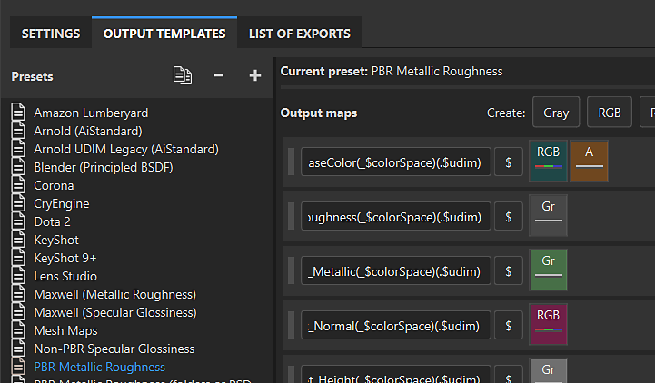

# Ausgabevorlagen

Substance 3D Painter verfügt über zwei Typen von Ausgabevorlagen, mit denen Sie das Verhalten des Exportvorgangs steuern können.

* [Standardanwendungen](default-presets.md) sind für die Arbeit mit bestimmten 3D-Ausgabevorlagen oder Workflows konzipiert und auf der Registerkarte <b>Ausgabevorlagen</b> des <b>Exportfensters</b> verfügbar. Du kannst eine Standardvorlage duplizieren und ändern oder eine neue Vorlage erstellen.
* [Vordefinierte Ausgabevorlagen](../../export/export-presets/predefined-presets/predefined-presets.md) können nicht geändert werden. Vordefinierte Vorlagen werden oben in der Dropdownliste <b>Ausgabevorlage</b> auf der Registerkarte <b>Einstellungen</b> des <b>Exportfensters</b> angezeigt.
