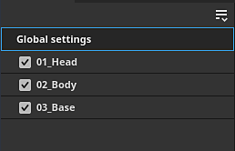

# Exporteinstellungen

{width="500px"}

Auf der Registerkarte <b>Exporteinstellungen</b> des <b>Fensters zum Exportieren von Texturen</b> können Sie die Komposition, die Größe und den Speicherort der exportierten Texturen konfigurieren.

## Konfiguration von Allgemein und Textursätzen

Das erste Element des Fensters ist die Liste der Textursätze auf der linken Seite. Der Bereich &quot;Globale Einstellungen&quot; bietet Zugriff auf allgemeine Parameter für alle Textursätze. Dies erleichtert die Anpassung eines einzelnen Satzes von Einstellungen, die auf alle Textursätze des Projekts angewendet werden. Änderungen an einzelnen Einstellungen für den Textursatz setzen die globalen Einstellungen für diesen Textursatz außer Kraft. Wenn Sie beispielsweise die Auflösung in den globalen Einstellungen auf 2048 und 1024 als Modifikation für einen bestimmten Textursatz festlegen, werden alle Textursätze mit der Auflösung 2048 exportiert, mit Ausnahme des auf 1024 festgelegten.

Das Kontrollkästchen neben dem Namen jedes Textursatzes gibt an, ob die zugehörigen Texturen exportiert werden oder nicht.

Das Dropdown-Menü ist für Projekte mit einer großen Anzahl von Textursätzen nützlich, da Sie die Auswahl schnell mit <b>Alle überprüfen</b>, <b>Alle deaktivieren</b> und <b>Alle </b> Aktionen umkehren ändern können.

## Allgemeine Exportparameter

Dieser Abschnitt enthält die gemeinsamen Einstellungen für jede Textur, die generiert wird:

| Einstellung | Beschreibung |
| --- | --- |
| <b>Ausgabeverzeichnis</b> | Speicherort für exportierte Texturen. |
| <b>Ausgabevorlage</b> | Wählen Sie die Ausgabevorlage aus, mit der die Kanäle benannt und in Texturdateien zusammengeführt werden sollen. Weitere Informationen zu Vorlagen finden Sie in der Liste [Ausgabevorlagen](../export-presets/export-presets.md). |
| <b>Dateityp </b> | Das Dateiformat und seine Bittiefe. Wenn die Option <b>Basierend auf Ausgabevorlage</b> aktiviert ist, wird das Dateiformat von der Exportvorgabe geerbt (wodurch Format und Bittiefe nicht global, sondern pro Textur bestimmt werden können). Die verfügbare Bittiefe hängt vom Dateityp ab. Weitere Informationen finden Sie in der folgenden Tabelle. |
| <b>Größe </b> | Die Auflösung der exportierten Texturdatei. Mögliche Werte:<ul data-preserve-html="true"> <li data-preserve-html="true"><b>Basierend auf der Größe jedes Textursatzes</b></li> <li data-preserve-html="true"><b>128</b></li> <li data-preserve-html="true"><b>256</b></li> <li data-preserve-html="true"><b>512</b></li> <li data-preserve-html="true"><b>1024</b></li> <li data-preserve-html="true"><b>2048</b></li> <li data-preserve-html="true"><b>4096</b></li> <li data-preserve-html="true"><b>8192</b> (nur für GPUs mit mehr als 1,5 GB Vram verfügbar)</li> </ul> |
| <b>Auffüllen von </b> | Füllung des Bereichs außerhalb der UV-Inseln innerhalb der Struktur. Mögliche Werte sind:<ul data-preserve-html="true"> <li data-preserve-html="true"><b>Kein Auffüllen (Passthrough)</b>: den aktuellen Status der Textur unverändert übernehmen.</li> <li data-preserve-html="true"><b>Unendliche Dilation</b>: Ziehen Sie die UV-Inseln bis zum benachbarten Rahmen oder bis zum Ende der Textur.</li> <li data-preserve-html="true"><b>Erweiterung + transparent</b>: die Ränder der UV-Insel auf die angegebene Entfernung in Pixel zu dehnen, ist der Rest transparent.</li> <li data-preserve-html="true"><b>Dilation + Standardhintergrundfarbe</b>: Um die Ränder der UV-Insel auf die angegebene Entfernung in Pixel zu dehnen, wird der Rest mit der Standardfarbe des Kanals des Textursatzes gefüllt.</li> <li data-preserve-html="true"><b>Dilation + Standardhintergrundfarbe</b>: Um die Ränder der UV-Insel auf die angegebene Entfernung in Pixel zu dehnen, wird der Rest mit der Standardfarbe des Kanals des Textursatzes gefüllt.</li> <li data-preserve-html="true"><b>Dilation + Diffusion</b>: UV-Insel-Ränder auf die angegebene Entfernung in Pixel ausdehnen, wird der Rest mit einer verschwommenen Version der UV-Insel (basierend auf MIP-Maps) gefüllt.</li> </ul> |

>[!NOTE]
>
> Das Dateiformat **psd** ist ein Container. Das bedeutet, dass Ausgabemaps in einer einzelnen Datei auf dem Datenträger gesammelt werden.

### Dither

Das Exportieren von 8-Bit-Texturen kann zu Streifenbildung in Farbverläufen führen. Dies macht sich besonders bei Normal- und Height-Maps bemerkbar. Es gibt zwei Möglichkeiten, dieses Problem zu lösen: mit höherer Präzision oder mit Dithering kompensieren.

Eine höhere Präzision (16 oder 32 Bit) ist ideal, aber möglicherweise nicht mit allen Anwendungen kompatibel. Vor allem Game-Engines komprimieren oft auf 8 Bit. Beim Dithering treten Störungen auf, die Banding-Probleme beheben, während gleichzeitig 8 Bit an Informationen verwendet werden.

### Texturdateiformate

Im Folgenden finden Sie eine Liste aller von Painter unterstützten Exportdateiformate:

| Formatname | Formaterweiterung | Unterstützte Bit-Tiefe |
| --- | --- | --- |
| **Bitmap** | BMP | 8, 8 + Dithering |
| **OpenEXR** | exr | 16 (schwebend), 32 (schwebend) |
| **Graphics Interchange Format** | gif | 8, 8 + Dithering |
| **Radiance HDR** | HDR | 32 (schwebend) |
| **Symbol** | ico | 8, 8 + Dithering |
| **JPEG 2000** | j2k | 8, 8 + Dithering, 16 |
| **JPEG-Netzwerkgrafiken** | jng | 8, 8 + Dithering, 16 |
| **JPEG 2000** | jp2 | 8, 8 + Dithering, 16 |
| **JPEG** | JPEG | 8, 8 + Dithering |
| **JPEG des erweiterten Bereichs** | jpeg-xr | 8, 8 + Dithering, 16, 32 (schwebend) |
| **Portable Bit Map** | PBM | 8, 8 + Dithering, 16 |
| **Portable Float Map** | pfm | 32 (schwebend) |
| **Tragbare Graukarte** | pgm | 8, 8 + Dithering, 16 |
| **Portable Network Graphics** | png | 8, 8 + Dithering, 16 |
| **Portable Pixel Map** | ppm | 8, 8 + Dithering, 16 |
| **Photoshop-Dokument** | psd | 8, 8 + Dithering, 16 |
| **TGA für Truevision** | Targa | 8, 8 + Dithering |
| **Tag-Bilddateiformat** | tiff | 8, 8 + Dithering, 16, 32 (schwebend) |
| **Bitmapformat für das Wireless-Anwendungsprotokoll** | wbmp | 8, 8 + Dithering |
| **WebP** | schlagen | 8, 8 + Dithering |
| **X PixMap** | xpm | 8, 8 + Dithering |

## Ausgabe-Maps

Wenn ein bestimmter Textursatz ausgewählt ist, ist der Abschnitt Ausgabemaps für diesen Textursatz sichtbar.

In diesem Abschnitt werden alle Texturen aufgeführt, die basierend auf der aktuellen Exportvorgabe generiert werden. Sie gibt die Vorlage für den Strukturnamen, das Dateiformat und die Bittiefe sowie den Farbraum an, wenn [Farbmanagement](../../features/color-management/color-management.md) aktiviert ist.

In diesem Abschnitt können Sie den Export bestimmter Dateien deaktivieren oder das <b>Dateiformat</b> und die <b>Bittiefe</b> überschreiben.

## USD-Element exportieren

Wenn Sie dieses Kontrollkästchen aktivieren, können Sie den Export im USD-Format durchführen. Im Gegensatz zur USDz-Vorgabe (Apple AR), die in <b>Ausgabevorlagen</b> verfügbar ist, berücksichtigt dieser Export alle Vorlagen oder Parameter, die Sie für Ihren Export konfiguriert haben. Die folgenden Dateien werden exportiert, wenn Sie das Kontrollkästchen &quot;USD-Element&quot; aktivieren -

* Ein Ordner mit Texturmaps
* Eine *.usda*, die auf den Texturmappenordner verweist.
* Eine optionale USD, die Materialien mit der ursprünglichen Gitterdatei zusammenfügt. Es kann direkt in Omniverse verwendet werden, um Ihr Gitter mit automatisch angewendeten Materialien zu zeigen.
* Eine optionale USD-Datei, die das im Projekt verwendete Gitter enthält. Es wird nur exportiert, wenn die ursprüngliche Gitterdatei kein USD ist oder wenn das automatische Ausgliedern in Painter zum Generieren von UVs verwendet wurde.
