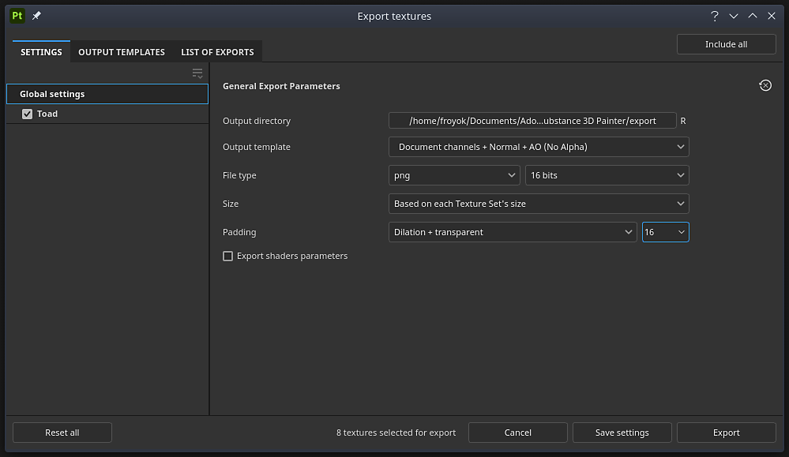

# Exportfenster

{width="500px"}

Öffnen Sie das <b>Exportfenster </b> mit <b>Datei > Texturen exportieren </b> oder Tastatur-Tastaturbefehl <b>Strg + Umschalt + E</b>.

Das <b>Exportfenster </b> ist in drei Registerkarten unterteilt:

* [Exporteinstellungen](export-settings.md)
* [Ausgabevorlagen](output-templates.md)
* [Liste der Ausfuhren](list-of-exports.md)

Im unteren Bereich des Fensters befinden sich mehrere Schaltflächen:

* <b>Alle </b> zurücksetzen (nur auf der Registerkarte <b>Einstellungen</b>): die Exportkonfiguration des Projekts zurücksetzen.
* <b>Abbrechen</b>: Schließen Sie das Fenster, ohne die Änderungen zu speichern.
* <b>Einstellungen speichern</b>: Speichern Sie die aktuellen Exporteinstellungen im Projekt.
* <b>Export</b>: Starten Sie den Export mit den aktuellen Exporteinstellungen und wechseln Sie automatisch zum Abschnitt <b>Exportliste</b>, um den Exportfortschritt zu verfolgen.
