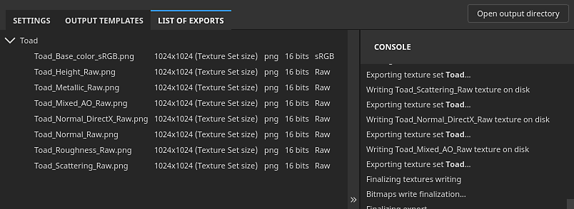

# Liste der Ausfuhren

{width="550px"}

Die Registerkarte &quot;</b>&quot; der Exportliste &quot;<b>&quot; des Exportfensters &quot;<b>&quot; &quot;</b>&quot; listet die exportierten Texturen von jedem Textursatz auf. Eine Konsole zeigt den Exportstatus an, einschließlich Fehlermeldungen.
