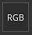
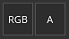

# Ausgabevorlagen

{width="500px"}

Auf der Registerkarte &quot;Ausgabevorlage&quot; können Sie neue Ausgabevorlagen verwalten und erstellen. Sie können Ausgabevorlagen verwenden, um Namen, Formate und die Konfiguration der exportierten Texturen zu ändern.

## Vorgabenliste

In der Liste Vorgaben werden alle verfügbaren Ausgabevorlagen angezeigt. Diese Liste enthält eine Auflistung von [Default-Ausgabevorlagen](../export-presets/default-presets.md) sowie alle benutzerdefinierten Vorlagen, die Sie erstellt haben.

Aus dieser Liste können Vorlagen <b>erstellt</b>, <b>umbenannt</b>, <b>dupliziert,</b> oder <b>gelöscht</b> sein.

| Aktion | Visuell | Beschreibung |
| --- | --- | --- |
| **Duplikat** | 

 | Erstellt eine Kopie der aktuell ausgewählten Ausgabevorlage in der Liste. |
| **Entfernen** | 

 | Entfernen Sie die aktuell ausgewählte Ausgabevorlage aus der Liste.  **Hinweis:** Das Löschen einer Vorlage kann nicht rückgängig gemacht werden. |
| **Hinzufügen** | 

 | Fügen Sie eine neue leere Ausgabevorlage hinzu. |
| **Doppelklicken auf** | 

 | Benennen Sie die ausgewählte Ausgabevorlage um. |
| **Rechtsklick** | 

 | Klicken Sie mit der rechten Maustaste auf eine Vorlage, um das Kontextmenü zu öffnen, in dem Sie eine Vorlage löschen, umbenennen oder duplizieren können. |

## Liste der Ausgabemaps

In diesem Abschnitt werden alle Texturen aufgelistet, die von der Vorlage und ihrer Komposition generiert werden.

### Zuordnungstypen und -schlüsselwörter

In der obersten Zeile werden alle Typen von Texturen aufgeführt, die erstellt werden können:

| Button | Visuell | Beschreibung |
| --- | --- | --- |
| **Grau** | 

 | Füge eine neue Graustufen-Map hinzu. |
| **RGB** | 

 | Fügen Sie eine neue RGB-Farbzuordnung hinzu. |
| **R+G+B** | 

 | Füge eine neue RGB-Map mit 3 einzelnen Graustufen-Steckplätzen hinzu. |
| **RGB+A** | 

 | Fügen Sie eine neue RGB-Map sowie einen Alpha-Steckplatz (Graustufen) hinzu. |
| **R+G+B+A** | 

 | Fügen Sie eine neue RGBA-Karte mit 4 einzelnen Graustufen-Steckplätzen hinzu. |

>[!NOTE]
>
> Einige Typen können zusammengeführt/reduziert werden, wenn sie leer sind oder dieselbe Eingabe-Map verwenden:
> 
> 

### Kartenname

Jede Textur kann mit einer benutzerdefinierten Namenskonvention benannt werden. Einige Stichwörter können (mithilfe der Schaltfläche **$**) hinzugefügt werden, um beim Generieren der endgültigen Datei automatisch durch die Anwendung ersetzt zu werden:

| Stichwort | Beschreibung |
| --- | --- |
| **$Projekt** | Ersetzt durch den Namen der Projektdatei (.spp). |
| **$Mesh** | Ersetzt durch den Namen der Meshdatei (Eingabe-Meshdatei, wie .fbx) |
| **$textureset** | Ersetzt durch den Namen des Materials/Textursatzes, von dem die Textur generiert wird. |
| **$udim** | Ersetzt durch die UDIM-Nummer, von der aus eine Textur generiert wird. |
| **$colorSpace** | Ersetzt durch den Namen des Farbraums, der für den angegebenen Kanal verwendet wird (RGB oder G, ignoriert Alpha). |

### Format und Bittiefe der Zuordnungsdatei

Die erste Dropdown-Liste kann verwendet werden, um das Dateiformat der aktuellen Ausgabemap anzugeben.

Die zweite Dropdown-Liste wird verwendet, um die Bittiefe der Ausgabemap anzugeben. Die Bittiefe hängt vom ausgewählten Dateiformat ab. Weitere Informationen finden Sie unter [Exporteinstellungen](export-settings.md).

>[!NOTE]
>
> Stellen Sie sicher, dass der Dateityp in den allgemeinen Bittiefen auf &quot;**Basierend auf Ausgabevorlage**&quot; festgelegt ist, damit das Format und die Formateinstellung beim Exportieren berücksichtigt werden.

## Quellzuordnungsliste

### Eingabe-Maps

Die Eingabe-Map-Liste gruppiert alle Kanäle neu, die über die [Textursatz-Einstellungen](../../interface/texture-set/texture-set-settings.md) hinzugefügt werden können.

>[!NOTE]
>
> Die **Benutzer**-Kanäle basieren auf ihrem ursprünglichen Namen (**Benutzer\_x**). Benutzerdefinierte Namen werden ignoriert.

### Mesh-Maps

Die Mesh-Map sind die Baking geführt Texturen:

| Name | Beschreibung |
| --- | --- |
| **Normal** | Gebackene Normalkarte. |
| **Welt-Raum-Normale** | Baking geführt Welt-Raum-Normale. |
| **ID** | Identitätsnachweis. |
| **Ambient occlusion** | Baking geführt ambient occlusion |
| **Krümmung** | Baking geführt Krümmung. |
| **Position** | Baking geführt Position. |
| **Thickness** | Gebackene Thickness. |
| **Height** | Baking geführt Height. |
| **Gebeugte Normale** | Baking geführt bent normals. |

### Konvertierte Maps

Konvertierte Maps sind Maps, die von der Anwendung aus einer anderen Quelle generiert werden:

| Name | Beschreibung |
| --- | --- |
| **Normales OpenGL** | Kombiniertes Normalen-Map im OpenGL-Format des Baking geführt Normalkanals und des Normalkanals des Textursatzes. |
| **Normale DirectX** | Kombinierte Normalen-Map im DirectX-Format des Baking geführt Normal- und des Normal-Kanals des Textursatzes. |
| **Gemischte AO** | Kombinierte Umgebungs-Verdeckung der Verdeckung für die gebackene Umgebung und des Kanals für die Verdeckung des Textursatzes. |
| **Diffus** | Aus dem Kanal **Grundfarbe** und **Metallic** erzeugte Diffuse-Textur (metallic Bereiche werden durch eine schwarze  ersetzt). |
| **Specular** | Specular-Textur aus **Grundfarbe** und **Metallic** Kanal generiert. |
| **Glossarität** | Glanzstruktur, die aus der Umkehrung des Raueitskanals erzeugt wird. |
| **Unity4-Diffusen** | Veraltet. Diffuse-Textur aus **Grundfarbe**-Kanal generiert, um Unity 4-Shadern zu entsprechen. |
| **Unity4 Gloss** | Veraltet. Glanz-Textur aus **Rauheit** und **Metallic** Kanal generiert, um Unity 4-Shadern zu entsprechen. |
| **Spiegelung** | Texturen, bei denen Weiß auf ein dielektrisches Material und andere Farben als metallische Materialien hinweist. |
| **1/ior** | Textur, die 1 dividiert durch den **IOR**-Wert enthält. **IOR** wird aus der metallic Map generiert: 1.4 für Dielektrika, 100 für Metalle (schwarze Farbe). |
| **Glanz2** | Quadratische Version des **Glanz**-Kanals (**Glanz** \* **Glanz**) |
| **f0** | Textur, die einen Reflexionswert wie Fresnel 0 (0,04 für Dielektrika, 1,0 für metallic) enthält. |
