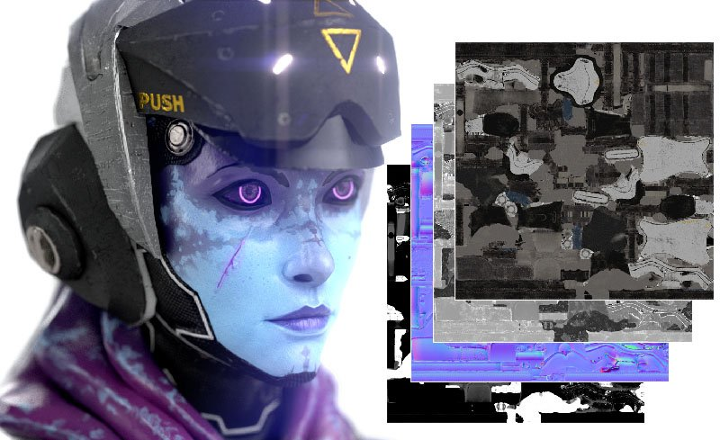

# Exportieren

## Exportieren von Texturen

Texturen werden als eine Sammlung von Bitmaps exportiert. Painter bietet dank Ausgabevorlagen viel Flexibilität beim Exportieren von Texturen. Mit Ausgabevorlagen kannst du z. B. die Benennung der Exportdateien, die Art und Weise, wie die Texturen in die Kanäle gepackt werden, sowie das Format und die Bittiefe der exportierten Dateien steuern. Wenn das einschüchternd klingt, keine Sorge, Painter umfasst Dutzende von Standard-Ausgabevorlagen, die für häufig verwendete 3D-Anwendungen und Anwendungsfälle konfiguriert sind.

Sie öffnen das Fenster <b>Exportieren</b> und beginnen mit dem Exportieren von Texturen mit <b>Datei > Texturen exportieren</b>, oder verwenden Sie den Tastaturbefehl <b>STRG + UMSCHALT + E</b>. Unter den folgenden Links finden Sie weitere Informationen zum Exportieren von Texturen:

* [Exportfenster](../export/export-window/export-window.md)
* [Ausgabevorlagen](../export/export-presets/export-presets.md)
* [Ändern oder Erstellen von Ausgabevorlagen](creating-export-presets.md)

### Das Gitter exportieren.

Painter kann das importierte Gitter ändern, z. B. indem automatisch UVs generiert werden. Wenn Sie in Painter Änderungen am Gitter vorgenommen haben, können Sie das Gitter mit <b>Datei > Gitter exportieren</b> exportieren.

Beim Exportieren eines Gitters stehen Ihnen einige Optionen zur Verfügung:

* <b>Ohne Versatz/Tesselierung</b>: exportiert das Basis-Gitter, ohne die Geometrie basierend auf den Materialien zu ändern.
  * <b>Triangulation anwenden</b>: Wenn das importierte Gitter aus Quads oder Polygonen bestand, können Sie diese Option aktivieren, um die triangulierte Painter-Version des Gitters zu exportieren. Dies kann dazu beitragen, visuelle Triangulationsfehler zu vermeiden, falls andere Anwendungen anders triangulieren.
* <b>Mit Versatz/Tesselierung</b>: Painter tesseliert das Gitter, fügt weitere Polygone hinzu und verwendet Versatz oder Height, um die Oberflächengeometrie des Gitters zu ändern.
  * <b>Eckpunktnormalen neu berechnen</b>: Das Ändern der Oberfläche des Gitters kann zu falschen Normalen bereits vorhandener Scheitelpunkte führen. Wenn diese Option aktiviert ist, aktualisiert Painter Scheitelpunktnormalen automatisch auf den richtigen Wert für die neue Fläche.

{width="500px"}
