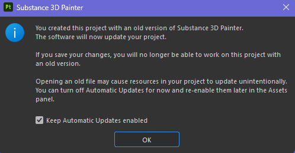

# Automatische Ressourcenaktualisierung

Die automatische Ressourcenaktualisierung (oder <b>automatische Aktualisierung</b>) ist ein Feature des [Assets-Fensters](../interface/assets/assets.md), mit dem Ressourcen neu geladen und aktualisiert werden können, wenn neue Versionen verfügbar sind. Dieser Prozess kann automatisch oder manuell in der Benutzeroberfläche oder über Python-Skripterstellung ausgelöst werden.

## Tutorial

Sie können sich ein kurzes Tutorial ansehen, um einen Überblick über die Funktion zu erhalten:

## Aktivieren der automatischen Aktualisierung

Um die automatische Aktualisierung <b>1&rbrace; zu aktivieren, klicken Sie unten im Fenster &quot;Elemente&quot; auf das Doppelpfeilsymbol. </b>Dadurch wird das Menü für die automatische Aktualisierung mit allen Einstellungen geöffnet. Aktivieren Sie dann eine der Optionen, die im Abschnitt <b>Automatische Updates</b> verfügbar sind.

### Automatische Updates

Die Einstellungen für die automatische Aktualisierung legen fest, wie oft und wo die Anwendung nach Updates suchen soll.

| Einstellung | Beschreibung |
| --- | --- |
| <b>Bedienfeld &quot;Elemente&quot;</b> | Wenn diese Option aktiviert ist, sucht die automatische Aktualisierung nach Elementen, die in allen derzeit geladenen Bibliotheken aktualisiert werden sollen. Dies schließt das aktuelle Projekt ein. Ressourcen, die im Ebenenstapel verwendet werden, Anzeigeeinstellungen, Shader-Einstellungen usw. werden jedoch nicht aktualisiert. |
| <b>Im Projekt </b> verwendete Ressourcen | Wenn diese Option aktiviert ist, sucht die automatische Aktualisierung nach zu aktualisierenden Elementen, die derzeit importiert und vom aktuellen Projekt verwendet werden. Dies gilt für Ressourcen, die im Ebenenstapel verwendet werden, Anzeigeeinstellungen, Shader-Einstellungen usw. |
| <b>Alle x Minuten aktualisieren</b> | Steuern Sie, wie oft die Anwendung nach einer Aktualisierung der Ressourcen sucht. Eine Verzögerung von 0 Minuten löst alle paar Sekunden ein Update aus. Beachten Sie, dass eine so geringe Verzögerung Leistungsprobleme verursachen kann. |

>[!NOTE]
>
> Wenn automatische Aktualisierungen aktiviert sind, sucht die Anwendung automatisch nach Änderungen, sobald sie wieder aktiviert wird.

### Manuelle Aktualisierungen

Die manuellen Aktualisierungsaktionen sind eine bequeme Möglichkeit, das Aktualisierungssystem bei Bedarf auszulösen. Sie können entweder mit oder ohne aktivierter automatischer Update-Einstellungen verwendet werden.

| Einstellung | Beschreibung |
| --- | --- |
| <b>Bedienfeld &quot;Elemente aktualisieren&quot;</b> | Starten Sie die automatische Aktualisierung. Verhalten Sie sich genauso wie im <b>Bedienfeld &quot;Elemente&quot;</b> (siehe oben). |
| <b>Im Projekt verwendete Ressourcen aktualisieren</b> | Starten Sie die automatische Aktualisierung. Verhalten Sie sich genauso wie die <b>Ressourcen, die im Projekt </b> verwendet werden (siehe oben). |

## Erweiterte Einstellungen

Mit den erweiterten Einstellungen können Sie das Verhalten des Aktualisierungsvorgangs steuern.

| Einstellung | Beschreibung |
| --- | --- |
| <b>Elemente überspringen, wenn ihre Parameter nicht übereinstimmen</b> | Wenn diese Option aktiviert ist, werden Ressourcen beim automatischen Update nicht aktualisiert, wenn die neue Version nicht mit der alten Version übereinstimmt. Zum Beispiel, wenn ein Substance-Material Parameter enthält, die in der neuen Version nicht mehr vorhanden sind (weil sie entfernt oder umbenannt wurden), wird die Ressource beim Aktualisierungsprozess ignoriert und stattdessen die alte Version beibehalten. |

>[!NOTE]
>
> Um die Aktualisierung von Elementen zu erzwingen, die nicht übereinstimmen, können Sie die Einstellung <b>Elemente überspringen, wenn ihre Parameter nicht übereinstimmen</b> deaktivieren.

## Status und Protokoll aktualisieren

Nach einer Ressourcenaktualisierung (automatisch oder manuell) wird das Ergebnis des Vorgangs auf der Registerkarte <b>Assets</b> im Fenster <b>Log</b> angezeigt, wobei sowohl erfolgreiche Updates als auch Probleme gemeldet werden. Im Falle einer Ressourcenkonflikt (siehe oben), die Details des Problems werden wir pro Ressource bereitgestellt.

Das Protokoll kann schnell geöffnet werden, indem Sie auf das entsprechende Symbol oben rechts im Menü für die automatische Aktualisierung klicken:

>[!NOTE]
>
> Wenn nach einem Update ein oder mehrere Probleme auftreten, wird das Protokollsymbol mit einem kleinen Warnsymbol angezeigt.

Je nachdem, wie der Aktualisierungsprozess abläuft, können verschiedene Arten von Problemen auftreten:

| Problem | Beschreibung |
| --- | --- |
| <b>Im Bedienfeld &quot;Elemente&quot; konnte keine Aktualisierung durchgeführt werden</b> | Diese Meldung bedeutet, dass ein Problem verhindert hat, dass das Aktualisierungssystem fortfährt. Erweitern Sie den Ressourcennamen, um weitere Informationen zu erhalten. |
| <b>(Dateiname).(Format) ist nicht vorhanden. (Ressourcenname)</b> kann nicht neu geladen werden. | Diese Meldung bedeutet, dass die Quelldatei einer Ressource nicht mehr gefunden werden kann (entweder, weil sie verschoben oder entfernt wurde). Eine einfache Lösung besteht darin, die Ressource erneut zu importieren oder im Fenster &quot;Elemente&quot; (über das Kontextmenü) zu verschieben. |

## Alte Projektmeldung

Wenn Sie ein altes Projekt öffnen, wird in der Popup-Meldung eine Warnmeldung angezeigt, die Sie über die automatische Aktualisierung informiert. Auf diese Weise können Sie den automatischen Aktualisierungsprozess schnell deaktivieren, falls er aktiviert geblieben ist, bevor Sie das alte Projekt öffnen.
