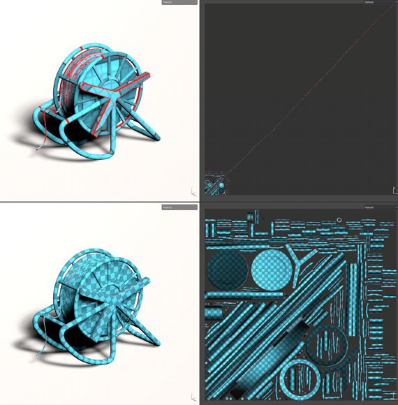

# Automatischer Entpack von UV

\
Durch den automatischen entpack von UV können beim Importieren eines 3D-Modells automatisch UV-Inseln generiert werden. Es kann zum Malen auf 3D-Modellen verwendet werden, die keine vorhandenen UVs haben.

## Aktivieren der automatischen UV-entpack

Wenn Sie ein neues Projekt erstellen oder einen Mesh erneut in ein bestehendes Projekt importieren, vergewissern Sie sich, dass die Einstellung &quot;Automatisches Entpacken&quot; aktiviert ist. Wenn diese Option deaktiviert ist, wird der Prozess übersprungen und Mesh-UVs bleiben unverändert.

## Einstellungen für den entpack von UV

Beim Importieren eines Meshs und bei Verwendung des entpackend Prozesses sind die folgenden Einstellungen verfügbar: Einige Einstellungen sind über die Schaltfläche &quot;Optionen&quot; in der Benutzeroberfläche verfügbar.

| Abschnitt | ***Einstellung*** | ***Beschreibung*** |
| --- | --- | --- |
| **Entpackungssequenz** | **Nähte** | Steuert, ob die Nähte (UV-Inseln-Rahmen) nur für Mesh generiert werden sollen, in denen sie nicht vorhanden sind oder die immer neu generiert werden.Mögliche Werte:<ul data-preserve-html="true"><li data-preserve-html="true"><strong> Fehlende Daten </strong> generieren (Standard): Nähte werden für Mesh generiert, denen sie fehlen.</li><li data-preserve-html="true"><strong> Alle </strong> neu berechnen : Für alle Mesh werden Nähte generiert.</li></ul> |
| **UV-Inseln** | Steuert, ob die UV-entpack aus Meshs ohne UVs oder für Mesh generiert werden soll. Mögliche Werte:<ul data-preserve-html="true"><li data-preserve-html="true"><strong> Fehlende Daten </strong> generieren (Standard): Für Mesh, denen UVs fehlen, wird eine entpackend UV generiert.</li><li data-preserve-html="true"><strong> Alle </strong> neu berechnen : Für alle Mesh wird eine entpackend UV generiert.</li></ul> |  |
| **Packing** | Steuert das Packing/Layout der UV-Inseln der Mesh.Mögliche Werte:<ul data-preserve-html="true"><li data-preserve-html="true"><strong> Fehlende Daten </strong> generieren (Standard): Packen Sie UV-Inseln für Mesh, denen UVs fehlten.</li><li data-preserve-html="true"><strong> Alle </strong> neu berechnen : Packen Sie alle UV-Inseln.</li></ul> |  |
|  |  |  |
| **Layoutanpassung** | **Randgröße** | Definiert den Abstand zwischen UV-Inseln. Diese Einstellung gilt für einen allgemeinen Prozentsatz, der unabhängig von der Auflösung ist.Mögliche Werte:<ul data-preserve-html="true"><li data-preserve-html="true"><strong> Kein Rand </strong> : 0 %</li><li data-preserve-html="true"><strong> Klein </strong> (Standard): 0,2%</li><li data-preserve-html="true"><strong> Medium </strong> : 0,5%</li><li data-preserve-html="true"><strong> Groß </strong> : 1 %</li></ul> |
|  | **Ausrichtung der UV-Insel** | Steuern Sie die Ausrichtung der UV-Inseln während des Packings.Mögliche Werte:<ul data-preserve-html="true"><li data-preserve-html="true"><strong>Nicht eingeschränkt</strong> (Standard): Es wird keine Einschränkung angewendet, um die Ausrichtung zu berechnen.</li><li data-preserve-html="true"><strong>Ausrichten an 3D-Mesh</strong>: die UV-Insel auf den Mesh hin beschränken</li></ul> |
|  |  |  |
| **UV-Kacheln** | **Maximale Anzahl von UV-Kacheln** | Wenn der Arbeitsablauf &quot;UV-Kacheln&quot; aktiviert ist, legen diese Einstellungen die maximale Anzahl der Kacheln fest, die für die Verteilung auf den UV-Inseln erstellt werden sollen. |
|  |  |  |
| **Optimierung** | **Längliche UV-Inseln vermeiden** | Wenn diese Option aktiviert ist, wird dieser Prozess UV-Inseln teilen, die als zu lang angesehen werden, um die Nutzung des Textur-Speicherplatzes zu verbessern.Beispiel für vorher (oben) und nachher (unten): 

 |

## Bekannte Einschränkungen

Im Folgenden finden Sie eine Liste der Einschränkungen im Zusammenhang mit dem entpackend Prozess:

* Die Verarbeitung von Meshs mit hohem Poly-Gehalt kann lange dauern.
* Scheitelpunkt an exakt denselben Koordinaten werden zusammengeführt
* UV-Generierung kann in seltenen Fällen auf bestimmten Mesh-Komponenten fehlschlagen
* Uneinheitliches oder stark verzerrtes Textilverhältnis in einer einzigen UV-Insel in einigen Fällen
* Nicht einheitliches Textilverhältnis zwischen Textursätzen
* Die erzeugte UV-Insel kann sehr lang sein und in manchen Fällen nicht in den UV-Raum passen
* Degenerierte Flächen oder nicht dreieckige Mesh-Flächen mit kleinen oder überlappenden Kanten werden möglicherweise nicht in UV entpackt
