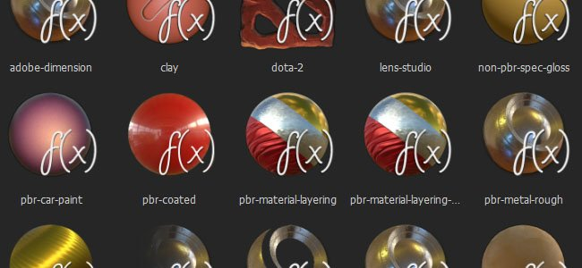

# Eigene Schattierungen

Substance Painter verwendet Shader, um Materialien in seinem Echtzeit-Viewport zu rendern.

Es ist möglich, benutzerdefinierte Shader zu schreiben, um neue Verhaltensweisen zu implementieren oder den Viewport einfach mit anderen Renderern abzugleichen. Zusätzliche Shader für Substance Painter finden Sie auf [Substance share](https://share.allegorithmic.com/libraries?by_category_type_id=6).

## Standardschattierungen

Standardmäßig umfasst Substance Painter die folgenden Shader:

{children} kann nicht gerendert werden. Seite nicht gefunden: Standardschattierungen.

## Erstellen neuer Schattierungen

Das Erstellen neuer benutzerdefinierter Shader ist durch einfaches Erstellen neuer **.glsl**-Dateien möglich.

Ein detaillierter [Shader-API](https://helpx.adobe.com/substance-3d/unlisted/documentation/spdoc/custom-shader-api-89686018.html) ist verfügbar und stellt Effektfunktionen bereit, um neue Helfer zu erstellen und in den bestehenden Workflow zu integrieren.
