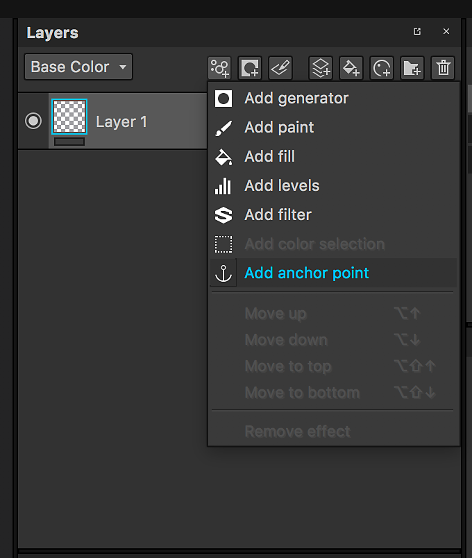

# Ankerpunkt

Mit einem Ankerpunkt können beliebige Ressourcen oder Elemente im Ebenenstapel gelegt und in verschiedenen Bereichen des Ebenenstapels mit unterschiedlichen Einstellungen referenziert werden. Mit ihnen eröffnen sich völlig neue Möglichkeiten. Ebenen und Masken können miteinander verknüpft werden. Ein einziger Ankerpunkt hat Auswirkungen auf mehrere Aspekte deines Projekts und Substance 3D Painter wird so zu einem nichtlinearen Erlebnis transformieren.

>[!NOTE]
>
> Ein Ankerpunkt kann nur innerhalb derselben Textur referenziert werden, die erstellt wurde. Das Erstellen von Verknüpfungen zwischen einem Anker und seinen Referenzen ist in Textursätzen nicht möglich.

## Ankerpunkt hinzufügen

Ankerpunkte sind im Menü &quot;Effekte&quot; verfügbar. Sie können sowohl auf Ebenen als auch auf Masken hinzugefügt werden.

## Ankerpunkt als Referenz verwenden.

Ein Ankerpunkt kann von einer anderen Ebene referenziert werden: Dadurch wird der Inhalt des Ankerpunkts in die Ebene instanziieren, die darauf verweist.

Ankerpunkte können in den folgenden Ressourcen als Referenz verwendet werden:

* Füllebene
* Fülleffekt
* Eingabe eines Substance-Filters (Effekt, Prozedural, Generator)

Nur Ankerpunkte, die **unterhalb von** der Ebene liegen, auf die verwiesen wird, können als Verweise verwendet werden.\
Wenn Sie einen Ankerpunkt über eine Ebene bewegen, die darauf verweist, wird der Verweis beschädigt. Sie können diese Aktion rückgängig machen, wenn Sie sie abbrechen möchten.

## Suchen nach Referenzen für einen Ankerpunkt

Wenn Sie auf einen Ankerpunkt klicken, können Sie in den Eigenschaften die Liste der Ebenen sehen, auf denen dieser Ankerpunkt als Referenz dient.

## Ankerpunkt suchen

Wenn Sie als Füllebene/Effekt einen Ankerpunkt als Referenz verwenden, können Sie zum Ankerpunkt springen.

