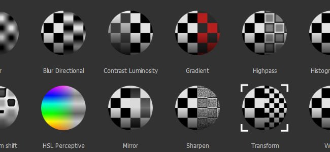

# Effekte

{width="450px"}

Bei den Effekten handelt es sich um verschiedene **Aktionen**, die auf **den Inhalt** oder **die Maske** einer **Ebene** im Ebenenstapel von Substance 3D Painter angewendet werden können.\
Sie ermöglichen eine unendliche Reihe von Änderungen von einfachen Farbvariationen bis hin zu komplexen Maskenerstellungen. Im Lieferumfang von Substance 3D Painter sind standardmäßig mehrere Effekte enthalten. Sie können aber auch eigene Effekte in Substance 3D Designer erstellen.

Effekte können dem Stapel durch **einen Rechtsklick** auf eine beliebige Ebene oder Maske oder durch Klicken auf die dedizierte **Schaltfläche oben** im Fenster &quot;Ebenenstapel&quot; hinzugefügt werden.\
Die meisten Effekte verfügen über eine Füllmethode und Deckkraft, wie normale Ebenen, und können neu angeordnet werden. So kannst du zum Beispiel einen ganzen Stapel an Effekten erstellen und eine komplexe Maske erstellen.

>[!NOTE]
>
> Sie können mit der rechten Maustaste auf einen Effekt klicken, um ihn neu anzuordnen, aber auch mit Alt+Nach-oben- oder Nach-unten-Taste schnell neu anordnen.

Dies sind die verschiedenen Effekttypen, die Sie in Substance 3D Painter finden:

* [Generator](generator.md)
* [Farbe](paint.md)
* [Füllen](fill.md)
* [Tonwertkorrektur](levels.md)
* [Vergleichsmaske](compare-mask.md)
* [Filter](filter.md)
* [Ankerpunkt](anchor-point.md)
