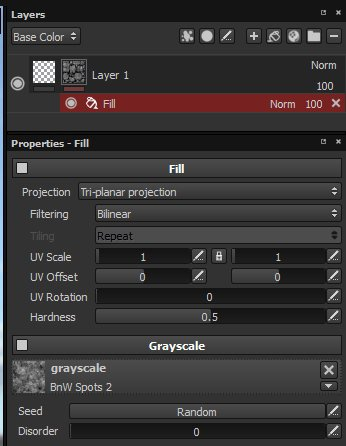

# Füllen

Fülleffekte sind mit einer Füllebene identisch, können jedoch als Effekt auf eine Ebene oder eine Maske angewendet werden, sodass komplexere Materialien oder Masken in einer einzigen Ebene erstellt werden können.

