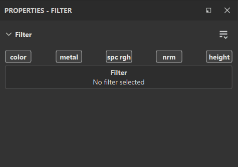

# Filter

Filtereffekte sind Substanzen, mit denen der Inhalt einer Ebene oder Maske transformieren wird. Mit dem Mischmodus &quot;Passthrough&quot; kann eine Ebene die Ergebnisse des Ebenenstapels ändern. Mit dem Mischmodus &quot;Passthrough&quot; kannst du Filter auf einer Ebene anwenden, um den Ebenenstapel insgesamt zu verändern.

## Wie kann ich einen Filter anwenden?

Je nach Filtertyp muss ein Filtereffekt auf dem Inhalt oder der Maske einer Ebene erstellt werden. Es gibt zwei Möglichkeiten, einen Filter anzuwenden:

* Der manuelle Ansatz erfordert mehrere Schritte zum Einrichten des Filters, bietet jedoch eine direkte Kontrolle über jeden Schritt des Prozesses.
* Der Drag-and-Drop-Ansatz ermöglicht das schnelle Hinzufügen eines Filters und stellt den Mischmodus automatisch auf &quot;Passthrough&quot; für alle Kanäle ein.

### Manuelles Hinzufügen eines Filters

Im folgenden Beispiel wird ein Weichzeichnungsfilter auf den Inhalt einer Ebene angewendet, aber er wird häufiger für das Anwenden von Filtern auf Masken verwendet:

**1. Filtereffekt hinzufügen**

Wählen Sie zunächst entweder den Inhalt einer Ebene oder die Ebenenmaske aus und klicken Sie dann auf die Schaltfläche **Effekt** (oder klicken Sie mit der rechten Maustaste, um das Kontextmenü zu öffnen). Wählen Sie die Option &quot;**Filter hinzufügen** &quot; in der Liste aus.

**2. Filter im Eigenschaftenfenster auswählen**

Im Bereich &quot;**Eigenschaften&quot;** wurde noch kein Filter ausgewählt. Klicken Sie auf die Schaltfläche &quot;Filterauswahl&quot;, um das Mini-Regal zu öffnen, und wählen Sie den gewünschten Filter aus. Hier wählen wir den **Weichzeichnungsfilter** aus.

>[!NOTE]
>
> Wenn Sie einen Filter manuell anwenden, sollten Sie daran denken, dass Sie möglicherweise den Mischmodus &quot;Passthrough&quot; verwenden müssen, wenn der Filter sich auf den Inhalt der darunter liegenden Ebenen auswirken soll.

## Ziehen und Ablegen eines Filters aus dem Regal

Diese Methode ist nur für Filter gedacht, die für den gesamten Ebenenstapel gelten sollen. Es werden automatisch alle Kanal [Füllmethoden](../../interface/layer-stack/blending-modes.md) festgelegt. Es funktioniert nicht, um Filter auf eine Maske anzuwenden.

**1. Öffnen Sie den Bereich &quot;Filter&quot; des Regals &quot;**

Klicken Sie im Regal links auf den Bereich &quot;Filter&quot;.

**2. Ziehen und Ablegen des Filters**

Wählen Sie den Filter aus, den Sie im Regal verwenden möchten. Ziehe die Ebene in deinen Ebenenstapel, um sicherzustellen, dass sie an der richtigen Stelle platziert wird (zum Beispiel, um sie nicht in unerwünschten Gruppen abzulegen).

Beachten Sie im obigen Beispiel, dass der abgelegte Filter bereits über einen Passthrough-Füllmethode verfügt. Dies gilt für alle Kanäle des Dokuments.

## Neue Filter zu Painter hinzufügen

Wenn Sie neue Filter in Painter importieren möchten, können Sie sie wie Standardressourcen hinzufügen. Ziehen Sie die Sbsar-Dateien einfach per Drag &amp; Drop in das Bedienfeld **Elemente**, und Sie können den Import der neuen Filter verwalten.

## Erstellen eigener Filter

Alle Filter sind Substance, die mit Substance 3D Designer erstellt werden können. Substance 3D Designer bietet Vorlagen für Substance 3D Painter, die Ihnen den schnellen Einstieg erleichtern.

Weitere Informationen finden Sie auf dieser Seite : [Erstellen benutzerdefinierter Effekte](../../content/creating-custom-effects/creating-custom-effects.md)

## Standardfilter in Painter

### Standard

* [Weichzeichnen](filters/standard/blur.md)
* [Weichzeichnungsrichtung](filters/standard/blur-directional.md)
* [Weichzeichnen-Steigung](filters/standard/blur-slope.md)
* [Tonwerte limitieren](filters/standard/clamp.md)
* [Farbbalance](filters/standard/color-balance.md)
* [Farbkorrektur](filters/standard/color-correct.md)
* [Kontrast Luminanz](filters/standard/contrast-luminosity.md)
* [Schlagschatten](filters/standard/drop-shadow.md)
* [Flächenfarbe](filters/standard/fill-area-color.md)
* [Flächenmaske füllen](filters/standard/fill-area-mask.md)
* [FXAA (Anti-Aliasing)](filters/standard/fxaa-anti-aliasing.md)
* [Glühen](filters/standard/glow.md)
* [Verlauf](filters/standard/gradient.md)
* [Dynamischer Verlauf](filters/standard/gradient-dynamic.md)
* [Graustufenkonvertierung](filters/standard/grayscale-conversion.md)
* [Hochpass](filters/standard/highpass.md)
* [Histogramm-Scan](filters/standard/histogram-scan.md)
* [Histogrammverschiebung](filters/standard/histogram-shift.md)
* [HSL](filters/standard/hsl-perceptive.md)
* [Invertieren](filters/standard/invert.md)
* [Spiegel](filters/standard/mirror.md)
* [verpixeln](filters/standard/pixelate.md)
* [Tontrennung](filters/standard/posterize.md)
* [Schärfen](filters/standard/sharpen.md)
* [Glätten](filters/standard/smoothstep.md)
* [Schwellenwert](filters/standard/threshold.md)
* [Transformieren](filters/standard/transform.md)
* [Verformen](filters/standard/warp.md)

### Fertigstellung

* [MattFinish-Pinsel linear](filters/finishes/matfinish-brushed-linear.md)
* [MatFinish galvanisiert](filters/finishes/matfinish-galvanized.md)
* [MatFinish Grainy](filters/finishes/matfinish-grainy.md)
* [MatFinish Grinded](filters/finishes/matfinish-grinded.md)
* [MatFinish Hammered](filters/finishes/matfinish-hammered.md)
* [MatFinish Lochkreise](filters/finishes/matfinish-perforated-circles.md)
* [mattFinish pulverbeschichtet](filters/finishes/matfinish-powder-coated.md)
* [MatFinish Raw](filters/finishes/matfinish-raw.md)
* [MattFinish Rough](filters/finishes/matfinish-rough.md)

### MatFX

* [MatFX Comic Book](filters/matfx/matfx-comic-book.md)
* [MatFX Detail-Edge Wear](filters/matfx/matfx-detail-edge-wear.md)
* [MatFX Edge Damages](filters/matfx/matfx-edge-damages.md)
* [MatFX HBAO](filters/matfx/matfx-hbao.md)
* [MatFX Öl-Malen](filters/matfx/matfx-oil-paint.md)
* [MatFX Peeling-Malen](filters/matfx/matfx-peeling-paint.md)
* [MatFX Rost Verwitterung](filters/matfx/matfx-rust-weathering.md)
* [MatFX-Absperrleitung](filters/matfx/matfx-shut-line.md)
* [MatFX Watercolor](filters/matfx/matfx-watercolor.md)
* [MatFX Wassertropfen](filters/matfx/matfx-water-drops.md)

### Beleuchtung

* [Umgebung mit vorberechnete Beleuchtung](filters/lighting/baked-lighting-environment.md)
* [Baking geführt Beleuchtung stilisiert](filters/lighting/baked-lighting-stylized.md)

### Erweitert

* [Anisotropes Kuwahara](filters/advanced/anisotropic-kuwahara.md)
* [Abgeflachte Kante](filters/advanced/bevel.md)
* [Weiche Abschrägung](filters/advanced/bevel-smooth.md)
* [Farbabgleich](filters/advanced/color-match.md)
* [Richtungsabstand](filters/advanced/directional-distance.md)
* [Gradationskurve](filters/advanced/gradient-curve.md)
* [Height anpassen](filters/advanced/height-adjustments.md)
* [Height auf Normal](filters/advanced/height-to-normal.md)
* [Maskenkontur](filters/advanced/mask-outline.md)
* [PBR-Validierung](filters/advanced/pbr-validate.md)
* [Quantisieren](filters/advanced/quantize.md)
* [Stilisierung](filters/advanced/stylization.md)
* [Tri-Planar Advanced](filters/advanced/tri-planar-advanced-filter.md)
