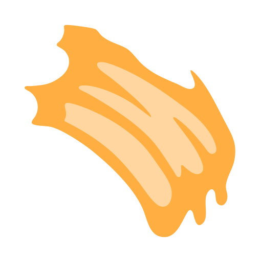

---

title: Stilisierung
description: Erfahren Sie, wie Sie den Stilisierungsfilter von Substance 3D Painter verwenden.
source-git-commit: 644a36a1dde953c1d793821e104049ebb6ec3c19
workflow-type: tm+mt
source-wordcount: '1055'
ht-degree: 1%
---

# Stilisierung

<table>
<tr style="border: 0;">
<td width="33.33%" style="border: 0;" valign="top">

<b>In:</b> Effekte/stilisiert, Stilisierung, realistisch, Hand, gemalt, Pinsel

</td>
<td width="100.00%" style="border: 0;" valign="top">

## Beschreibung

Der Stilisierungsfilter verleiht einem Material ein handgemaltes, stilisiertes Aussehen.

Es wird auf einer Textur-Ebene verwendet, um malerische Pinselstriche, Variationen der Smoothness, Farbneuzuordnungen und Baking geführt Beleuchtungseffekte hinzuzufügen.

</td>
</tr>
</table>

## Eingaben

| Eingabename | Beschreibung |
| --- | --- |
| <b>Ambient occlusion Base:</b> Color |  |
| <b>Krümmung:</b> Farbe |  |
| <b>Normale Basis:</b> Farbe |  |

## Parameter

| Parametername | Beschreibung |
| --- | --- |
| <b>Stilisierung:</b> | Passen Sie die globale Intensität des Filters an. |
| <b>Pinselstriche:</b> | Passen Sie die Gesamtintensität des Pinselstricheffekts an. |
| <b>Smoothness:</b> | Passen Sie die Gesamtintensität des Effekts &quot;Smoothness&quot; an. |
| <b>Einfärben:</b> | Passen Sie die Gesamtintensität des Einfärbungseffekts an. |
| <b>Verlauf:</b> | Passen Sie die Gesamtintensität des Verlaufseffekts an. |
| <b>Baking geführt Beleuchtung:</b> | Passen Sie die Gesamtintensität des Baking geführt Beleuchtungseffekts an. |
| <b>Kanten und Hohlräume:</b> | Passen Sie die Gesamtintensität des Effekts &quot;Kanten und Hohlräume&quot; an. |

### Pinselstriche

| Parametername | Beschreibung |
| --- | --- |
| <b>Konturstärke:</b> | Passen Sie die Anzahl der Pinselstriche an, die vom Filter verwendet werden. |
| <b>Konturmodus:</b> | Wählen Sie die Art der Pinselstriche aus, die vom Filter verwendet werden. |
| <b>Konturen auswählen:</b> | Wählen Sie die Pinselstrichformen aus, die bei Verwendung mehrerer Konturen projiziert werden sollen. |
| <b>Konturen auswählen:</b> | Wählen Sie die Pinselstrichform aus, die projiziert werden soll, wenn Sie eine einzelne Kontur verwenden. |
| <b>Konturenskalierung:</b> | Passen Sie die Skalierung der Pinselstriche an. |
| <b>Nicht einheitliche Größe:</b> | Schalten Sie die ungleichmäßige Skalierung für die projizierten Pinselstriche um. |
| <b>Konturgröße:</b> | Passen Sie das Seitenverhältnis der projizierten Pinselstriche an. |
| <b>Konturen, Skalierung zufällig:</b> | Passen Sie die Stärke der zufälligen Skalierungsvariation an, die auf die Pinselstriche angewendet wird. |
| <b>Konturen folgen Oberfläche:</b> | Schaltet die Ausrichtung der Pinselstriche auf die Ausrichtung des Meshs um. |
| <b>Konturdrehung:</b> | Passen Sie den Drehwinkel des Pinselstrichs an. |
| <b>Drehung der Striche zufällig:</b> | Passen Sie den Grad der zufälligen Drehung an, die auf die Pinselstriche angewendet wird. |
| <b>Projektion Härte:</b> | Passen Sie die Härte der Stempel-Projektion an. |
| <b>Normaler Schwellenwert:</b> | Passen Sie den normalen Schwellenwert für die Projektion der Kontur an. |

### Pinselstricheffekte

| Parametername | Beschreibung |
| --- | --- |
| <b>Benutzerdefinierte Farbe:</b> | Verwenden Sie eine eigene Farbe für die Pinselstriche. |
| <b>Farbvariation:</b> | Passen Sie an, wie stark sich die Pinselstriche mit der Grundfarbe vermischen. |
| <b>Farbdeckkraft:</b> | Passen Sie die Deckkraft der benutzerdefinierten Farbe an, die auf die Pinselstriche angewendet wird. |
| <b>Farbe:</b> | Passen Sie die auf die Pinselstriche angewendete benutzerdefinierte Farbe an. |
| <b>Farbzufall:</b> | Passen Sie die Stärke der zufälligen Farbvariation an, die auf die Pinselstriche angewendet wird. |
| <b>Benutzerdefinierte Rauheit:</b> | Verwenden Sie einen benutzerdefinierten Wert für die Rauheit der Pinselstriche. |
| <b>Variation der Rauheit:</b> | Passen Sie die Variation der Rauheit über die Pinselstriche hinweg an. |
| <b>Rauheit:</b> | Passen Sie die Rauheit der Pinselstriche an. |
| <b>Metallic benutzerdefinierter Benutzer:</b> | Verwenden Sie einen benutzerdefinierten metallic Wert für die Pinselstriche. |
| <b>Metallic Variation:</b> | Passen Sie metallic Variationen über die Pinselstriche hinweg an. |
| <b>Metallic:</b> | Passen Sie den metallic Wert der Pinselstriche an. |
| <b>Benutzerdefiniert:</b> | Legen Sie für die Pinselstriche weitere Optionen für die normale Zuordnung fest. |
| <b>Normale Variation:</b> | Passen Sie die Intensität der Pinselstriche im normalen Kanal an. |
| <b>Normaler Zufallswert:</b> | Passen Sie die Stärke der zufälligen normalen Variation an, die auf die Pinselstriche angewendet wird. |
| <b>Füllmethode (Normal):</b> | Wählen Sie den normalen Mischmodus für die Pinselstriche aus. |

### Glättung

| Parametername | Beschreibung |
| --- | --- |
| <b>Farb-Smoothness:</b> | Passen Sie den Kuwahara-Glättungseffekt an, der auf die Grundfarbe angewendet wird. |
| <b>Rauheit Smoothness:</b> | Passen Sie den Kuwahara-Glättungseffekt an, der auf die Rauheit angewendet wird. |
| <b>Metallic Smoothness:</b> | Passen Sie den Kuwahara-Glättungseffekt an, der auf Metallic angewendet wird. |
| <b>Height-Smoothness:</b> | Passen Sie den Kuwahara-Glättungseffekt an, der auf das Height angewendet wird. |
| <b>Normale Smoothness:</b> | Passen Sie den Kuwahara-Glättungseffekt an, der auf &quot;Normal&quot; angewendet wird. |
| <b>Ambient occlusion Smoothness:</b> | Passen Sie den Kuwahara-Glättungseffekt auf dem Ambient occlusion an. |

### Färben

| Parametername | Beschreibung |
| --- | --- |
| <b>Farbdeckkraft:</b> | Passen Sie die Deckkraft der auf die Grundfarbe angewendeten Farbabweichung an. |
| <b>Farbe:</b> | Wählen Sie die Farbe aus, mit der die Grundfarbe überschrieben wird. |
| <b>Schmutz-Variation:</b> | Wählen Sie die Musterform für die Farbvariation aus. |
| <b>Schmutz-Deckkraft:</b> | Passen Sie die Stärke der musterbasierten Farbvariation in der Grundfarbe an. |
| <b>Schmutz-Farbe:</b> | Passen Sie den Farbton der musterbasierten Farbvariation in der Grundfarbe an. |
| <b>Füllbetrag:</b> | Passen Sie die Anzahl der Muster an, die der Farbvariation zugeordnet sind. |
| <b>Musterskalierung:</b> | Passen Sie die Skalierung der Muster an, die der Farbvariation zugeordnet sind. |

### Verlauf

| Parametername | Beschreibung |
| --- | --- |
| <b>Verlaufsmodus:</b> | Legen Sie fest, ob der Verlauf eine oder zwei Farben verwendet. |
| <b>Farbe:</b> | Passen Sie die erste Verlaufsfarbe an. |
| <b>Farbdeckkraft:</b> | Passen Sie die Deckkraft der ersten Verlaufsfarbe an. |
| <b>Farbüberblendmodus:</b> | Wählen Sie den Mischmodus der ersten Verlaufsfarbe aus. |
| <b>Farbe 2:</b> | Passe die zweite Verlaufsfarbe an. |
| <b>Farbe 2 Deckkraft:</b> | Passen Sie die Deckkraft der zweiten Verlaufsfarbe an. |
| <b>Füllmethode für Farbe 2:</b> | Wählen Sie den Mischmodus der zweiten Verlaufsfarbe aus. |
| <b>Horizontale Drehung:</b> | Passen Sie die horizontale Drehung des Verlaufs an. |
| <b>Vertikale Drehung:</b> | Passen Sie die vertikale Drehung des Verlaufs an. |
| <b>Verlaufsumkehr:</b> | Kehre die Verlaufsmaske um. |
| <b>Verlaufsversatz:</b> | Passen Sie den Versatz der Verlaufsmaske an. |
| <b>Verlaufskontrast:</b> | Passen Sie den Kontrast der Verlaufsmaske an. |

### Baking geführt Beleuchtung

| Parametername | Beschreibung |
| --- | --- |
| <b>Pinselstriche in der Beleuchtung:</b> | Passen Sie an, wie stark die Variation des Pinselstrichs in der Baking geführt Beleuchtung erscheint. |
| <b>Datenintensität:</b> Diffusen | Passe die Intensität des diffusen Lichts an. |
| <b>Diffuse:</b> | Passe die Farbe des diffusen Lichts an. |
| <b>Diffusen-Radius:</b> | Passen Sie den Radius des diffusen Lichts an. |
| <b>Datenkontrast:</b> Diffusen | Passe den Kontrast des diffusen Lichts an. |
| <b>Specular-Intensität:</b> | Passen Sie die Intensität des Specular-Lichts an. |
| <b>Specular-Farbe:</b> | Passen Sie die Specular-Lichtfarbe an. |
| <b>Specular-Radius:</b> | Passen Sie den Radius des Specular-Lichts an. |
| <b>Specular-Kontrast:</b> | Passen Sie den Kontrast des Specular-Lichts an. |
| <b>Horizontale Drehung:</b> | Passen Sie die horizontale Drehung der Lichtquelle an. |
| <b>Vertikale Drehung:</b> | Passen Sie die vertikale Drehung der Lichtquelle an. |
| <b>Farbschärfe:</b> | Passen Sie die auf die Grundfarbe angewendete Scharfzeichnung an. |
| <b>Oberflächenschärfe:</b> | Passen Sie den Mesh-basierten Effekt &quot;Oberflächendetails&quot; für die Grundfarbe an. |

### Kanten und Hohlräume

| Parametername | Beschreibung |
| --- | --- |
| <b>Modus:</b> | Wählen Sie aus, ob Hohlräume, Kanten oder beides auf der Grundfarbe zugeordnet werden sollen. |
| <b>Kontrast von Kanten und Hohlräumen:</b> | Passen Sie den Kontrast der Kanten und der Hohlraummaske an. |
| <b>Deckkraft der Hohlräume:</b> | Passe die Intensität der Hohlräume an, die in die Grundfarbe übergehen. |
| <b>Kavitätenverteilung:</b> | Passen Sie die Verteilung der Hohlräume an, die in die Grundfarbe übergehen. |
| <b>Pinselstriche in Hohlräumen:</b> | Passen Sie an, wie stark die Pinselstriche die Überblendung der Hohlräume maskieren. |
| <b>Farbe für benutzerdefinierte Hohlräume:</b> | Verwenden Sie eine eigene Farbe in den Hohlräumen. |
| <b>Hohlraumfarbe:</b> | Passen Sie die benutzerdefinierte Farbmischung in den Hohlräumen an. |
| <b>Kantendeckkraft:</b> | Passe die Intensität der Kanten an, die mit der Grundfarbe verblendet werden. |
| <b>Edges Spread:</b> | Passen Sie den Abstand der Kanten an, die mit der Grundfarbe vermischt wurden. |
| <b>Pinselstriche in Kanten:</b> | Passen Sie an, wie stark die Pinselstriche die Kantenüberblendung maskieren. |
| <b>Farbe für benutzerdefinierte Kanten:</b> | Verwenden Sie eine eigene Farbe an den Kanten. |
| <b>Kantenfarbe:</b> | Passen Sie die benutzerdefinierte Farbe an, die in die Kanten übergeht. |

#### Helfer

| Parametername | Beschreibung |
| --- | --- |
| <b>Helfer anzeigen:</b> | Wählen Sie die Helfer- oder Debuginformationen aus, die in Grundfarbe angezeigt werden sollen. |

