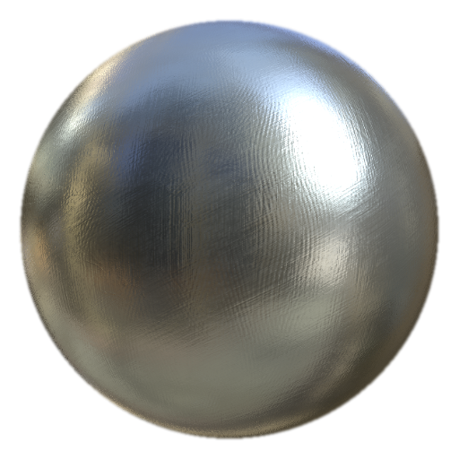

# MatFinish Grinded

<table>
<tr style="border: 0;">
<td width="33.33%" style="border: 0;" valign="top">

<b>In:</b> Effekte/Finish, Oberfläche

</td>
<td width="100.00%" style="border: 0;" valign="top">

## Beschreibung

Der MatFinish Grinded-Filter ist Teil einer Metal-Finish-Sammlung und wird verwendet, um einen geschliffenen Metalleffekt zu erzeugen.

Es wird auf einer Füllebene verwendet. Passe Füllebene, Rauheit, metallic und andere Eigenschaften der Basisoberfläche an. Gib den gewünschten Filter für die abschließende Oberflächenbehandlung ein.

</td>
</tr>
</table>

## Eingaben

| Eingabename | Beschreibung |
| --- | --- |
| <b>Position:</b> Farbe | Verwenden Sie die Baking geführt Positionszuordnung. |
| <b>Welt-Raum-Normale:</b> Farbe | Verwenden Sie die Baking geführt Welt-Raum-Normale-Map. |

## Parameter

| Parametername | Beschreibung |
| --- | --- |
| <b>Seed:</b> | Weisen Sie einen zufälligen Wert zu, um eine andere Variation zu erstellen, ohne die Gesamteinstellungen zu ändern. |
| <b>Skalierung:</b> | Passen Sie die Gesamtskala der Oberfläche an. |
| <b>Schleifintensität:</b> | Passen Sie die Intensität des Schleifeffekts an. |
| <b>Triplanare Zuordnung:</b> | Dreidimensionale Zuordnung ein/aus. |

