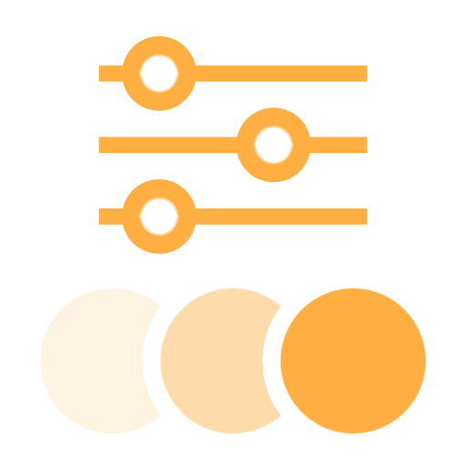

# Farbkorrektur

<table>
<tr style="border: 0;">
<td width="33.33%" style="border: 0;" valign="top">

<b>In:</b> Effekte/Farbe

</td>
<td width="100.00%" style="border: 0;" valign="top">

## Beschreibung

Der Filter &quot;Farbkorrektur&quot; nimmt Änderungen an Lichtern, Mitteltönen und Tiefen vor.

Es wird auf einer Füllebene verwendet, um subtile Anpassungen an Kontrast, Luminanz und Sättigung vorzunehmen.

</td>
</tr>
</table>

## Parameter

### Schatten

<table>
<tr>
<td><b>Kontrast:</b></td>
<td>Passe den Kontrast der Schatten an.</td>
</tr>
<tr>
<td><b>Luminanz:</b></td>
<td>Passen Sie die Helligkeit der Schatten an.</td>
</tr>
<tr>
<td><b>Sättigung:</b></td>
<td>Passe die Sättigung der Schatten an.</td>
</tr>
</table>

### Mitteltöne

<table>
<tr>
<td><b>Kontrast:</b></td>
<td>Passe den Kontrast der Mitteltöne an.</td>
</tr>
<tr>
<td><b>Luminanz:</b></td>
<td>Passen Sie die Helligkeit der Mitteltöne an.</td>
</tr>
<tr>
<td><b>Sättigung:</b></td>
<td>Passe die Sättigung der Mitteltöne an.</td>
</tr>
</table>

### Lichter

<table>
<tr>
<td><b>Kontrast:</b></td>
<td>Passe den Kontrast der Lichter an.</td>
</tr>
<tr>
<td><b>Luminanz:</b></td>
<td>Passe die Helligkeit der Lichter an.</td>
</tr>
<tr>
<td><b>Sättigung:</b></td>
<td>Passe die Sättigung der Lichter an.</td>
</tr>
</table>

