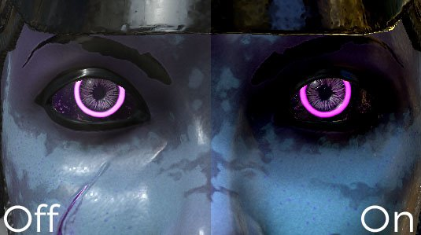

# Farbkorrektur

Farbkorrekturparameter :

| *Einstellung* | *Beschreibung* |
| --- | --- |
| **Sättigung** | Steuert die Farbintensität/-sättigung im Viewport. Verwenden Sie eine Sättigung bei 0, um ein Graustufen-Rendering zu erhalten. |
| **Kontrast** | Steuert den Unterschied zwischen hellen und dunklen Farben. |
| **Helligkeit** | Steuert die Helligkeit/Luminanz der Farben. |
| **Voreinstellung** | Legt die Luminanz des Viewports global fest. |
| **Sepiatonverhältnis** | Erweiterter Parameter, um dem Viewport einen Sepia-Effekt zu verleihen. |
| **Weißabgleichstemperatur (K)** | Temperatur der Farben, in Kelvin. Der Standardwert ist 6500 K, entsprechend dem Tageslicht. [Weitere Informationen finden Sie auf Wikipedia](https://en.wikipedia.org/wiki/Color_temperature). |
