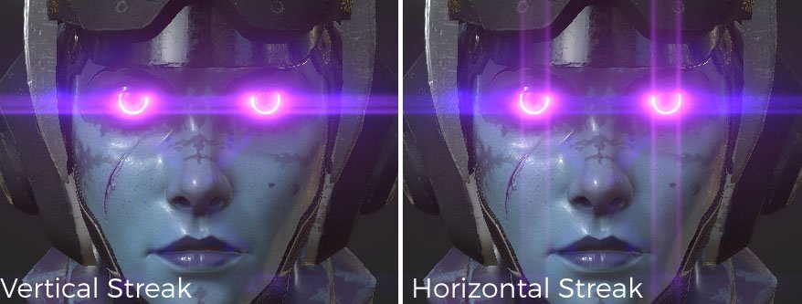

# Blendeffekt

Beschreibung der Parameter :

| Einstellung | Beschreibung |
| --- | --- |
| **Luminanz** | Das ist die Gesamthelligkeit des Blendeffekts. Wenn Sie diesen Wert auf 0,0 setzen, wird der Effekt vollständig deaktiviert.  Realistische Werte liegen im Bereich von etwa 0,5 bis 4,0, bis zu einem Maximum von etwa 16,0. |
| **Schwellenwert** | Nur Pixel, die heller als der Schwellenwert sind, werden extrahiert, um Blendeffekte zu erzeugen.  Für natürlich aussehende Ergebnisse werden Werte zwischen 0,0 und 1,0 empfohlen. |
| **Remap** **Factor** | Wenn Sie einen anderen Wert als 1,0 angeben, wird die extrahierte Komponente mit hoher Luminanz weiter nichtlinear erweitert (oder komprimiert). Wenn Sie einen Wert über 1,0 übergeben, wird die Blendung für helle Pixel stärker.  Verwenden Sie diese Option, wenn Sie die Luminanzzuordnung der Blendung isoliert anpassen möchten, ohne andere Effekte zu beeinträchtigen. Die Luminanz nach dem Helldurchgang nimmt in einer glatten Kurve zu, wobei sich die Luminanzwerte 1,0 dem **Remap-Faktor** nähern und die Luminanzwerte größer als 1,0 dem **Remap** **Faktor** ^2). |
| **Form** | Die Form definiert das Aussehen der Blendung, verschiedene Modelle sind verfügbar:<ul data-preserve-html="true"><li data-preserve-html="true"><strong>Blüte</strong> : Nur Blüteneffekt.</li><li data-preserve-html="true"><strong>Blendenfleck:</strong> Blüte / Geister (Blendenfleck) / Nachbild.</li><li data-preserve-html="true"><strong>Standard:</strong> Geben Sie einen guten Ausgleich aller Grundelemente ein.</li><li data-preserve-html="true"><strong>Billiges Objektiv:</strong> Scharfes Ghosting und andere Darstellungen eines billigen Objektivs. </li><li data-preserve-html="true"><strong>Nachher-Image:</strong> Geben Sie einen Typ mit sehr starkem Nachher-Image ein. </li><li data-preserve-html="true"><strong>Filter Cross Screen:</strong> Objektiv mit Generator des kreuzförmigen Sternfilters angeschlossen.</li><li data-preserve-html="true"><strong>Bildschirmübergreifende Spektralfilter</strong>: Linse mit Generator eines kreuzförmigen Sternfilters mit starkem Spektralbereich.</li><li data-preserve-html="true"><strong>Snow-Kreuz filtern</strong> : Objektiv mit Generator des Sternfilters in sechs Richtungen angebracht.</li><li data-preserve-html="true"><strong>Querspektrum des Snows filtern</strong> : Linse mit Generator eines Sternfilters mit starkem Spektrum in sechs Richtungen.</li><li data-preserve-html="true"><strong>Sunny Cross filtern</strong> : Objektiv mit Generator des Sternfilters in acht Richtungen angebracht.</li><li data-preserve-html="true"><strong>Sunny Cross Spectral filtern</strong> : Objektiv mit Generator eines Sternfilters mit starkem Spektrum in acht Richtungen angebracht.</li><li data-preserve-html="true"><strong>Horizontaler Streifen</strong> : Dieser Blendenfleck-Typ erzeugt starke horizontale Sternstreifen.</li><li data-preserve-html="true"><strong>Vertikaler Streifen</strong> : Tippe mit starken Sternen in vertikaler Richtung. Schmieren für CCD Digitalkamera, etc.</li></ul> |

## Beispiele für Formen

