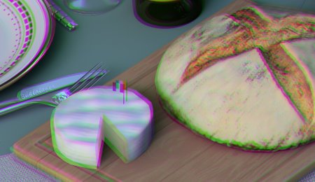

# Laterale Aberration

Simuliert eine chromatische Aberration durch Verschieben von Farbkanälen vom Bildmittelpunkt aus nach außen, wodurch die Farbränder an den Rändern von Objektiven mit realer Kamera wiedergegeben werden.

| <b>Parameter</b> | <b>Beschreibung</b> |
| --- | --- |
|  |  |
| --- | --- |
| <b>Betrag</b> | Steuert die Intensität des Effekts &quot;Farbränder&quot;. Höhere Werte führen zu einem ausgeprägteren Kanalabstand zu den Kanten. |
| <b>Radius</b> | Steuert die Größe des nicht betroffenen mittleren Bereichs. Kleinere Werte rücken den Aberrationseffekt näher in die Mitte und wirken sich auf einen größeren Teil des Bildes aus. |
| <b>Weichheit</b> | Steuert die Smoothness der Überblendung zwischen dem korrigierten Mittelpunkt und den abweichenden Kanten. |
| <b>Verhältnis</b> | Legt das Seitenverhältnis des betroffenen Bereichs fest. Mit dem Wert 1 erstellen Sie eine Kreisform. Werte größer als 1 erstellen ein breiteres, elliptisches Muster. |
| <b>Center X</b> | Horizontale Lage des optischen Zentrums, von dem die Aberration ausgeht. |
| <b>Center Y</b> | Vertikale Lage des optischen Zentrums, von dem die Aberration ausgeht. |
| <b>Achromatische Aberrationen</b> | Ändert die Aberrationsfarben von normalen Regenbogenfarben zu Grün-/Violetttönen. |
