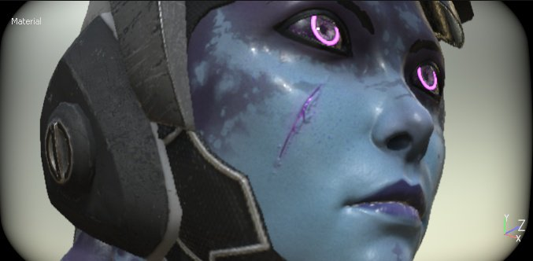
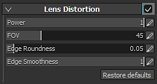

# Objektivverzerrungen

Die Verzerrung eines Objektivs ist eine optische Erscheinung, die zu einer Schwellung oder Schrumpfung in Richtung des Bildumfangs führt. Die Quellung wird als tonnenförmige Verzerrung und die Schrumpfung als kissenförmige Verzerrung bezeichnet.\
Je besser das Objektiv der Kamera ist, desto weniger werden diese Phänomene auftreten. Dieser Effekt kann verwendet werden, um ein nicht perfektes Objektiv und damit realistischere Bilder zu simulieren.

| *Einstellung* | *Beschreibung* |
| --- | --- |
| **Leistung** | Steuert, wie schnell die Verzerrung vom Bildschirmrand aus angewendet wird. |
| **FOV** | Steuert die Verzerrung des Objektivs (simuliertes Sichtfeld). |
| **Kantenrundung** | Steuert die runde Form an den Rändern oder am Viewport. |
| **Kantenglättung** | Steuert die Härte/Smoothness der schwarzen Kanten des Viewports. |
