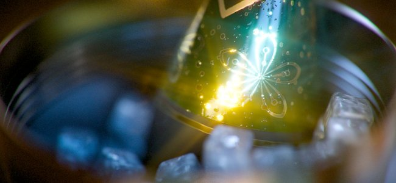

# Nachbearbeitung

Post-Effects sind Filter, die auf Bilder angewendet werden können, die im Viewport von Substance 3D Painter gerendert werden, um häufige Effekte auf die Kamera zu simulieren.

Post-Effekte können in jedem Projekt über das Fenster [Anzeigeeinstellungen](../../interface/display-settings/display-settings.md) aktiviert werden.

>[!NOTE]
>
> Diese Post-Effekte werden aus Gründen der Übersichtlichkeit nicht auf die 2D-Ansicht angewendet. Nur die 3D-Ansicht zeigt das Bildergebnis mit den Effekten an.

Auf den folgenden Seiten werden die verschiedenen Nachbearbeitungseffekte beschrieben, die derzeit unterstützt werden:

* [Schärfentiefe](depth-of-field.md)
* [Bloom](bloom.md)
* [Blendeffekt](glare.md)
* [Blendenflecke](lens-flare.md)
* [Laterale Aberration](lateral-aberration.md)
* [Vignette](vignette.md)
* [Schärfen](sharpen.md)
* [Filmkörnung](film-grain.md)
* [Tone Mapping](tone-mapping.md)
* [Farbkorrektur](color-correction.md)

Die Tabelle &quot;Lookup-Textur&quot; kann auch zur Feinabstimmung des endgültigen Bildergebnisses verwendet werden. Weitere Informationen finden Sie in der Dokumentation zu [Farbprofil](color-profile.md).
