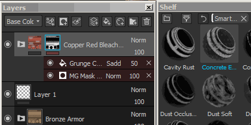
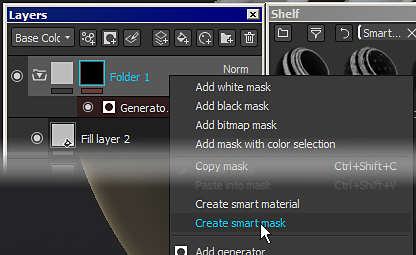

# Intelligente Materialien und Masken.

Substance 3D Painter unterstützt die Verwendung erweiterter **Ebenenvorgaben** . Diese Vorgaben können verwendet werden, um schnell **einen**&#x200B;ähnlichen Texturierungsprozess für **Textursatz oder Projekte freizugeben**, während die Ergebnisse unterschiedlich sind, **angepasst an die Mesh-Topologie** .

>[!NOTE]
>
> Beachten Sie, dass es nach dem Hinzufügen im Ebenenstapel nicht möglich ist, das verwendete intelligente Material abzurufen. Wenn ein intelligente Material aktualisiert werden muss, muss der Prozess manuell durchgeführt werden.\
> Einzelne Ressourcen können jedoch mit [Resources Updater](plugins/resources-updater.md) aktualisiert werden.

## Wie werden Intelligente Materialien/Masken verwendet?

Intelligente Materialien können überall im Ebenenstapel verwendet werden, während intelligente Masken nur im Effekt-Stapel verwendet werden können.\
Weitere Informationen zu den Unterschieden finden Sie unter : [Ebenenstapel](../interface/layer-stack/layer-stack.md) und [Effekte](effects/effects.md)

### Hinzufügen eines Intelligenten Materials

Intelligente Materialien können auf zwei verschiedene Arten hinzugefügt werden:

* Durch Ziehen und Ablegen eines intelligenten Materials aus dem Regal in den Ebenenstapel :\
  
* Durch Klicken auf die Schaltfläche Intelligente Material , um ein Mini-Regal zu öffnen:\
  

### Hinzufügen einer Intelligente Maske

Da Intelligente Masken Effektvorgaben sind, können sie nur zu Effekt-Stapeln hinzugefügt werden (speziell für Masken).

* Um eine Intelligente Maske hinzuzufügen, ziehen Sie einfach **eine Datei vom Regal auf die Ebene** target **und legen Sie sie dort ab:**\
  
* Durch Ziehen und Ablegen von **mehreren** Intelligente Masken werden diese angesammelt:\
  
* Es ist jedoch möglich, **den gesamten Stapel zu ersetzen**, indem Sie **STRG** während des Drag &amp; Drop drücken:\
  

### Wie erstelle ich Intelligente Materialien/Masken?

Zum Erstellen eines Intelligenten Materials ist ein **Ordner** erforderlich.\
Der Inhalt der Intelligente Materialien wird in dem Ordner gespeichert. Klicken Sie dann einfach mit der rechten Maustaste auf den Ordner und wählen Sie &quot;**intelligente Material erstellen** &quot; aus. Das Intelligente Material wird dann dem aktuellen Regal hinzugefügt und entsprechend dem ausgewählten Ordner benannt.

Klicken Sie zum Erstellen einer Intelligente Maske einfach mit der rechten Maustaste auf eine Ebene und wählen Sie &quot;**intelligente Maske erstellen**&quot; aus.

## Wie kann ich ein intelligente Material/eine Maske freigeben/abrufen?

Die Vorgaben werden **auf dem Datenträger &quot;**&quot; gespeichert und können aus dem entsprechenden Ordner abgerufen werden.\
Informationen zum Suchen des Speicherorts des **Regals** finden Sie unter : [Hinzufügen von Inhalten auf der Festplatte](../content/importing-assets/adding-content-on-the-hard-drive.md) .

Dann kann jeder die Datei einfach **importieren** in sein Substance 3D Painter-Regal, um die Vorgabe zu verwenden.
