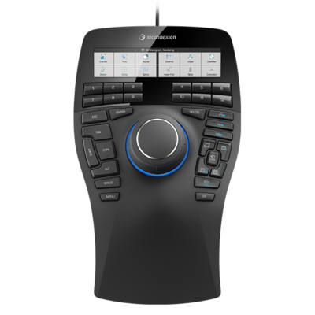

# SpaceMouse® by 3Dconnection

Die SpaceMouse® by 3D-Verbindung ist ein Gerät, das die einfache Navigation in 3D ermöglicht. Sie kann verwendet werden, um das Kamera/3D-Modell im Application Viewport zu bearbeiten.

* Die SpaceMouse® wird seit Version 7.4.2 unterstützt.
* Um dieses Gerät ordnungsgemäß zu verwenden, installieren Sie den neuesten Treiber von [3Dconnection](https://3dconnection.com/uk/drivers/).

>[!NOTE]
>
> Benutzer, die das Kompaktmodell verwenden und häufig die Umgebungszuordnung drehen müssen, können die Umschalttaste der linken Schaltfläche zuweisen.

## Tutorial

## Überblick

Mit dem Hauptkontrollknopf oder der SpaceMouse® können Sie den Viewport so drehen, schwenken und zoomen, wie dies mit normalen Maus-/Stift- und Tastatursteuerelementen nicht möglich ist. Das Gerät kann in Kombination mit Maus und Tablets mit Eingabestift verwendet werden.

Alle Modelle und Versionen sollten mit der Anwendung kompatibel sein:

| Modell | Beschreibung | Visuell |
| --- | --- | --- |
| **Kompaktes Modell** | Basismodell mit Knopfsteuerung. | 

 |
| **Pro-Modell** | Knopfsteuerung und zusätzliche Tasten für Tastatur-Tastaturbefehl. | 

 |
| **Unternehmensmodell** | Knopfsteuerung, zusätzliche Tasten und Kontextanzeige. | 

 |

>[!NOTE]
>
> Die Modelle Compact, Pro und Enterprise wurden getestet und validiert, um ordnungsgemäß mit der Anwendung zu funktionieren.

## Radial-Menü

Das Menü kann direkt vom Gerät aus aufgerufen werden:

* Auf dem Kompaktmodell, indem Sie auf die linke Schaltfläche klicken und Eigenschaften aus dem radialen Menü auswählen:

  {width="250px"}
* Bei den Modellen Pro und Enterprise kann auf das Eigenschaftenmenü durch Drücken der Menüschaltfläche zugegriffen werden.

Alternativ können Sie mit der rechten Maustaste auf das 3D-Verbindungssymbol in der Taskleiste (neben der Systemuhr) klicken und **3D-Verbindungseinstellungen öffnen** auswählen. Dieses Menü ist kontextsensitiv, basierend auf dem zuletzt aktiven Fenster. Die Titelleiste gibt an, welchem Programm es entspricht. Wenn es sich nicht um Adobe Substance 3D Painter handelt, wechseln Sie zum Fenster &quot;Painter&quot; und kehren Sie dann zum Einstellungsfenster zurück:

## Standardeinstellungen

{width="400px"}

Im Einstellungsbedienfeld von SpaceMouse® sind die Standardeinstellungen für Painter in der neuesten Treiberversion verfügbar. Es ist keine zusätzliche Konfiguration erforderlich. Schließen Sie das Gerät einfach an, und es wird per Plug-and-Play wiedergegeben.

Stellen Sie sicher, dass Sie das richtige Gerät aus dem oberen Dropdown-Menü auswählen, standardmäßig sollte es das richtige auswählen.

Der Regler &quot;Geschwindigkeit&quot; ändert die Empfindlichkeit in alle Achsen und Richtungen.

### Erweiterte Einstellungen

Durch Klicken auf die Schaltfläche &quot;Erweiterte Einstellungen&quot; können Sie das detaillierte Verhalten der Hauptsteuerelemente ändern.

Jede Standardeinstellung kann geändert werden. Es gibt zwei wichtige Abschnitte mit den Registerkarten **Navigationsmodi** und **Rotationszentrum**.

#### Navigationsmodi

{width="400px"}

Definieren Sie das Verhalten des Drehknopfes in 3D:

| Einstellung | Beschreibung |
| --- | --- |
| Objektmodus | Der Knopf ist das 3D-Objekt selbst, er ist die Standardeinstellung. |
| Kamera Mode | Steuern Sie die Kamera frei in 3D. |
| Kamera-Zielmodus | Steuere die Kamera, die immer auf einen Punkt im 3D-Raum zielt. |
| Hubschraubermodus | Steuern Sie einen Helikopter im 3D-Raum. |
| Horizont sperren | Um die Kamera so zu fixieren, dass der Horizont immer horizontal ausgerichtet ist. Painter bietet bereits eine ähnliche Option in seinen Einstellungen, kann aber hier separat gesteuert werden. Es ist standardmäßig gesperrt. |

#### Rotationszentrum

{width="400px"}

Definieren Sie das Verhalten des kleinen Pivot-Symbols:

| Einstellung | Beschreibung |
| --- | --- |
| Auto | Bewegen Sie das Pivot- oder Kamera-Ziel automatisch, wenn es deaktiviert ist, bleibt es immer beim Mesh-Origin-Pivot erhalten. |
| Immer anzeigen | Der Drehpunkt wird immer im 3D-Viewport angezeigt, auch wenn er nicht mit dem Gerät interagiert. |
| In Bewegung anzeigen | Der Drehpunkt wird im 3D-Viewport nur angezeigt, wenn mit dem Gerät interagiert wird. Dies ist die Standardoption. |
| Ausblenden | Entfernen Sie den Drehpunkt im 3D-Viewport vollständig. |

>[!NOTE]
>
> Der Drehpunkt wurde speziell für Painter entwickelt, kann jedoch bei Bedarf ausgeblendet werden.

### Schaltflächen

{width="400px"}

Durch Klicken auf **Schaltflächen** ist es möglich, Befehle, Makros oder radiale Menüs zuzuweisen. Weitere Informationen finden Sie in der [3Dconnection-Dokumentation](https://3dconnection.com/uk/support/faq/).
