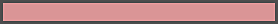
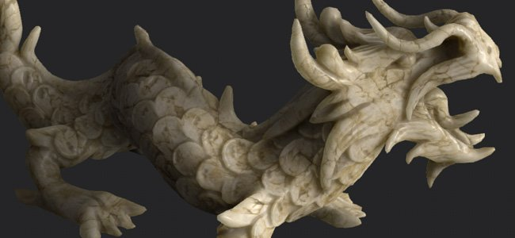
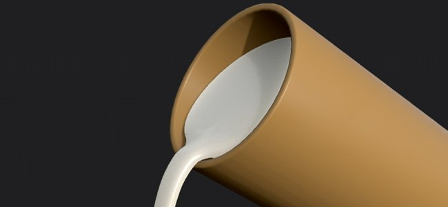

# Typ des unterirdischen Materials

Auf dieser Seite werden die verschiedenen Typen von Materialien aufgeführt, die mit der Funktion &quot;Volumenstreuung&quot; erstellt werden können, und es wird erläutert, wie Substance 3D Painter konfiguriert werden kann, um sie zu erstellen. Für jeden Typ von Material wird eine Skalierung und eine Farbe angegeben, die in den [Unteroberflächenparametern](subsurface-parameters.md) festgelegt werden können.

>[!NOTE]
>
> Die auf dieser Seite aufgelisteten Werte geben einen Überblick über die einzelnen Material. Sie sind nicht exakte Werte und müssen pro Projekt interpretiert und/oder angepasst werden.

## Menschliche Haut

Für ein gutes Hautbild ist Folgendes erforderlich:

* Eine gute Basis-Textur : für einen realistischen Charakter bedeutet dies eine große Menge an Details und verschiedenen Farben.
* Starkes Height/normale Textur: der Untergrundeffekt die Oberflächendetails weicher macht, wobei starke Details in erster Linie den Effekt kompensieren.

| *Einstellung* | *Beschreibung* |
| --- | --- |
| **Skalierung** | <ol data-preserve-html="true"><li data-preserve-html="true">05 bis 0,2</li></ol> |
| **Farbe** | **R** : 0,575 **G** : 0,894 **B** : 0,376 

 **Hinweis:** Diese Farbe eignet sich für den kaukasischen Skintyp. |

Beispiele für realistische Menschen findet man über 3D-Scans von echten Menschen:

* Digital Emily : <http://gl.ict.usc.edu/Research/DigitalEmily2/>
* Infinite Reality LPS Head : <http://www.ir-ltd.net/> | <http://casual-effects.com/data/>

## Jade

**Jade** ist ein Ziermineral, das vor allem für seine grünen Sorten bekannt ist, die in der antiken asiatischen Kunst eine herausragende Rolle spielen.

| *Einstellung* | *Beschreibung* |
| --- | --- |
| **Skalierung** | <ol data-preserve-html="true"><li data-preserve-html="true">25</li></ol> |
| **Farbe** | **R** : 0,575 **G** : 0,894 **B** : 0,376 

 |

## Marmor

| *Einstellung* | *Beschreibung* |
| --- | --- |
| **Skalierung** | <ol data-preserve-html="true"><li data-preserve-html="true">25</li></ol> |
| **Farbe** | **R** : 0,845 **G** : 0,777 **B** : 0,525 

 |

## Wachs

Wachs bildet eine breite Palette organischer Verbindungen. Es existiert natürlich, kann aber auch im Labor hergestellt werden. Wachs findet man z.B. in Kerzen.

| *Einstellung* | *Beschreibung* |
| --- | --- |
| **Skalierung** | <ol data-preserve-html="true"><li data-preserve-html="true">6 oder mehr.</li></ol> |
| **Farbe** | **R** : 0,820 **G** : 0,470 **B** : 0,205 

 |

## Milch

| *Einstellung* | *Beschreibung* |
| --- | --- |
| **Skalierung** | <ol data-preserve-html="true"><li data-preserve-html="true">7</li></ol> |
| **Farbe** | **R** : 0,895 **G** : 0,833 **B** : 0,750 

 |
