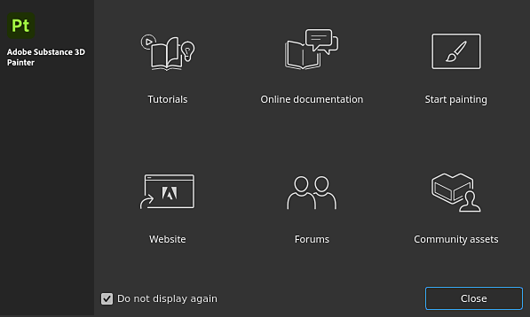

# Erste Schritte

Vom Fenster <b>Begrüßungsbildschirm</b> aus können Sie auf die folgenden Seiten zugreifen:

* [Tutorials](https://www.adobe.com/go/substance3dpaintertutorials_de)
* Online-Dokumentation (Sie sind bereits hier!).
* Mit dem Malen beginnen: Laden Sie das Beispielprojekt &quot;Meet Mat&quot;.
* [Website](https://www.adobe.com/creativecloud/3d-augmented-reality.html)
* [Foren](https://community.adobe.com/t5/substance-3d-painter/bd-p/substance-3d-painter?filter=all&page=1&sort=latest_replies)
* [Community-Assets](https://helpx.adobe.com/substance-3d-community-assets/home.html)

Andernfalls beginnen Sie mit den Grundlagen der Projekterstellung und dem Exportieren von Texturen:

* [Projekterstellung](project-creation.md)
* [Exportieren](../export/export.md)
* [Glossar](glossary.md)
* [Leistung](../technical-support/performances-guidelines/performances-guidelines.md)
* [Aktivierung und Lizenzen](activation-and-licenses.md)
* [Systemanforderungen](system-requirements.md)

Um Ihren Arbeitsablauf zu beschleunigen, sehen Sie sich die Liste der Tastaturbefehle an:

* [Kürzel](../interface/settings/shortcuts.md)

{width="500px"}
