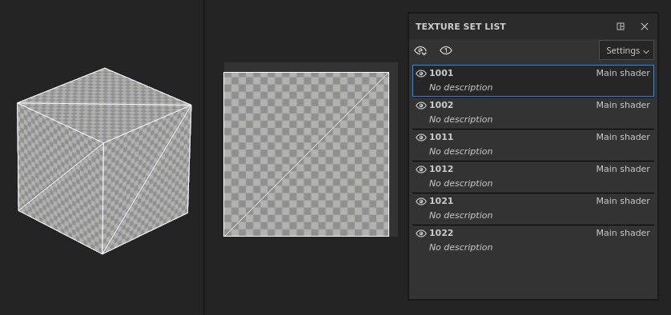

# Projekterstellung

Mit dem <b>neuen Projektfenster </b> können Sie eine Projektdatei erstellen, in der Ihr 3D-Modell und seine Texturierungsinformationen gespeichert werden.

Pro im importierten 3D-Material gefundener Modelldefinition wird ein neuer [Textursatz](../interface/texture-set/texture-set.md) erstellt. Dies bedeutet, dass mehrere Objekte durch eine einzige Datei importiert werden können (auch mit überlappenden UVs), wenn sie unterschiedliche Materialien haben.

## Erstellen eines neuen Projekts

Um ein neues Projekt zu erstellen, klicken Sie auf <b>Datei > Neu</b> oder verwenden Sie den Tastaturbefehl <b>Strg + N</b>.

Im Folgenden werden alle Parameter erläutert, die im Fenster &quot;Neues Projekt&quot; verfügbar sind.

### Grundlegende Einstellungen

| *Parameter* | *Beschreibung* |
| --- | --- |
| **Datei** | Klicken Sie auf die Schaltfläche &quot;Auswählen&quot;, um eine zu ladende 3D-Modelldatei anzugeben. [Eine Liste der unterstützten Dateiformate ist hier verfügbar.](https://experienceleague.adobe.com/de/docs/substance-3d/general-knowledge/ecosystem/import-and-export-formats) |
| **Vorlage** | Geben Sie eine Vorlage an, die die Standardeinstellungen des Projekts definiert. Eine Vorlage enthält die folgenden Parameter:<ul data-preserve-html="true"> <li data-preserve-html="true">Textursatz-Einstellungen.</li> <li data-preserve-html="true">Anzeigeeinstellungen.</li> <li data-preserve-html="true">Baking-Einstellungen.</li> <li data-preserve-html="true">Shader-Ressourcen (einschließlich angehängter Texturen)</li> <li data-preserve-html="true">Umgebungs-Map.</li> </ul>  **Hinweis:** Vorlagen sind <b>\*.spt</b> Dateien, die aus einem vorhandenen Projekt über das [Dateimenü](../interface/main-menu/file-menu.md) erstellt und im Ordner &quot;Assets&quot; gespeichert werden, um einfach für Teammitglieder freigegeben zu werden. |
| <b>Auflösung</b> | Definieren Sie die Standardauflösung für die Textur des Projekts für jeden Textursatz. Die Auflösung kann bei der Arbeit innerhalb der Anwendung auf bis zu 4K (4096 x 4096 Pixel) und beim Export auf 8K (8192 x 8192 Pixel) steigen. Die Auflösung kann später jederzeit über die [Textursatz-Einstellungen](../interface/texture-set/texture-set-settings.md) geändert werden.  **Hinweis: Für den**-8K-Export sind mindestens 2,5 GB VRam auf der GPU erforderlich, um verfügbar zu sein. |

### Dateitypspezifische Einstellungen

Wenn ein USD ausgewählt ist, werden andere dateitypspezifische Einstellungen verfügbar.

| *Parameter* | *Beschreibung* |
| --- | --- |
| <b>Umfang und Varianten</b> | Wählen Sie einen bestimmten Teil einer USD aus. Standardmäßig ist dies auf &quot;Root&quot; festgelegt, was bedeutet, dass die gesamte USD zum Erstellen des Painter-Projekts verwendet wird.  <b>Änderung...</b> öffnet ein neues Fenster, in dem der Inhalt des USD angezeigt wird. Wenn Varianten erkannt werden, ist es möglich, eine bestimmte Variante für die Projekterstellung auszuwählen. Der Umfang und die Varianten können nach der Projekterstellung in den [Projektkonfiguration](../interface/project-configuration.md)-Einstellungen geändert werden. Beachten Sie, dass -<ul data-preserve-html="true"> <li data-preserve-html="true">Nur die Modellvariantenauswahl hat Auswirkungen auf das Projekt.</li> <li data-preserve-html="true">Innerhalb von Varianten verschachtelte Varianten werden derzeit nicht erkannt.</li> </ul> |
| <b>Unterteilungsebene</b> | Bei Geometrie, die unterteilt werden soll, können Sie mit dieser Einstellung angeben, wie stark der Mesh für die Texturierung in Painter unterteilt werden soll. Wenn in der USD-Datei explizit &quot;none&quot; als Unterteilung festgelegt ist, wird diese Einstellung ausgegraut.  Nach dem entpack der UV wird eine Unterteilung angewendet, sodass sich die Form der UVs des Meshs nicht ändert. Unterteilungsebenen können nach der Projekterstellung in den [Projektkonfigurationseinstellungen](../interface/project-configuration.md) geändert werden. |
| <b>Rahmen</b> | Bei USD, in denen Animationen erkannt werden, können Sie mit dieser Einstellung den Rahmen auswählen, der zum Erstellen Ihres Painter-Projekts verwendet wird. Wenn die ausgewählte USD-Datei keine Animation enthält, ist diese Einstellung ausgegraut. Der Rahmen kann nach der Projekterstellung in den [Projektkonfigurationseinstellungen](../interface/project-configuration.md) geändert werden. |

### ERWEITERTE Einstellungen

| *Parameter* | *Beschreibung* |
| --- | --- |
| **Normalen-Map-Format** | Definiert die Normalen-Map-Format für das Projekt, kann entweder<ul data-preserve-html="true"><li data-preserve-html="true"><strong>DirectX</strong> (X+, Y-, Z+)</li><li data-preserve-html="true"><strong>OpenGL</strong> (X+, Y+, Z+)</li></ul>  **Hinweis:** Zur Erinnerung:<ul data-preserve-html="true"> <li data-preserve-html="true"><b>Das unreale Engine </b> verwendet standardmäßig DirectX.</li> <li data-preserve-html="true"><b>Unity</b> verwendet standardmäßig OpenGL.</li> </ul> |
| **Tangentialraum pro Fragment berechnen** | Wenn diese Option aktiviert ist, werden die Bitangents im Shader des Fragments (Pixel) anstelle des Scheitelpunkt Shader berechnet. Dieser Parameter beeinflusst die Art und Weise, wie die Normalen-Map vom Shader im Viewport decodiert wird. Wenn Sie diese Einstellungen ändern, muss der Normalen-Map erneut aktualisiert werden.  **Hinweis:** Zur Erinnerung:<ul data-preserve-html="true"> <li data-preserve-html="true">Für <b>Unreal Engine</b> muss diese Einstellung aktiviert sein.</li> <li data-preserve-html="true"><b>Unity</b> muss diese Einstellung deaktiviert (oder aktiviert sein, wenn Sie den HDRP-Workflow verwenden).</li> </ul> |

### UV-Kachel-Einstellungen (UDIMs)

>[!NOTE]
>
> Diese Einstellungen können nicht mehr geändert werden, nachdem das Projekt erstellt wurde.

| *Parameter* | *Beschreibung* |
| --- | --- |
| **Arbeitsablauf für die UV-Kachel verwenden** | Wenn diese Option aktiviert ist, wird der importierte Mesh anders verarbeitet, damit außerhalb des regulären UV-Bereichs (0-1) gemalt werden kann. Projekte, die UDIM verwenden, sollten diese Einstellung aktivieren. Die Verarbeitung des Meshs kann je nach Einstellung unterschiedlich sein.   Weitere Informationen finden Sie in der [Dokumentation zur UV-Kachel](../features/uv-tiles/uv-tiles.md). |
| <b>UV-Kachellayout pro Material beibehalten und kachelübergreifendes Malen aktivieren</b> | UV-Kacheln (UDIM) werden importiert und nach Material-Zuweisung auf dem Mesh gruppiert. Das bedeutet, dass ein einziger Textursatz mehrere UV-Kacheln enthalten kann, die in der 2D-Ansicht nebeneinander angezeigt werden. UV-Kacheln innerhalb desselben Textursatzes können nahtlos übermalt werden.  

 |
| <b>UV-Kacheln in einzelne Texturensätze konvertieren (veraltet)</b> | UV-Kacheln (UDIM) werden in einzelne Textursatz aufgeteilt und umbenannt, wobei alle Material-Zuweisungen ignoriert werden. Jede UV-Kachel wird in den UV [0-1]-Bereich verschoben, um lackierbar zu sein.  

 |

### Importeinstellungen

| ***Parameter*** | ***Beschreibung*** |
| --- | --- |
| **Kameras importieren** | Wenn Kameras in der Gitterdatei vorhanden sind, werden sie in das Projekt importiert und stehen als Voreinstellungen zur Visualisierung zur Verfügung.  **Hinweis:** Substance 3D Painter unterstützt unter bestimmten Bedingungen einige Kameras nicht:<ul data-preserve-html="true"><li data-preserve-html="true">Physische Kameras von 3DS Max.</li><li data-preserve-html="true">Orthografische Kameras, die in Alembic-Dateien (&#42;.abc) gespeichert sind.</li></ul> |
| **Automatisches Ausgliedern** | Wenn diese Option aktiviert ist, werden fehlende UVs auf dem importierten Mesh generiert. Die Verarbeitung kann sich je nach den über die Schaltfläche **Optionen** ausgewählten Einstellungen ändern.Weitere Informationen finden Sie in der [Dokumentation zum automatischen Entpack von UV](../features/automatic-uv-unwrapping.md). |

### Maps nach dem Baking importieren

Verwenden Sie die Schaltfläche <b>Hinzufügen</b>, um Textur-Dateien als Mesh-Map zu laden und sie automatisch in den [Textursatz-Einstellungen](../interface/texture-set/texture-set-settings.md) zuzuweisen. Damit die Mesh-Map ihren Textursätzen automatisch zugewiesen werden, muss eine bestimmte Namenskonvention eingehalten werden. Gitterzuordnungen können auch direkt in der Anwendung gebacken werden. finden Sie in der Dokumentation zum Baking.

Namenskonvention:<b> TextureSetName\_MeshMapName</b>

Beispiel:<b> DefaultMaterial\_ambient\_Verdeckung.png </b>

Liste der unterstützten Mesh-Map und deren Benennung:

| *Mesh-Map* | *Dateinamenkonvention* |
| --- | --- |
| **Ambient occlusion** | ambient\_Verdeckung |
| **Krümmung** | Biegung |
| **Normal** | normal\_base |
| **Normaler Weltraum** | world\_space\_normals |
| **ID** | id |
| **Position** | Position |
| **Thickness** | Stärke |

### Physische Größe

Mit den Einstellungen für die Physische Größe können Sie anpassen, wie Painter die Physische Größe Ihres Meshs in realen Einheiten bestimmt. Dies ist nützlich, um sicherzustellen, dass die Materialien in einem realistischen Maßstab angewendet werden.

* Interne Einheitenskala der Meshdatei verwenden: Die meisten Dateitypen enthalten Informationen über die Physische Größe des Objekts, während es aus der 3D-Modellierungsanwendung exportiert wurde. Wenn diese Option aktiviert ist, verwendet Painter diese Informationen aus der importierten Datei.
* Benutzerdefinierte Einheitenskalierung: Überschreiben Sie die Einheitenskalierung der importierten Datei. Wenn keine Einheitenskalierung enthalten ist, passen Sie die Größe einer einzelnen &quot;Einheit&quot; mithilfe eines benutzerdefinierten Eingabefelds an.
* Wechseln Sie beim Zuweisen von Materialien zur Skalierung der Füllebene in die Physische Größe: Wenn diese Option aktiviert ist, können Materialien mit Informationen zur Physische Größe ihre Skalierung an die Physische Größe der Fläche anpassen, auf die sie angewendet werden.

### Farbmanagement

Dieser Abschnitt steuert die Farbmanagementeinstellungen des Projekts. Standardmäßig ist sie auf &quot;Veraltet&quot; (sRGB / linearer Arbeitsablauf) festgelegt.

Lesen Sie die Dokumentation zum [Farbmanagement](../features/color-management/color-management.md), um mehr über die Verwendung dieses Workflows und die Auswirkungen der Einstellungen zu erfahren.
