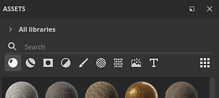

# Assets

Im Fenster &quot;Asset&quot; können Sie auf die Standardressourcen zugreifen, die mit der Anwendung geliefert werden (als **Starter-Assets** bezeichnet), sowie auf alle [importierten](https://helpx.adobe.com/substance-3d/unlisted/documentation/spdoc/adding-content-to-the-shelf-142213317.html) Ressourcen (die dann unter **Ihre Assets** gefunden werden können).

* Auf dem Datenträger wird die Bibliothek **Starter Assets** im Installationsordner der Anwendung gespeichert, während sich die in **Ihre Bibliothek** importierten Assets standardmäßig im Ordner Dokumente befinden.
* Weitere Informationen zum Speicherort Ihrer Elemente auf dem Datenträger finden Sie unter [Hinzufügen von Inhalt auf der Festplatte](../../content/importing-assets/adding-content-on-the-hard-drive.md).
* Es ist auch möglich, einen anderen Bibliotheksspeicherort hinzuzufügen. Schauen Sie sich hierzu [Neue Bibliothek hinzufügen](adding-a-new-library.md) an.

## Überblick

Das Fenster &quot;Elemente&quot; ist standardmäßig in drei Hauptabschnitte unterteilt:

1. Der Filterbereich
1. Die Elementliste
1. Untere Leiste

### Filterbereich

Weitere Informationen finden Sie auf der [Navigationsseite](navigation.md).

#### Assets-Liste

#### Untere Leiste

