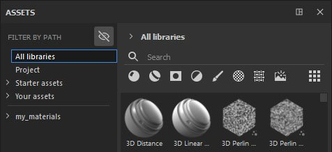

# Nach Pfad filtern

**Nach Pfad filtern** ist ein zusätzlicher Abschnitt, mit dem Sie durch Ihre Elemente navigieren können. Es hat dieselbe Struktur wie die Breadcrumbs, was bedeutet, dass Sie den Pfad/die Position Ihrer Assets sehen können.

Standardmäßig ist **Nicht anwendbare Ordner ausblenden** aktiviert, sodass Sie leere Ordner auf der Benutzeroberfläche ausblenden können. Dies ist hilfreich, wenn Sie z. B. &quot;Nach Pfad filtern&quot; mit einem bestimmten Suchwort kombinieren oder einen Elementtyp auswählen. So können Sie nur die relevanten Stellen sehen, die Ihre Suche enthalten.

