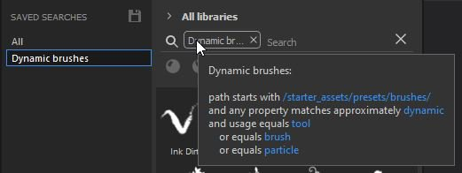

# Gespeicherte Suchen

Gespeicherte Suchvorgänge sind neben &quot;Nach Pfad filtern&quot; ein weiterer neuer Abschnitt, der im Asset-Fenster geöffnet werden kann. So können Sie Ihre häufigsten Suchanfragen und Abfragen speichern, jederzeit einfach darauf zugreifen und sogar als neue Unterbibliotheks-Registerkarte öffnen, die separat angedockt werden kann.

Um eine gespeicherte Suche zu erstellen, können Sie verschiedene Navigationstypen kombinieren. Sie können eine schriftliche Abfrage in das Suchfeld eingeben, den gewünschten Elementtyp (oder mehrere Elementtypen) und einen Speicherort auswählen, indem Sie entweder nach Pfad filtern oder nach Breadcrumbs suchen. Alle diese können als einzelne gespeicherte Suche gespeichert werden, oder sie können in separate gespeicherte Suchen aufgeteilt werden. Sie können beispielsweise eine gespeicherte Suche nach Pinseln erstellen, die dynamische Konturen verwenden, da diese Art von Arbeit häufig verwendet wird.

>[!NOTE]
>
> Gespeicherte Suchvorgänge werden in einer Konfigurationsdatei gespeichert, die manuell bearbeitet werden kann. Weitere Informationen finden Sie unter [Manuelles Hinzufügen gespeicherter Suchen](../../pipeline-and-integration/resource-management/adding-saved-searches-manually.md).

Sobald Sie Ihre gespeicherte Suche erstellt haben, wird sie in Ihrer Suchliste angezeigt. Sie können mit der rechten Maustaste darauf klicken, um eine neue Unterbibliothek-Registerkarte zu erstellen, sie umzubenennen oder zu löschen.

Sie können auch Informationen zum Inhalt der Suche anzeigen, indem Sie mit dem Mauszeiger auf das Such-Tag im Suchfeld zeigen.

