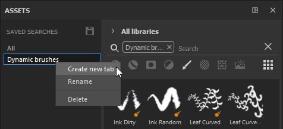
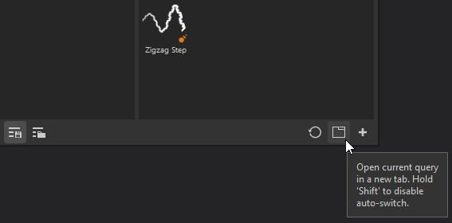

# Registerkarte &quot;Unterbibliothek&quot;

Eine Unterbibliothek ist eine neue Registerkarte oder ein neues Fenster in Substance 3D Painter, die bzw. das einer bestimmten Suche gewidmet ist.\
Standardmäßig ist keine Unterbibliothek-Registerkarte geöffnet, sondern nur das Hauptfenster Elemente. Sie können Registerkarten mit untergeordneten Bibliotheken über das Hauptfenster &quot;Elemente&quot; auf zwei Arten erstellen:

* Durch **Rechtsklick** auf eine der gespeicherten Suchen und Auswählen von **Neue Registerkarte erstellen.**

* Durch **Auswählen oder Eingeben einer Suchabfrage** (über Elementtypen, Breadcrumbs, Textabfrage oder &quot;Nach Pfad filtern&quot;) und anschließendes Verwenden der dedizierten **Schaltfläche** am unteren Rand des Fensters &quot;Elemente&quot;.

Beim Erstellen einer Unterbibliothek wird automatisch eine neue Registerkarte erstellt und **an der Schnittstelle im selben Bereich wie das Hauptfenster &quot;Elemente&quot; angedockt**.

Von dort aus kann das Unterbibliotheksfenster an einer beliebigen Stelle angedockt werden oder frei schwebend an einer beliebigen Stelle der Oberfläche oder auf einem anderen Bildschirm belassen werden.

>[!NOTE]
>
> * Eine Unterbibliothek hat dieselben Funktionen wie das Hauptfenster Elemente. Wenn sie jedoch zurückgesetzt wird, wird sie auf ihre ursprüngliche Suchabfrage zurückgesetzt.
> * Im Gegensatz zum Hauptfenster &quot;Asset&quot; muss eine Unterbibliothek, die Sie schließen, neu erstellt werden.
> * Wenn eine gespeicherte Suche entfernt wird, bleibt das Unterbibliotheksfenster bestehen, bis es geschlossen wird.
