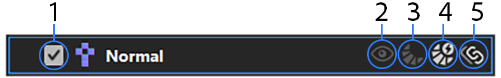
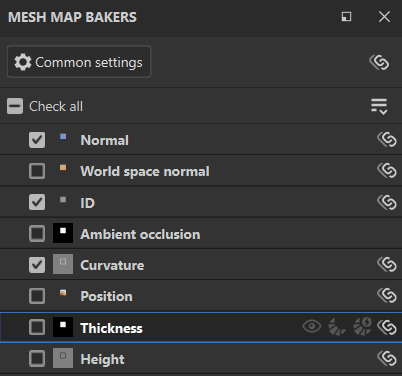

# Bedienfeld &quot;Mesh-Map Baker&quot;

<table>
  <tr style="border: 0;">
    <td style="border: 0;" valign="top"></td>
    <td style="border: 0;" valign="top">Im Bereich "<strong>Mesh-Map Baker"</strong> können Sie auswählen, welche Maps Baking geführt werden sollen, und auf die Einstellungen für jeden Map-Typ zugreifen.</td>
  </tr>
</table>

## Steuerelemente pro Karte

Für jede Karte in der Liste der Mesh-Map steht eine Reihe von Steuerelementen zur Verfügung:

1. **Überprüfen** oder **Deaktivieren** des Bakings für die Zuordnung.
1. **Die Map im Viewport visualisieren**.
1. **Quick Baking** nur diese Zuordnung.
1. Aktivieren Sie **Automatische Aktualisierung** für den ausgewählten Mesh-Map. **Karten mit automatischem Rebaked** werden automatisch umgebrochen, wenn Änderungen an den Baking-Parametern oder der Verzerrungskorrektur vorgenommen werden.
1. **Einstellungen für diesen Zuordnungstyp auf allen Textursätzen synchronisieren**. Deaktivieren Sie diese Option, um die Baking-Einstellungen für einzelne Maps anzupassen.

## Mesh-Map-Einstellungen verwalten

Es gibt mehrere Möglichkeiten, Ihr Projekt so zu verwalten, dass die Baking-Einstellungen von Mesh-Map oder Textursätzen gemeinsam genutzt werden. Bei komplexen Projekten hilft es, den Baking führ zu vereinfachen, wenn du die Freigabeeinstellungen verstehst.

Es gibt zwei Einstellungstypen, die Sie für alle Textursatz freigeben können:

* Baking-Einstellungen: Dies sind Parameter, die Sie in den **allgemeinen Einstellungen** und den **Mesh-Map-Einstellungsbedienfeldern** ändern können.
* Status überprüfen: Verwenden Sie diese, um das Baking für bestimmte Mesh-Map ein- oder auszuschalten.

### Synchronisieren von Baking-Einstellungen zwischen Textursätzen

Wenn Ihr Projekt über mehrere Textursatz verfügt, werden die Optionen zum Synchronisieren zwischen Textursätzen im Bereich &quot;**Mesh-Map Baker&quot; angezeigt**.

Wenn Sie die Schaltfläche **Einstellungen synchronisieren** oben im Bedienfeld **Mesh-Map-Baker** auswählen, wird das **Allgemeine Synchronisierungsfenster für Einstellungen** geöffnet.

In diesem Fenster können Sie auswählen, auf welchen Textursätzen allgemeine Einstellungen synchronisiert werden sollen. Wenn alle Textursatz ausgewählt sind, werden sie durch Ändern der allgemeinen Einstellungen in einem beliebigen Textursatz für alle anderen Textursatz geändert.

Wenn Sie die **Schaltfläche &quot;Einstellungen synchronisieren&quot;** neben einer einzelnen Mesh-Map verwenden, können Sie Textursatz auswählen, um die für die Mesh-Map spezifischen Einstellungen freizugeben.

#### Einstellungen für nicht synchronisierte Textursatz freigeben

Manchmal ist es sinnvoll, die Mesh-Map auf verschiedenen Textursätzen nicht zu synchronisieren, die Baking-Einstellungen sollten jedoch von einem Textursatz auf einen anderen kopiert werden.

Um allgemeine Einstellungen auf bestimmte Textursatz zu kopieren, ohne sie zu synchronisieren, wählen Sie **Alle Einstellungen auf weitere Textursatz synchronisieren...** aus der Dropdown-Liste **Mesh-Map-Baker**.

Sie können auch **Alle Einstellungen mit allen Textursätzen synchronisieren** verwenden, um die Einstellungen in alle Textursatz im Projekt zu kopieren.

Wenn Sie die Einstellungen für eine einzelne Mesh-Map auf einen bestimmten Textursatz kopieren möchten, gehen Sie wie folgt vor:

1. Klicken Sie mit der rechten Maustaste auf die Mesh-Map.
1. Wählen Sie **Mesh-Map-Einstellungen auf weitere Textursatz anwenden...**

*Im obigen Beispiel beginnt jeder Textursatz mit unterschiedlichen Einstellungen für AO. Ohne die zu synchronisierende AO-Mesh-Map festzulegen, verwenden wir **Umgebungsabschattungseinstellungen auf weitere Textursatz anwenden...**, damit wir die AO-Einstellungen für den neuen Textursatz von derselben Grundlinie aus ändern können.*

### Verwalten des Überprüfungsstatus für Mesh-Map

Der Überprüfungsstatus bestimmt, ob eine bestimmte Map beim Baking von Mesh-Map einbezogen wird. Es gibt viele Möglichkeiten, den Überprüfungsstatus für den aktuellen Textursatz zu verwalten:

* Aktivieren oder deaktivieren Sie einzelne Karten.
* Verwenden Sie **Alle überprüfen** oder **Alle deaktivieren**, um alle Mesh-Map zu überprüfen oder zu deaktivieren.
* Verwenden Sie **Aktivierte Mesh-Map** aus der Dropdown-Liste **Mesh-Map-Baker umkehren**, um den Überprüfungsstatus aller Maps zu ändern.

>[!TIP]
>
> Sie können auf ein Kontrollkästchen klicken und es ziehen, um mehrere Maps schnell zu aktivieren bzw. zu deaktivieren (siehe Animation oben).

*Im obigen Beispiel verwenden wir **Aktivierte Mesh-Map umkehren**, um schnell zwischen den Auswahlbereichen zu wechseln. Anschließend werden Mesh-Map Baking geführt, die noch nicht Baking geführt wurden.*

Wenn Sie mit mehreren Textursätzen arbeiten, können Sie den Überprüfungsstatus von Zuordnungen auch auf andere Textursatz kopieren, indem Sie **Auf weitere Textursatz überprüft anwenden...** auswählen oder den Überprüfungsstatus auf alle Textursatz kopieren, bei denen **Auf alle Textursatz überprüft anwenden**.

*Im obigen Beispiel haben wir das Height, die bent normals oder die Deckkraft im Textursatz **Material.001**&#x200B;noch nicht Baking geführt. Diese Mesh-Map sind bereits im Textursatz &quot;**Material**&quot; ausgewählt. Daher verwenden wir &quot;**Auf weitere Textursatz anwenden&quot; aktiviert...**&#x200B;und wählen &quot;**Material.001**&quot;, um den Überprüfungsstatus zu kopieren. Anschließend werden die Maps Baking geführt. Beachten Sie, dass die Visualisierung zweimal durch die Mesh-Map navigiert, während die Maps Baking geführt werden. Das liegt daran, dass sie für beide Textursatz Baking geführt werden.*