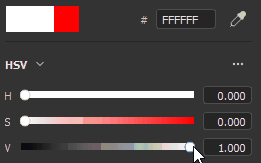
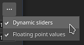
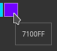
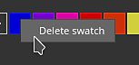

# Farbwähler

Mit dem Farbwähler können Sie eine Farbe festlegen, die auf das Gitter gemalt oder darauf projiziert werden soll. Sie kann verwendet werden, um Farben aus externen Bildern auszuwählen oder ein vorhandenes Bild in der Anwendung anzupassen.

Das Farbwählerfenster wird angezeigt, wenn Sie in Painter auf ein Farbfeld klicken. Es befindet sich in den Eigenschaften oder in zusätzlichen Einstellungen oder Menüs, z. B. in den Parametern &quot;Anzeige&quot; oder &quot;Schattierung&quot;.

## Farbwähler - Übersicht

Der einmal geöffnete Farbwähler ist semi-persistent, d. h., er bleibt bis zu einer Kontextänderung geöffnet - z. B. beim Wechsel von einer Farb- zu einer Füllebene. Es ist möglich, das Fenster zu verschieben und an einer beliebigen Stelle auf einem der verfügbaren Bildschirme zu platzieren. Im Gegensatz zu anderen Fenstern kann der Farbwähler jedoch nicht angedockt werden.

Das Fenster ist vertikal angeordnet und besteht aus drei Bereichen:

* Farbverlaufswähler (oder Farbspektrum)
* Schieberegler (RGB/HSV)
* Farbfelder

{width="200px"}

### Farbverlaufswähler (Spektrum)

| Name und Bild | Beschreibung |
| --- | --- |
| **Anzeigeselektor** 

 | Lassen Sie zu, welche Anzeige zum Bearbeiten von Farben verwendet werden soll (Spektrum und Schieberegler). Der Standardwert stimmt mit der Anzeige überein, die vom Haupt-Viewport verwendet wird.  **Hinweis:** Diese Einstellung ist nur verfügbar, wenn [Farbmanagement](../features/color-management/color-management.md) aktiviert ist. |
| **Spektrum** 

 | Der vertikale Regler ist der allgemeine Farbton. Mit dieser Option können Sie die Farbschattierung auswählen, die im Verlaufsfeld angezeigt werden soll.Sobald der allgemeine Farbton ausgewählt ist, können Sie den Fadenkreuz-Cursor im Verlaufsfeld halten und ziehen, um die gewünschte Farbe auszuwählen.  **Hinweis:** Wenn [Farbmanagement](../features/color-management/color-management.md) aktiviert ist, werden HDR-Farben aus der aktuellen Anzeige geklemmt (im Arbeitsfarbraum). Dies dient dazu, die Ausgabe von HDR-Werten in farbverwalteten Kanälen zu vermeiden. |
| **Aktuelle und vorherige Farbe** 

 | Das linke Rechteck zeigt die endgültige Farbe an, die vom Farbwähler ausgegeben wird.Das rechte Rechteck zeigt die vorherige Farbe an (als der Farbwähler geöffnet wurde). Sie können darauf klicken, um die vorherige Farbe wiederherzustellen und sie zur aktuellen Farbe zu machen. |
| **Hexadezimalfeld** 

 | Die Hexadezimalfelder stellen die aktuelle Farbe als Hexadezimalwerte dar. Die RGB-Komponenten werden als Buchstabenpaar dargestellt.Beispiel: #FF0000 repräsentieren die rote Farbe.  **Hinweis:** Wenn [Farbmanagement](../features/color-management/color-management.md) aktiviert ist, arbeitet das Hexadezimalfeld immer im sRGB-Standardfarbraum, um das Kopieren/Einfügen von Werten über die Software hinweg zu vereinfachen, unabhängig vom aktuellen Anzeige- oder Arbeitsfarbraum, der vom Projekt verwendet wird. |
| **Pipette** 

 | Mit der Pipette können Sie eine Farbe aus einer externen Quelle auswählen. Um es zu verwenden **klicken Sie** auf das Symbol, bewegen Sie dann die Maus und erneut, um die gewünschte Farbe zu kopieren.  **Hinweis:** Wenn Sie eine Farbe im Viewport auswählen, können Sie den **Shift**-Modifizierer verwenden, um den aktuellen Kanal auszuwählen, der direkt bearbeitet wurde. Dadurch wird eine verlustbehaftete Farbkonvertierung zwischen der Originalstruktur und der auf dem Bildschirm angezeigten Farbe vermieden. Dies ist auch nützlich, um Farben auszuwählen, ohne vom Anzeigemodus **Material** wechseln zu müssen. 

  **Hinweis:** Farbfelder verfügen auch über eine Pipette daneben und können verwendet werden, um schnell Farben auszuwählen, ohne den Farbwähler öffnen zu müssen. 

  **Hinweis:** Unter Mac OS kann die Pipette aufgrund von Datenschutzeinstellungen möglicherweise keine Farben außerhalb der Anwendungsoberfläche auswählen. Um dieses Problem zu beheben, weisen Sie der Anwendung die richtigen Rechte zu in: `System Preferences > Security & Privacy > Privacy > Screen Recording` |

### Farbeinstellungen

| Einstellung | Beschreibung |
| --- | --- |
| **Pipettenfarbraum** | Geben Sie den Farbraum für die Farbe an, die außerhalb des Viewports ausgewählt ist.Die Einstellung **auto** verwendet den sRGB-Standardfarbraum aus den Projekteinstellungen. 

 **Hinweis:** Diese Einstellung gilt auch für Pipetten neben Farbschaltflächen.  **Hinweis:** Die im Viewport ausgewählten Farben verwenden dieses Profil auch, wenn sie nicht den Umschalt-Modifikator verwenden. |

### Schieberegler

Mit den Farbreglern kannst du einzelne Werte manuell anpassen.

Die Schieberegler können auf zwei verschiedene Modi eingestellt werden: **HSV** oder **RGB**. Um den Modus zu ändern, verwenden Sie das spezielle Dropdown-Menü.

#### HSV

**HSV** steht für **H** ue, **S** aturation und **V** value.

Mit **Farbton** können Sie durch die globalen Farbfamilien blättern, ähnlich wie mit dem Regler für vertikale Verläufe.

**Die Sättigung** steuert den Farbreichtum der ausgewählten Farbe und wechselt von Graustufen zu vollständig gesättigten Farben.

**Wert** bestimmt, wie dunkel oder hell eine Farbe ist, und reicht von vollständig schwarz bis vollständig weiß.

#### RGB

**RGB** steht für **R** ed, **G** Green und **B** lue.

Dies sind die Hauptkomponenten, die digital zum Speichern von Farben in Computergrafiken verwendet werden. Jeder Schieberegler gibt an, wie viel von der Komponente in der endgültigen Farbe vorhanden ist.

Beispiel: Das Bild unten hat eine Farbe, die 100 % Rot, aber 50 % Blau und Grün enthält.

Es ist üblicher, dass die RGB-Schieberegler über 0-255 Werte gemessen werden. Dies kann durch Deaktivieren der Option **Gleitkommawerte** erfolgen.

### Reglereinstellungen

Über das Menü &quot;Einstellungen&quot; können Sie einige zusätzliche Verhalten konfigurieren:

| Einstellung | Beschreibung |
| --- | --- |
| **Dynamische Schieberegler** | Wenn diese Option aktiviert ist, wird die Hintergrundfarbe der Schieberegler basierend auf der aktuellen Farbe angepasst. |
| **Gleitkommawerte** | Wenn diese Option aktiviert ist, werden Schiebereglerwerte von 0,0 bis 1,0 dargestellt. Wenn diese Option deaktiviert ist:<ul data-preserve-html="true"> <li data-preserve-html="true"><strong>HSV</strong>: Der Farbtonregler wird in Grad (wie bei einem Farbrad) gemessen. Sättigung und Wert verwenden Prozentwerte. </li> <li data-preserve-html="true"><strong>RGB</strong>: werden als Wert zwischen 0 und 255 dargestellt.</li> </ul> |

## Mit Farbraum arbeiten

In diesem Abschnitt wird der endgültige Farbwert für den aktuellen Arbeitsfarbraum angezeigt.

Wenn Sie mit der Maus auf den Titel **Arbeitsfarbraum** zeigen, wird der Name des aktuellen Farbraums angezeigt.

>[!NOTE]
>
> Dieser Abschnitt ist nur verfügbar, wenn [Farbmanagement](../features/color-management/color-management.md) aktiviert ist.

## Farbfelder

Farbfelder bieten eine Möglichkeit, Farben zu speichern, damit sie später wiederverwendet werden können. Farbfelder sind für alle Projektionen und Sitzungen verfügbar.

### Farbfeld hinzufügen

Durch Klicken auf diese Schaltfläche wird eine neue Farbfeldfarbe im aktuellen Satz erstellt.

Die Farbfeldfarbe wird nur erstellt, wenn die letzte Farbe (die Farbe neben der Schaltfläche) sich von der aktuell bearbeiteten Farbe unterscheidet.

>[!NOTE]
>
> Farbfeldfarben werden unabhängig von der aktuellen [Farbmanagement](../features/color-management/color-management.md)-Konfiguration verwaltet und als sRGB-Farben gespeichert.

### Farbfeld

Klicke auf ein Farbfeld, um es zu laden.

Wenn Sie mit der Maus auf das Farbfeld zeigen, wird der zugehörige Hexadezimalwert angezeigt.

>[!NOTE]
>
> Wenn [Farbmanagement](../features/color-management/color-management.md) aktiviert ist, wird die Anzeige der Farben entsprechend der aktuell ausgewählten Anzeige angepasst.

### Farbfeldeinstellungen

Klicken Sie mit der rechten Maustaste auf ein Farbfeld, um das Menü zu öffnen und es zu löschen.

### Einstellungsmenü

Im Menü &quot;Einstellungen&quot; können Sie alle Farbfelder löschen.

>[!NOTE]
>
> Farbfelder werden in einer Konfigurationsdatei gespeichert, die im Dokumentenordner des Benutzers verfügbar ist. Weitere Informationen finden Sie auf der Seite [Shelf und Assets-Speicherort](../pipeline-and-integration/resource-management/shelf-and-assets-location.md).
