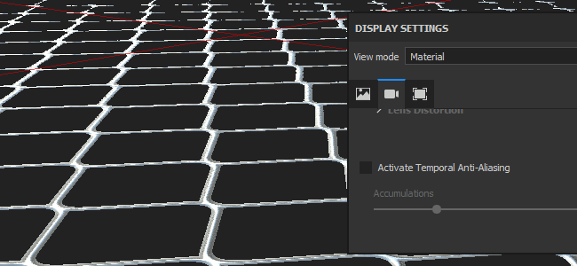

# Kameraeinstellungen

Dieser Abschnitt der **Anzeigeeinstellungen** steuert das Verhalten der Kamera sowie das endgültige Aussehen des Viewports.

## Kamera

| *Einstellung* | *Beschreibung* |
| --- | --- |
| **Blickfeld** | Ermöglicht die Steuerung des Sichtfelds der Kamera (in Grad) |
| **Fokusentfernung** | Definiert den Abstand, in dem sich der Fokuspunkt befindet.  Dieser Punkt wird von der Tiefe des Effekts &quot;Feld&quot; verwendet. 

 **Hinweis:** Die Fokusentfernung kann automatisch festgelegt werden, indem Sie mit der Tastenkombination **STRG + mittlere Maustaste** auf einen Punkt des Gitters klicken. |
| **Blende** | Definiert die Breite der Tiefe des Felds. 

 **Hinweis:** Wenn Iray diesen Parameter steuert, wird durch Ändern des Parameters eine Berechnung erneut ausgelöst. |

## Post-Effekte

Weitere Informationen finden Sie auf der [Seite nach dem Effekt](../../features/post-processing/post-processing.md).

## Temporale Anti-Aliasing

Wenn die Option **Temporale Anti-Aliasing** (**TAA**) aktiviert ist, werden gezackte Kanten im Viewport entfernt.\
**TAA** sammelt Informationen über mehrere Rendering-Frames hinweg an. Dies bedeutet, dass der Effekt deaktiviert wird, bis die Kamera nicht mehr bewegt wird oder ein anderer Vorgang ausgeführt wird.

| *Einstellung* | *Beschreibung* |
| --- | --- |
| **Akkumulierungen** | Legt fest, wie viele Frames zur Verringerung des Alias-Effekts kumuliert werden.<ul data-preserve-html="true"> <li data-preserve-html="true">16: Empfohlener Wert für die meisten Fälle</li> <li data-preserve-html="true">64: Nützlich zum Bereinigen hoher Kontrastwerte (z. B. Alpha Test Shader und Dithering kombiniert)</li> </ul>  **Hinweis:** Diese Einstellung hat keine Auswirkungen auf die Leistung. Ein hoher Wert kann jedoch länger dauern, bis gute Ergebnisse erzielt werden. |

{width="500px"}

Mit dem Anti-Aliasing kann auch der Shader **Alpha-Test** gefiltert werden, wenn die Einstellung &quot;**Alpha-Dithering**&quot; aktiviert ist:

{width="500px"}

## Streuung unter der Oberfläche

Weitere Informationen finden Sie auf der Seite [Untergrundstreuung](../../features/subsurface-scattering/subsurface-scattering.md).

## Farbprofil

Weitere Informationen finden Sie auf der [Seite des Farbprofils](../../features/post-processing/color-profile.md).

## Tone Mapping

| Einstellung | Beschreibung |
| --- | --- |
| **Funktion** | Geben Sie die Funktion an, die verwendet wird, um Farbwerte anzupassen, die die Monitoranzeigefunktionen überschreiten (Neuzuordnung von HDR-Werten zu einem LDR-Bereich). Mögliche Werte sind:<ul data-preserve-html="true"><li data-preserve-html="true"><strong>Linear</strong> (Standard): Bei keiner Transformation werden Werte über 1,0 geklemmt.</li><li data-preserve-html="true"><strong>ACES</strong>: Verwenden Sie die ACES Filmic-Tone-Mapping-Kurve.</li></ul> 

 **Hinweis:** Einige Game Engines und Rendering-Software verwenden den ACES-Tonabbildner. Durch Aktivieren dieser Funktion können Sie Farben zwischen Anwendungen abgleichen und Unterschiede vermeiden. |
