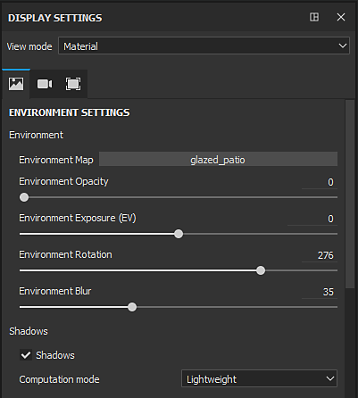
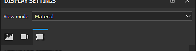

# Anzeigeeinstellungen

{width="320px"}

Im Fenster &quot;**Anzeigeeinstellungen**&quot; werden die Einstellungen für Umgebung, Kamera und Viewport neu gruppiert. Diese Einstellungen gelten global für das Projekt und können sich auf das Aussehen des Viewports auswirken.

## Ansichtsmodus

Der Ansichtsmodus steuert, wie der Viewport aussehen wird. Die Dropdown-Liste ist in drei Abschnitte unterteilt:

| Abschnitt | Beschreibung |
| --- | --- |
| **Beleuchtung** | Zeigen Sie das 3D-Modell im Viewport mit voller Beleuchtung an, einschließlich Schatten, falls aktiviert. |
| **Ein Kanal** | Wird auch als Solomodus bezeichnet. Zeigt den Mesh im Viewport nur mit einem bestimmten Kanal oder einer bestimmten Textur ohne Beleuchtung an. |
| **Mesh-Map** | Zeigt den Mesh im Viewport nur mit einer bestimmten Baking geführt Textur ohne Beleuchtung an. |

>[!NOTE]
>
> Der Ansichtsmodus kann auch mithilfe der <b>Dropdownliste</b> geändert werden, die in den Ecken der [Viewport](../../interface/viewport/viewport.md) verfügbar ist. Es stehen auch [Tastaturbefehle](../settings/shortcuts.md) zur Verfügung, um schnell zwischen Kanälen, Mesh-Map und sogar zum Materialmodus zurückzukehren.

## Abschnitte &quot;Einstellungen&quot; anzeigen

Weitere Informationen zu den einzelnen Abschnitten finden Sie auf der entsprechenden Seite :

* [Umgebungseinstellungen](environment-settings.md)
* [Kameraeinstellungen](camera-settings.md)
* [Viewport Einstellungen](viewport-settings.md)
