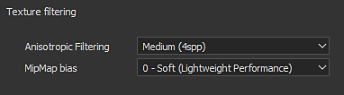
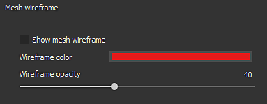
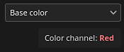

# Viewport Einstellungen

Dieser Abschnitt der **Anzeigeeinstellungen** steuert verschiedene Einstellungen für die Anzeige des Viewports, z. B. die Filterung der Textur und das Drahtgitter des Meshs.

## Texturfilterung

Der Anisotrope Filterung- und Mipmap-Bias ermöglicht die Steuerung der Anzeige von Texturen im Viewport. Diese Einstellungen wirken sich nicht direkt auf die Texturen aus und werden beim Export nicht angewendet. Sie verfeinern nur den Rendering-Prozess im Viewport. Mit der Einstellung &quot;Mipmap-Bias&quot; können Sie die Verwendung sehr scharfer Texturen für Pixel erzwingen, die weit weg oder schräg geneigt sind. In einigen Fällen können sie jedoch Moiré-Muster oder Zittern erzeugen.

Standardeinstellungen beeinträchtigen Qualität und Leistung und sollten nur geändert werden, wenn sie wirklich benötigt werden.

| *Einstellung* | *Beschreibung* |
| --- | --- |
| **Anisotrope Filterung** | Das anisotrope Filtern verbessert die Texturqualität bei schrägen Winkeln. Hohe Qualitätswerte sorgen für eine bessere Filterung, können jedoch zu Leistungseinbußen führen. Diese Einstellung steuert die Probenmenge pro Pixel (spp), die für die Filterung verwendet wird:<ul data-preserve-html="true"><li data-preserve-html="true"><strong>Deaktiviert</strong> : Keine Filterung</li><li data-preserve-html="true"><strong>Niedrig</strong> (2spp)</li><li data-preserve-html="true"><strong>Mittel</strong> (4spp): Standardwert</li><li data-preserve-html="true"><strong>Hoch</strong> (8spp)</li><li data-preserve-html="true"><strong>Sehr hoch</strong> (16spp)</li></ul> 

 |
| **MipMap-Voreinstellung** | Versetze die Mipmap-Stufe der Details, um die Texturqualität zu verbessern. Scharfe Werte können zu Leistungseinbußen und gezackten Texturen führen.<ul data-preserve-html="true"><li data-preserve-html="true"><strong>0 - Soft</strong> (Lightweight Performance) : Standardwert</li><li data-preserve-html="true"><strong>1 - Mittlere Weiche</strong></li><li data-preserve-html="true"><strong>2 - Sharp</strong></li><li data-preserve-html="true"><strong>3 - Sehr scharf</strong> (intensive Leistung)</li></ul>(von 0 bis -3) |

## Kamerarahmen

Weitere Informationen zum Kamera-Management finden Sie unter: [Kameras-Management](../viewport/camera-management.md)

## Werkzeuganzeige

| *Einstellung* | *Beschreibung* |
| --- | --- |
| **Schablone beim Malen ausblenden** | Wenn Sie eine Schablone verwenden (siehe Eigenschaften des Malen-Werkzeugs), können Sie diese Einstellung beim Malen auf dem Mesh vorübergehend ausblenden. |
| **Deckkraft der Schablone-Anzeige** | Steuert die Sichtbarkeit der Schablone über dem Viewport-Rendering, wenn nicht gezeichnet wird. |
| **Projektionen-Vorschaukanal** | Steuert, welcher Kanal des Materials angezeigt werden soll, wenn das Projektion-Werkzeug verwendet wird. |

## Mesh-Drahtmodell

| *Einstellung* | *Beschreibung* |
| --- | --- |
| **Mesh-Drahtgitter anzeigen** | Aktivieren oder deaktivieren Sie die Anzeige des Mesh-Drahtgitter im Viewport. |
| **Drahtgitter** | Steuert die Farbe, die zum Zeichnen des Mesh-Drahtgitter verwendet wird. |
| **Drahtgitter-Deckkraft** | Bestimmt, wie stark das Drahtgitter sichtbar ist, wenn es über dem Mesh gezeichnet wird. |

## Kanalanzeige

>[!NOTE]
>
> Die Kanalanzeigeeinstellungen sind nur verfügbar, wenn der Anzeigemodus **Ein Kanal** verwendet wird.

| *Einstellung* | *Beschreibung* |
| --- | --- |
| **Einzelansicht ohne Beleuchtung anzeigen (unbeleuchtet)** | Wenn Sie diese Einstellung aktivieren, wird bei der Anzeige im Ein Kanal-Modus die Beleuchtung entfernt und der Kanal als Flächenfarben angezeigt. Wenn diese Option deaktiviert ist, wird eine Schattierung auf den Rand des Meshs angewendet. |
| **HDR** | Bei der Anzeige einer **HDR.1}-Textur (z. B. des Heights) im Ein Kanal-Modus skaliert diese Einstellung die Gesamtwerte.** Dies ist nützlich, um Werte anzuzeigen, die über 1 oder unter -1 liegen. Das Ergebnis entspricht **Kanal, der von der Skala** getaucht wurde.Im folgenden Beispiel hat der Height-Kanal Werte bis zu 3. Standardmäßig können sie jedoch nur angezeigt werden, wenn der Skalierungswert geändert wird: 

 |
| **Verwenden Sie +/- Farbe für HDR. Werte** | Diese Einstellung ermöglicht eine einfachere Anzeige der HDR. Textur, indem positive Werte durch die erste Farbe und negative Werte durch die zweite Farbe ersetzt werden. Neutralwerte (0) sind schwarz.Beispiel : 

 |
| **Farbkanäle** | Ändern Sie den Kanalansichtsmodus so, dass die R-, G-, B- oder Alpha-Komponente des aktuellen Viewports nur einzeln angezeigt wird. Diese Einstellung ist im Material-Anzeigemodus nicht verfügbar. Wenn diese Option aktiviert ist, wird der Name des ausgewählten Farbkanals im Viewport angezeigt:  

  Mögliche Werte:<ul data-preserve-html="true"><li data-preserve-html="true"><strong>RGBA</strong> (Standard): auf Farbkanälen alle Komponenten mit der Transparenz anzeigen.</li><li data-preserve-html="true"><strong>Graustufen+Alpha</strong> (Standard): auf dem Graustufenkanal, zeigen Sie die Graustufenwerte mit der Transparenz an.</li><li data-preserve-html="true"><strong>R</strong>: auf Farbkanälen nur die Rot-Komponente anzeigen.</li><li data-preserve-html="true"><strong>G</strong>: auf Farbkanälen nur die grüne Komponente anzeigen.</li><li data-preserve-html="true"><strong>B</strong>: in Farbkanälen nur die Blaukomponente anzeigen.</li><li data-preserve-html="true"><strong>Alpha</strong>: auf allen Kanälen nur die Transparenz der Textur anzeigen.</li></ul> |

## Raster

Mit den Raster-Einstellungen können Sie die Zeichnung eines 3D-Rasters innerhalb des 3D-Viewports anzeigen und steuern.

Die Zoomeinteilungen werden automatisch auf der Grundlage der aktuellen Kamera von Raster und Winkel erstellt. Die aktuelle Raster-Einheit wird unten links im Viewport angezeigt.

| Einstellung | Beschreibung |
| --- | --- |
| **Raster anzeigen** | Wenn diese Option aktiviert ist, machen Sie den Raster im 3D-Viewport sichtbar. |
| **Achse** | Definieren Sie, entlang welcher Achse der Raster im Viewport sichtbar ist. Der Standardwert ist Y, da dies die Achse nach oben der Anwendung ist. |
| **Farbe des Rasters** | Die Farbe des Rasters beim Zeichnen im Viewport. |
| **Deckkraft des Rasters** | Die Deckkraft des Rasters im Viewport. |
