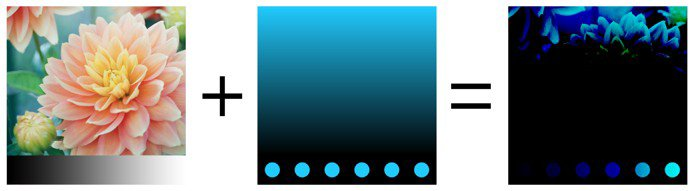
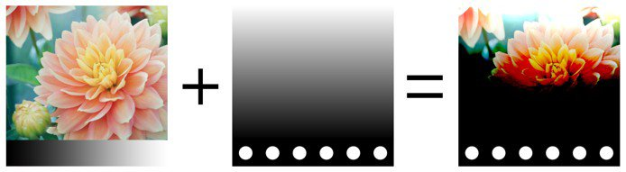

# Füllmethoden

Ebenen und Effekte haben Zugriff auf viele **Füllmethoden**. Sie ermöglichen es, das Ergebnis einer Ebene mit den anderen darunter liegenden Ebenen auf unterschiedliche Weise zu mischen.

Nicht alle Füllmethoden sind für alle Anwendungsfälle geeignet. Die **Normalen-Map**-Mischmodi sind beispielsweise nur für den **Normalkanal** in einem Textursatz geeignet.

## Reihenfolge der Füllmethoden

Um zu verstehen, wie und wann ein Füllmethode angewendet wird, ist es wichtig, die Reihenfolge zu verstehen, in der Vorgänge im **Ebenenstapel** ausgeführt werden:

1. Die Ebene &quot;Unten&quot; wird berechnet.
1. Die Ebene am oberen Rand wird berechnet und mit der darunter liegenden Ebene auf der Grundlage der Füllmethode gemischt (Beispiel: Multiplizieren).
1. Die Maske wird angewendet, um die Ebene &quot;Top&quot; fertigzustellen.

## Füllmethode ändern

Der Mischmodus kann für **jeden Kanal** in einer Ebene geändert werden. Um zwischen den Ebenenstapeln zu wechseln, verwenden Sie das Dropdown-Menü links oben im Kanalfenster.

Um den Mischmodus zu ändern, klicken Sie einfach auf das Dropdown-Menü für den Mischmodus einer bestimmten Ebene:

>[!NOTE]
>
> Mit den folgenden Tastenkombinationen können Sie schnell zwischen den Mischmodi wechseln, wenn der Fokus auf der Dropdown-Liste liegt:
> 
> * Tastaturbefehle nach oben oder unten
> * Mausrad nach oben oder unten

## Liste der Mischmodi

Unten finden Sie eine Liste aller in Substance 3D Painter verfügbaren Mischmodi für Ebenen und Effekte. Die meisten Füllmethoden funktionieren über Vorgänge auf dem RGB (oder in Graustufen), aber einige Vorgänge werden auch über einen anderen Modus ausgeführt, der [HSV (Farbton, Sättigung, Wert)](https://en.wikipedia.org/wiki/HSL_and_HSV) ist. Alle Füllmethoden werden intern im **linearen Gamma-Raum** ausgeführt.

| *Name* | *Beschreibung* |
| --- | --- |
| Normal | Zeigt die Ebene &quot;Top&quot; ohne Transformation über der Ebene &quot;Bottom&quot; an (Kopiermodus). Wenn die Ebene &quot;Top&quot; transparent ist (Alpha), wird die Ebene &quot;Bottom&quot; durch die transparenten Pixel hindurch angezeigt. 

 |
| Passthrough | Reduziert die Ebene &quot;Unten&quot; auf die Ebene &quot;Oben&quot;. Meist nützlich in den folgenden Fällen:<ul data-preserve-html="true"> <li data-preserve-html="true">So wenden Sie einen Effekt auf alle Ebenen unter der Ebene &quot;Top&quot; an</li> <li data-preserve-html="true">So verwischen oder Klonen Sie die Ebenen unter der Ebene &quot;Top&quot;</li> </ul> 

 **Hinweis:** **Effekte** können **direkt in den Ebenenstapel gezogen und abgelegt werden**. Dadurch wird eine Ebene erstellt, deren Füllmethode für alle Kanäle auf &quot;Passthrough&quot; festgelegt ist. |
| Disable | Verwirft die Überblendung der Ebene und zeigt nur die vorherigen Ebenen an. Sie kann verwendet werden, um die Berechnung eines Kanals zu optimieren, indem sie ihn in der Ebene &quot;Top&quot; ignoriert. 

 |
| Ersetzen | Überschreibt die Ebene &quot;Unten&quot; Dies ist beispielsweise nützlich, um das Füllen von Informationen mit den darunter liegenden Ebenen zu vermeiden. &quot;Ersetzen&quot; funktioniert anders als die normale Füllmethode, da auch das Alpha in der Ebene &quot;Top&quot; ignoriert wird, was zu transparenten Pixeln führen könnte. 

 |
|  |  |
| Multiplizieren | Multipliziert die Ebene &quot;Top&quot; mit der Ebene &quot;Bottom&quot;. Das Ergebnis ist immer eine dunklere Farbe. 

 |
| Divide | Dividiert die darunter liegenden Ebenen durch die Farbinformationen der aktuellen Ebene. Das Ergebnisbild ist meistens heller und kann manchmal ausgebrannt aussehen. 

 |
| Umgekehrte Dividieren | Identisch mit der Dividieren-Füllmethode, aber die Ebenen &quot;Oben&quot; und &quot;Unten&quot; werden beim Füllvorgang ausgetauscht. 

 |
| Abdunkeln (Min) | Behält den minimalen Farbwert zwischen der Ebene &quot;Top&quot; und der Ebene &quot;Bottom&quot; bei. 

 |
| Aufhellen (Max) | Behält den maximalen Farbwert zwischen der Ebene &quot;Top&quot; und der Ebene &quot;Bottom&quot; bei. 

 |
|  |  |
| Linear abwedeln (Addieren) | Fügt der Ebene &quot;Unten&quot; den Farbwert der Ebene &quot;Oben&quot; hinzu. Das Ergebnis kann Farben ergeben, die kleiner als 0 oder größer als 1 sind. In diesem Fall wird das Ergebnis geklemmt/beschnitten, wenn der Kanal nicht HDR ist. Diese Füllmethode ist nützlich, um z. B. Height-Informationen zu sammeln. 

 |
| Subtrahieren | Subtrahiert die Farbe der obersten Ebene von der Ebene &quot;Unten&quot;. Das Ergebnis kann Farben ergeben, die unter 0 liegen. In diesem Fall wird das Ergebnis geklemmt/zugeschnitten, wenn der Kanal nicht HDR ist. 

 |
| Inverse Subtract | Wie beim Subtrahieren-Mischmodus, aber die Ebenen &quot;Oben&quot; und &quot;Unten&quot; werden beim Mischvorgang ausgetauscht. 

 |
| Difference | Subtrahiert die Farbe der obersten Ebene von der untersten Ebene, übernimmt jedoch den absolute Wert des Ergebnisses (negative Werte werden positiv). 

 |
| Ausschluss | Ähnlich wie beim Mischmodus &quot;Differenz&quot;, es wird jedoch ein Ergebnis mit niedrigerem Kontrast erzeugt. 

 |
| Addition mit Vorzeichen (AddSub) | Fügt der Ebene &quot;Unten&quot; Farbinformationen basierend auf den Farben der Ebene &quot;Oben&quot; hinzu bzw. zieht sie ab. Graustufenwerte haben keine Auswirkungen, während dunklere Farben Informationen entfernen und hellere Farben Informationen hinzufügen. 

 |
|  |  |
| Überlagerung | Kombinieren Sie die Füllmethoden &quot;Negativ multiplizieren&quot; und &quot;Negativ multiplizieren&quot;. Die Graustufenwerte in der Ebene &quot;Top&quot; haben keine Auswirkungen, aber dunkle Farben multiplizieren die Farben, während helle Farben die Farben aufhellen. 

 |
| Schirm | Farbinformationen der Ebene &quot;Oben&quot; und &quot;Unten&quot; werden invertiert und dann miteinander multipliziert. Dieses Ergebnis wird erneut invertiert. Das Ergebnis ist das Gegenteil des Multiplizieren-Mischmodus und es wird ein helleres Bild erzeugt. 

 |
| Linear nachbelichten | Fügt die Farbinformationen der Ebene &quot;Oben&quot; und &quot;Unten&quot; zusammen und subtrahiert dann 1 vom Ergebnis. 

 |
| Farbig nachbelichten | Dividiert die Ebene &quot;Unten&quot; durch die Ebene &quot;Oben&quot;. Die Ebene &quot;Unten&quot; wird invertiert, bevor der Vorgang ausgeführt wird. Beim Mischen wird die Ebene &quot;Top&quot; abgedunkelt und ihr Kontrast erhöht, sodass die Farben der Ebene &quot;Bottom&quot; sichtbar werden. Je dunkler die Ebene &quot;Unten&quot; ist, desto mehr Farbe wird verwendet. 

 |
| Farbig abwedeln | Dividiert die untere Ebene durch die umgekehrte obere Ebene. Dadurch wird die Ebene &quot;Unten&quot; aufgehellt, je nachdem, welchen Wert die Ebene &quot;Oben&quot; hat. Je heller die Ebene &quot;Top&quot; ist, desto stärker wirken sich ihre Farben auf die Ebene &quot;Bottom&quot; aus. 

 |
|  |  |
| Weiches Licht | Ähnlich wie der Überlagerungsfüllmodus, jedoch mit einer anderen Kurve angewendet, um die Farbinformationen zu überblenden, was zu einem weniger kontrastierenden Bild führt. 

 |
| Hartes Licht | Ähnlich wie der Überlagerungsfüllmodus (Kombination von Multiplizieren und Negativ multiplizieren). Der Unterschied besteht darin, dass die Reihenfolge der Operation umgekehrt ist, was zu einem Bild mit dunkleren oder helleren Farben, aber mit weniger Kontrast führt. 

 |
| Strahlendes Licht | Kombiniert die Mischmodi &quot;Farbig abwedeln&quot; und &quot;Farbig nachbelichten&quot;. Auf hellere Farben als Grau wird das Abwedeln angewendet, auf dunklere Farben das Nachbelichten. Grauwerte sind davon nicht betroffen. Das Ergebnis ist ein kontrastreicheres Bild. 

 |
| Lineares Licht | Kombiniert Linear abwedeln und Linear nachbelichten. Auf hellere Farben als Grau wird das Abwedeln angewendet, auf dunklere Farben das Nachbelichten. Grauwerte sind davon nicht betroffen. Das Ergebnis ähnelt dem von Strahlende Licht, ist aber kontrastarmer. 

 |
| Lichtpunkt | Hellt Farbinformationen auf Grundlage der Farben der Ebene &quot;Top&quot; auf und dunkelt sie ab. Wenn die dunklen Farben auf der Ebene &quot;Top&quot; dunkler sind als die Farben auf der Ebene &quot;Bottom&quot;, werden sie sichtbar. Andernfalls werden sie nicht mehr sichtbar. Dasselbe Prinzip gilt für helle Farben. Dieser Mischmodus kann zu Flecken (großen Rauschen) führen und alle Mitteltöne werden vollständig entfernt. 

 |
|  |  |
| Tint | Führt den Vorgang mit dem HSV-Modell aus. Behält nur den Farbton der oberen Ebene bei und verwendet die Sättigung und den Wert der unteren Ebene. Schwarze und sehr dunkle Farben haben keinen Farbton, daher bleiben die Farben der Ebene &quot;Unten&quot; unverändert. 

 |
| Saturation | Führt den Vorgang mit dem HSV-Modell aus. Behält nur die Sättigung der oberen Ebene bei und verwendet den Farbton und den Wert der unteren Ebene. Schwarze und sehr dunkle Farben sind entsättigt, daher werden Farben der Ebene &quot;Bottom&quot; zu Graustufenwerten. 

 |
| Color | Führt den Vorgang mit dem HSV-Modell aus. Behält nur den Farbton und die Sättigung der oberen Ebene bei und verwendet den Wert der unteren Ebene. Schwarze und sehr dunkle Farben haben keinen Farbton und sind entsättigt, daher werden Farben der Ebene &quot;Unten&quot; zu Graustufenwerten. 

 |
| Value | Führt den Vorgang mit dem HSV-Modell aus. Behält nur den Wert der oberen Ebene bei und verwendet den Farbton und die Sättigung der unteren Ebene. 

 |
|  |  |
| Normalen-Map kombinieren | Whiteout-Füllmethode. Behalten Sie die Details bei, während Sie sicherstellen, dass flache Normalen weiterhin ordnungsgemäß funktionieren. Weitere Informationen finden Sie unter [Normalen-Map Painting](../../painting/advanced-channel-painting/normal-map-painting.md). 

 |
| Normalen-Map-Detail | Detailorientierter Mischvorgang (neu ausgerichtete Normalzuordnung), präziser als Normalen-Map kombinieren. Erhalte flache Normalen-Map und die Intensität der beiden Quellen. Um sicherzustellen, dass das Ergebnis die Normale der obersten Ebene neu ausgerichtet wird, sodass sie der Oberfläche der untersten Ebene folgt. Weitere Informationen finden Sie unter [Normalen-Map Painting](../../painting/advanced-channel-painting/normal-map-painting.md). 

 |
| Normalen-Map-Detail umgekehrt | Das gleiche Verhalten wie beim Normalen-Map-Detail-Mischen, jedoch wird die Ebene &quot;Unten&quot; an die Oberfläche der Ebene &quot;Oben&quot; transformieren. Weitere Informationen finden Sie unter [Normalen-Map Painting](../../painting/advanced-channel-painting/normal-map-painting.md). 

 |

>>
