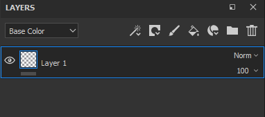

# Erstellen von Ebenen

Es gibt mehrere Möglichkeiten, Ebenen im Ebenenstapel hinzuzufügen/zu erstellen:

| *Aktion* | *Demonstration* |
| --- | --- |
| Erstellen Sie eine **Malebene**, indem Sie auf die entsprechende Schaltfläche klicken 

 | 

 |
| Erstellen Sie eine **Füllebene**, indem Sie auf die entsprechende Schaltfläche klicken 

 | 

 |
| Erstellen Sie einen **Ordner**, indem Sie auf die entsprechende Schaltfläche klicken 

 | 

 |
| **Duplizieren** einer Ebene mit einer der folgenden Methoden:<ul data-preserve-html="true"><li data-preserve-html="true">Rechtsklick > Duplizieren</li><li data-preserve-html="true">Tastaturbefehl STRG+D bzw. BEFEHL+D</li><li data-preserve-html="true">STRG oder BEFEHL drücken und beibehalten und Ebene(n) ziehen und ablegen</li></ul> | 

 |
| Löschen einer Ebene durch Klicken auf die entsprechende Schaltfläche 

 | 

 |

>[!NOTE]
>
> Einige dieser Aktionen verfügen über einen zugeordneten Tastaturbefehl, der auf der [dedizierten Seite](../settings/shortcuts.md) aufgerufen werden kann.

Ziehen und Ablegen von Ressourcen aus dem Regal kann auch eine Möglichkeit zum Erstellen von Ebenen sein:

| *Aktion* | *Demonstration* |
| --- | --- |
| Ziehen Sie ein **Material** aus den [Elementen](../assets/assets.md) in den Ebenenstapel. | 

 |
| Ziehen Sie ein **Smart-Material** von den [Elementen](../assets/assets.md) in den Ebenenstapel. | 

 |
| Ziehen Sie einen **Effekt** aus den [Elementen](../assets/assets.md) in den Ebenenstapel. | 

 |
