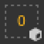

# Geometriemaske

\
Die Geometriemaske ist eine sekundäre Maske auf Ebenen, die die Maskierung einer Ebene basierend auf der 3D-Modellgeometrie des zugehörigen Textursatzes ermöglicht. Es kann durch Netznamen oder durch UV-Kacheln maskiert werden.

## Überblick

Die Maske &quot;Geometrie&quot; legt fest, auf welchen Teil des 3D-Modells die Ebene über eine Einschluss-/Ausschlussliste angewendet werden soll.

Die Geometriemaske ist ein nützliches Werkzeug, um schnell große Teile der 3D-Modellgeometrie zu verwerfen. Es bietet verschiedene Vorteile für die Farbmaske:

* Es ist in der Regel schneller einzurichten und mit Ansichtsfenster-Auswahlmodi zu verwenden.
* Es bietet eine bessere Leistung, da Geometrie beim Generieren der Texturen vollständig verworfen werden kann.
* Es ist nicht-destruktiv und wird aktualisiert, wenn sich das 3D-Modell nach einem erneuten Import ändert.
* Damit können Sie die Geometrie unterhalb der maskierten Geometrie malen, sodass verborgene Teile gemalt werden können.
* Wie bei einer Pinselmaske kann die Geometriemaske auf eine Gruppe angewendet werden, um mehrere Ebenen gleichzeitig zu beeinflussen.

### Symbolstatus

Das Symbol für die Geometriemaske kann anzeigen, in welchem Zustand es sich befindet:

| Symbol | Beschreibung |
| --- | --- |
| 

 | Es wurde keine Geometrie ausgeschlossen. Die Ebene wird auf das gesamte Gitter des zugehörigen Textursatzes angewendet. Dies ist der Standardstatus aller neuen Ebenen oder Ordner. |
| 

 | Mindestens ein Maschenname wurde ausgeschlossen. Die Zahl gibt die Anzahl der verbleibenden Elemente an, auf die sich die Ebene auswirkt. |
| 

 | Eine oder mehrere UV-Kacheln wurden ausgeschlossen. Die Zahl gibt die Anzahl der verbleibenden Elemente an, auf die sich die Ebene auswirkt. |
| 

 | Es sind keine Gitternamen enthalten, die Ebene hat keine tatsächlichen Auswirkungen. |

## Bearbeiten der Geometriemaske

Um die Geometriemaske einer bestimmten Ebene zu ändern, klicken Sie einfach auf das entsprechende Symbol. Um den Bearbeitungsmodus zu verlassen, klicken Sie einfach auf einen anderen Teil der Ebene, z. B. auf den Inhalt oder die Malmaske:

### Maskierungstypen

Die Geometriemaske unterstützt zwei Arten der Maskierung:

| Typ | Beschreibung |
| --- | --- |
| **UV-Kacheln** | Die Maskierung erfolgt, indem angegeben wird, welche UV-Kachel-(UDIM-)Nummer einbezogen werden soll. Dies ist die leistungsstärkste Methode, die es ermöglicht, eine Textur vollständig aus der Berechnung zu verwerfen. |
| **Gitternamen** | Zum Maskieren wird angegeben, welches Teilgitter im 3D-Modell enthalten sein soll. Die Geometrie wird nach Gitternamen gruppiert. |

### Ebenenstapelaktionen

Der Maskenzustand &quot;Geometrie&quot; kann direkt über den Ebenenstapel geändert werden, indem Sie mit der rechten Maustaste auf das Symbol klicken.

Es bietet die folgenden Aktionen:

| Aktion | Beschreibung |
| --- | --- |
| **Geometriemaske kopieren** | Kopiere den Typ und die Auswahl der Geometriemaske der angegebenen Ebene. |
| **In Geometriemaske einfügen.** | Fügen Sie die zuvor kopierten Geometrie-Maskeneigenschaften ein. |
| **Alle einschließen** | Markieren Sie alle Elemente der angegebenen Maske als ausgewählt. |
| **Alle ausschließen** | Markieren Sie alle Elemente der angegebenen Maske als &quot;Deaktiviert&quot;. |

## Malen durch maskierte Geometrie

Wenn Teile der Geometrie ausgeschlossen wurden, können diese im Ansichtsfenster ausgeblendet werden. Dies ermöglicht es, auf der Geometrie zu malen, die zuvor darunter war und nicht zugänglich.

Um die ausgeschlossene Geometrie auszublenden, verwenden Sie die Schaltfläche oben im Ansichtsfenster in der Kontextsymbolleiste:

Im folgenden Beispiel wurde das 3D-Modell in zwei Objekte aufgeteilt: ein oberes und unteres Teil. Standardmäßig kollidieren Pinselstriche mit allen Objekten. Durch den Ausschluss des Oberteils ist es nun möglich, ausschließlich auf das Unterteil zu malen.

>[!NOTE]
>
> Die Liste zum Ein-/Ausschließen von Geometriemasken ist dynamisch. Wenn Sie ihren Status ändern, wird eine neue Berechnung der Pinselstriche in der Ebene ausgelöst. Dies ermöglicht es, die Maskierung anzupassen, ohne die Pinselstriche zu verlieren, wenn Sie ein Gitter mit neuen UV-Kacheln erneut importieren oder wenn sich die Gitternamen geändert haben. Es bedeutet aber auch, dass Pinselstriche nicht gebacken werden, sodass jede Änderung der Geometriemaske zu einer falschen Pinselprojektion führen kann.

| Visuell | Beschreibung |
| --- | --- |
| 

 | Es wurde keine Geometrie in der Geometriemaske ausgeschlossen. Die Malebene, auf der der weiße Pinselstrich durchgeführt wurde, kollidiert mit der gesamten Geometrie.Die Schaltfläche **Ausgeschlossene Geometrie ausblenden** ist deaktiviert. |
| 

 | Der obere Teil wurde in der Geometriemaske ausgeschlossen, und der weiße Pinselstrich kollidiert nur mit dem unteren Teil der Geometrie.Die Schaltfläche **Ausgeschlossene Geometrie ausblenden** ist aktiviert. |
| 

 | Der obere Teil wurde in der Geometriemaske ausgeschlossen, und der weiße Pinselstrich kollidiert nur mit dem unteren Teil der Geometrie.Die Schaltfläche **Ausgeschlossene Geometrie ausblenden** ist deaktiviert. |
