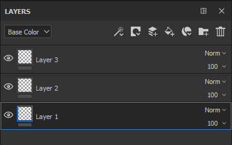

# Verwalten von Ebenen

Mögliche Manipulationen innerhalb des Ebenenstapels:

| *Aktion* | *Demonstration* |
| --- | --- |
| Klicke und ziehe, um eine Ebene zu verschieben. Wenn Sie eine Ebene verschieben, wird möglicherweise eine Leiste angezeigt, die angibt, wo die Ebene platziert wird:<ul data-preserve-html="true"><li data-preserve-html="true"><strong>Leiste über einer Ebene</strong> : wird die Ebene über die Ebene gelegt</li><li data-preserve-html="true"><strong>Leiste zwischen zwei Ebenen</strong> : wird die Ebene zwischen die beiden Ebenen gelegt</li><li data-preserve-html="true"><strong>Leiste unter einer Ebene</strong> : wird die Ebene unter die Ebene gelegt.</li></ul> | 

 |
| **In einen Ordner verschieben** : Ebene per Mausklick auf einen Ordner ziehen, um sie darin abzulegen | 

 |
| **Mehrfachauswahl** : Dies kann auf zwei verschiedene Arten erfolgen:<ul data-preserve-html="true"><li data-preserve-html="true">Drücken und halten Sie die Strg- oder Befehlstaste</li><li data-preserve-html="true">Umschalttaste drücken, während auf die erste und letzte Ebene geklickt wird</li></ul> | 

 |
| **Ebenen gruppieren** : Mit einer der folgenden Aktionen kann ein Ordner mit der aktuell ausgewählten Ebene erstellt werden:<ul data-preserve-html="true"><li data-preserve-html="true">Rechtsklick > Ebenen gruppieren</li><li data-preserve-html="true">Drücken von Strg+G oder Befehl+G</li></ul> | 

 |
