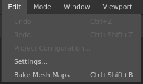

# Bearbeitungsmenü

\
Über das Bearbeitungsmenü können Sie schnell auf die Aktionen &quot;Rückgängig&quot; und &quot;Wiederholen&quot; zugreifen, aber auch auf die Projekteinstellungen und die globalen Einstellungen.

| Aktion | Beschreibung |
| --- | --- |
| **Rückgängig** | Gehen Sie im Stapel [Verlauf](../history.md) einen Schritt zurück. |
| **Wiederholen** | Gehen Sie im Stapel [Verlauf](../history.md) einen Schritt weiter. |
| **Projektkonfiguration** | Öffnen Sie das Fenster [Projekteinstellungen](../project-configuration.md) des aktuellen Projekts. |
| **Einstellungen** | Öffnen Sie das allgemeine Fenster [Anwendungseinstellungen](../settings/settings.md). |
| **Baking Mesh-Map** | Öffnen Sie das Fenster &quot;[Baking](../../baking/baking.md)&quot;. |
