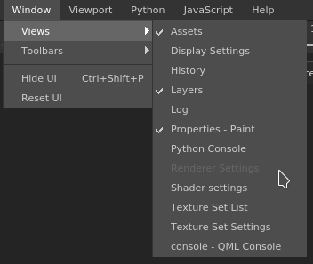

# Menü &quot;Fenster&quot;

\
Das Fenstermenü erlaubt es, eine Liste der Fenster anzuzeigen, und wenn sie in der Oberfläche sichtbar sind. Einige Symbolleisten können Sie auch über das Menü „Symbolleisten“ ausblenden.

| Aktion | Beschreibung |
| --- | --- |
| **Ansichten** | Führt die in der Benutzeroberfläche verfügbaren Fenster auf (das Kontrollkästchen gibt an, ob es derzeit angezeigt wird). |
| **Symbolleisten** | Führt die in der Benutzeroberfläche verfügbaren Symbolleisten auf (das Kontrollkästchen gibt an, ob es derzeit sichtbar ist, wodurch sie aktiviert werden können): Docks, Plug-ins und Tools. |
| **Benutzeroberfläche ausblenden** | Blendet alle Fenster und Docks der Benutzeroberfläche aus und maximiert den bzw. die Viewport. |
| **Benutzeroberfläche zurücksetzen** | Setzt das aktuelle Fensterlayout auf die Standardwerte zurück. |
