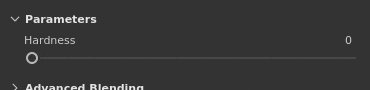

# Schieberegler

Diese Seite zeigt, wie die Regler in der Anwendungsoberfläche verwendet werden.

| Aktion | Beispiel | Beschreibung |
| --- | --- | --- |
| **Ziehen** | 

 | Klicken und ziehen Sie, wenn Sie den Mauszeiger über einen Schieberegler bewegen, um seinen Wert zu ändern. |
| **Präzisionsziehen** | 

 | Halten Sie die Umschalttaste auf der Tastatur gedrückt, während Sie klicken, um den Ziehabstand des Schiebereglers zu erhöhen. Mit diesem Tastaturbefehl können Sie den Schieberegler beim Ziehen präziser anpassen. |
| **Sprung** | 

 | Klicken Sie auf einen beliebigen Regler, um zu dem Wert unter der Mausposition zu springen. |
| **Nach oben/Nach unten** | 

 | Nachdem Sie den Fokus eines Schiebereglers durch Klicken darauf erhalten haben, verwenden Sie die Nach-oben- und Nach-unten-Tasten auf der Tastatur, um den Wert Schritt für Schritt zu erhöhen oder zu verringern. |
| **Value Edition** | 

 | Klicken Sie in das Textfeld direkt über einem Schieberegler, um den Wert manuell über die Tastatur zu bearbeiten. |
