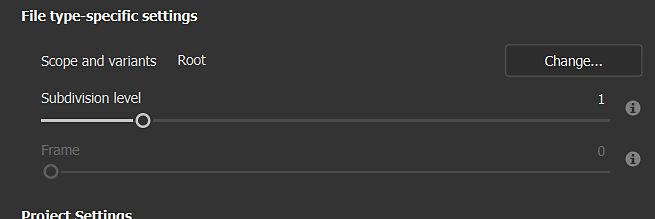

# Projektkonfiguration

Das Projektkonfigurationsfenster enthält Steuerelemente zum Ändern von Projekteinstellungen. Projekteinstellungen werden in der Regel beim Erstellen eines neuen Projekts festgelegt, in einigen Fällen müssen Sie diese Einstellungen jedoch zu einem späteren Zeitpunkt im Projekt ändern.

## 3D-Mesh

Wenn Änderungen am 3D-Gitter oder an der Gitterdatei vorgenommen wurden, können Sie das Gitter erneut importieren, während die anderen Projektdaten beibehalten werden. Überprüfen Sie **Mesh** erneut importieren, und stellen Sie sicher, dass die richtige Datei importiert wird.

Ein erneutes Importieren des Meshs ist in den folgenden Fällen hilfreich:

* Aktualisieren der 3D-Modell-Topologie
* Aktualisieren der UVs
* [Textursatz hinzufügen oder entfernen](texture-set/texture-set.md)

| **Parameter** | **Beschreibung** |
| --- | --- |
| **3D-Mesh** | Gibt den Pfad zur 3D-Modelldatei an. Verwenden Sie die **Schaltfläche &quot;Auswählen&quot;**, um die Quelldatei für das Projekt zu ändern. |
| **Mesh erneut importieren** | Wenn diese Option aktiviert ist, wird die Meshdatei erneut importiert, wenn Sie unten auf der Benutzeroberfläche auf &quot;OK&quot; klicken. Dieser Parameter wird automatisch überprüft, wenn die Schaltfläche &quot;Auswählen&quot; verwendet wird, um eine andere Meshdatei als die ursprüngliche Meshdatei anzugeben. |

>[!NOTE]
>
> Wenn sich die Material-IDs ändern oder beim erneuten Importieren des Projekt-Meshs umbenannt werden, können die vorherigen Textursatz im Projekt deaktiviert werden, wodurch das Erscheinungsbild fehlender Texturen angezeigt wird. Dies kann mit dem [Neuzuweisungsfenster](texture-set/texture-set-reassignment.md) aus der **Textursatz-Liste** behoben werden.

## Projekteinstellungen

Dieser Abschnitt steuert mehrere projektbezogene Einstellungen:

<table>
  <tr>
    <th><em>Einstellung</em></th>
    <th><em>Beschreibung</em></th>
  </tr>
  <tr>
    <td><strong>Normalen-Map-Format</strong></td>
    <td>Definiert das Format der Normalmap, die für das Gitter im Viewport verwendet wird. Dieser Parameter betrifft nur die <a href="shader-settings/shader-settings.md">Shader</a> in der Viewport- und Mesh-Maps in <a href="../baking/baking.md">bakers</a>. Der Ebenenstapel ist unabhängig. Empfohlener Wert für gängige Anwendungen:  <ul><li><strong>Einheit</strong>: OpenGL</li><li><strong>Unreales Engine</strong>: DirectX</li><li><strong>Maya</strong>: OpenGL</li><li><strong>3DS Max.</strong>: DirectX</li><li><strong>Blender</strong>: OpenGL</li></ul></td>
  </tr>
  <tr>
    <td><strong>Berechnen des Tangentialraums pro Fragment</strong></td>
    <td>Legt fest, wie Normalen-Map im Viewport für Schattierung und Beleuchtung berechnet und angezeigt werden. Wenn diese Option aktiviert ist, werden die Tangente und die Binormalen des Meshs pro Pixel und nicht pro Scheitelpunkt berechnet. Empfohlener Wert für häufige Anwendungen:  <ul><li><strong>Einheit</strong>: Deaktiviert (aktiviert, wenn HDRP verwendet wird)</li><li><strong>Unreales Engine</strong>: Aktiviert</li></ul></td>
  </tr>
</table>

>[!NOTE]
>
> Wenn Sie das Normalformat oder die Berechnung der Tangente ändern, müssen die Mesh-Map neu Baking geführt werden, um sicherzustellen, dass das Erscheinungsbild in den Viewporten korrekt ist.

### Dateitypspezifische Einstellungen

Wenn Sie ein USD Mesh-Format auswählen, werden andere dateitypspezifische Einstellungen verfügbar.

{width="473px"}

<table>
  <tr>
    <th><em>Parameter</em></th>
    <th><em>Beschreibung</em></th>
  </tr>
  <tr>
    <td><strong>Umfang und Varianten</strong></td>
    <td>Wählen Sie einen bestimmten Teil einer USD aus. Standardmäßig ist sie auf "Root" festgelegt, was bedeutet, dass die gesamte USD im Painter-Projekt verwendet wird. <strong>Änderung...</strong> öffnet ein neues Fenster, in dem der Inhalt des USD angezeigt wird. Wenn Varianten erkannt werden, können Sie eine bestimmte Variante auswählen, die in das Projekt geladen werden soll.  Hinweis: <ul><li>Nur die Modellvariantenauswahl hat Auswirkungen.</li><li>Innerhalb von Varianten verschachtelte Varianten werden derzeit nicht erkannt.</li></ul></td>
  </tr>
  <tr>
    <td><strong>Unterteilungsebene</strong></td>
    <td>Gilt für Geometrie mit Unterteilung. Geben Sie an, wie viel Mesh zur Texturierung in Painter unterteilt werden soll. Wenn in der USD-Datei explizit "none" als Unterteilung festgelegt ist, wird diese Einstellung ausgegraut. Die Unterteilung wird nach dem entpack der UV angewendet, sodass sie die Form der UVs des Meshs nicht ändern würde.</td>
  </tr>
  <tr>
    <td><strong>Rahmen</strong></td>
    <td>Gilt für USDs, in denen Animationen erkannt werden. Wählen Sie den Rahmen aus, der in das Painter-Projekt geladen werden soll. Wenn die ausgewählte USD-Datei keine Animation enthält, ist diese Einstellung ausgegraut.</td>
  </tr>
</table>

## Einstellungen für UV-Kacheln

Dieser Abschnitt enthält Steuerelemente, mit denen Sie die Verwendung von UDIM im Projekt umschalten können. Es ist nicht möglich, diese Einstellungen zu ändern, nachdem das Projekt erstellt wurde, aber Sie können die Einstellungen für das Projekt hier anzeigen. Weitere Informationen finden Sie in der Dokumentation zu [UV-Kacheln](../features/uv-tiles/uv-tiles.md).

## Importeinstellungen

Diese Einstellungen steuern, wie der markierte Mesh importiert wird:

| *Einstellung* | *Beschreibung* |
| --- | --- |
| **Kameras importieren** | Wenn diese Option aktiviert ist, werden die in der Meshdatei vorhandenen Kameras ebenfalls importiert und sind im 3D-Viewport verfügbar. |
| **Konturpositionen auf dem Mesh beibehalten** | Diese Einstellung steuert, wie Pinselstriche nach dem Import eines neuen 3D-Mesh neu berechnet werden. Es wird empfohlen, diese Einstellung in den meisten Fällen aktiviert zu lassen. Weitere Informationen finden Sie in der Dokumentation zur [UV-Reprojektion](../features/uv-reprojection.md). |
| **Automatisches Entpacken** | Automatischer Entpack von UV. Klicken Sie auf die Schaltfläche Option, um den Prozess zu konfigurieren. Weitere Informationen finden Sie in der [Dokumentation zum automatischen Entpack von UV](../features/automatic-uv-unwrapping.md). |

### Physische Größe

Passen Sie die [Physische Größe](../features/physical-size.md) des importierten Meshs an.

| *Einstellung* | *Beschreibung* |
| --- | --- |
| **Interne Einheitenskala der Meshdatei verwenden** | Wenn der Mesh mit physikalisch akkuraten Messungen erstellt wurde, lassen Sie diese Option aktiviert, um dieselbe Physische Größe in Painter beizubehalten. |
| **Benutzerdefinierte Einheitenskalierung** | Wenn der Mesh nicht unter Berücksichtigung der Physische Größe erstellt wurde, können Sie mit dieser Option die Größe des Meshs anpassen. Sie müssen die gewünschte Physische Größe und die Schriftgröße (in Einheiten) des importierten Meshs kennen, um diesen Wert zu bestimmen. |
| **Wechseln der Skalierung der Füllebene zur Physische Größe beim Zuweisen von Materialien** | Wenn diese Option aktiviert ist, wechseln Füllebenen und -effekte automatisch die Skalierungsmethode in die Physische Größe, wenn Sie ein Material zuweisen, das Physische Größe-Eigenschaften aufweist. |

### Einstellungen für das Farbmanagement

Dieser Abschnitt steuert die Einstellungen für die Farbkonvertierung. Weitere Informationen finden Sie in der Dokumentation zum [Farbmanagement](../features/color-management/color-management.md).
